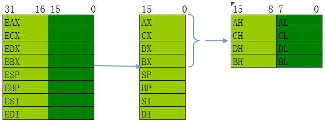
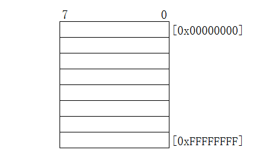

## 通用寄存器

通用寄存器：

|      | 寄存器 |      | 编号(二进制) | 编号(十进制) |
| :--: | :----: | :--: | :----------: | :----------: |
| 32位 |  16位  | 8位  |              |              |
| EAX  |   AX   |  AL  |     000      |      0       |
| ECX  |   CX   |  CL  |     001      |      1       |
| EDX  |   DX   |  DL  |     010      |      2       |
| EBX  |   BX   |  BL  |     011      |      3       |
| ESP  |   SP   |  AH  |     100      |      4       |
| EBP  |   BP   |  CH  |     101      |      5       |
| ESI  |   SI   |  DH  |     110      |      6       |
| EDI  |   DI   |  BH  |     111      |      7       |



16位寄存器是由32位寄存器砍一半，低位变成1个16位，表示字符差一个E

8位寄存器是由16位寄存器砍一半，变成2个8位，分别为地位和高位，以H、L区分

  


### MOV指令

**语法**

> **r 通用寄存器**
>
> **m 代表内存**
>
> **imm 代表立即数**
>
> **r8 代表8位通用寄存器**
>
> **m8 代表8位内存**
>
> **imm8 代表8位立即数**


- MOV r/m8,  r8 
- MOV  r/m16,  r16
- MOV  r/m32,  r32
- MOV  r8,  r/m8
- MOV  r16,  r/m16
- MOV  r32,  r/m32
- MOV r8,  imm8
- MOV r16,  imm16
- MOV r32,  imm32

**作用**

拷贝源操作数到目标操作数

- 源操作数可以是立即数、通用寄存器、段寄存器、或者内存单元
- 目标操作数可以是通用寄存器、段寄存器或者内存单元
- 操作数的宽度必须一样
- **源操作数和目标操作数不能同时为内存单元**


### ADD指令

- ADD AL, imm8 
- ADD AX,  imm16
- ADD EAX,  imm32
- ADD r/m8,  imm8
- ADD  r/m16,  imm16
- ADD  r/m32,  imm32
- ADD r/m16,  imm8
- ADD r/m32,  imm8
- ADD r/m8,  r8
- ADD r/m16,  r16
- ADD r/m32,  r32
- ADD r8,  r/m8
- ADD r16,  r/m16
- ADD r32,  r/m32


### SUB指令

- SUB AL, imm8 
- SUB AX,  imm16
- SUB EAX,  imm32
- SUB r/m8,  imm8
- SUB  r/m16,  imm16
- SUB  r/m32,  imm32
- SUB r/m16,  imm8
- SUB r/m32,  imm8
- SUB r/m8,  r8
- SUB r/m16,  r16
- SUB r/m32,  r32
- SUB r8,  r/m8
- SUB r16,  r/m16
- SUB r32,  r/m32


### AND指令

- AND AL, imm8 
- AND AX,  imm16
- AND EAX,  imm32
- AND r/m8,  imm8
- AND  r/m16,  imm16
- AND  r/m32,  imm32
- AND r/m16,  imm8
- AND r/m32,  imm8
- AND r/m8,  r8
- AND r/m16,  r16
- AND r/m32,  r32
- AND r8,  r/m8
- AND r16,  r/m16
- AND r32,  r/m32


### OR指令

- OR AL, imm8 
- OR AX,  imm16
- OR EAX,  imm32
- OR r/m8,  imm8
- OR  r/m16,  imm16
- OR  r/m32,  imm32
- OR r/m16,  imm8
- OR r/m32,  imm8
- OR r/m8,  r8
- OR r/m16,  r16
- OR r/m32,  r32
- OR r8,  r/m8
- OR r16,  r/m16
- OR r32,  r/m32


### XOR指令

- XOR AL, imm8 
- XOR AX,  imm16
- XOR EAX,  imm32
- XOR r/m8,  imm8
- XOR  r/m16,  imm16
- XOR  r/m32,  imm32
- XOR r/m16,  imm8
- XOR r/m32,  imm8
- XOR r/m8,  r8
- XOR r/m16,  r16
- XOR r/m32,  r32
- XOR r8,  r/m8
- XOR r16,  r/m16
- XOR r32,  r/m32


### NOT指令

- NOT r/m8
- NOT r/m16
- NOT r/m32


## 内存读写

### 寄存器与内存的区别：

- 寄存器位于CPU内部，执行速度快，但比较贵
- 内存速度相对较慢，但成本较低，所以可以做的很大
- 寄存器和内存没有本质区别，都是用于存储数据的容器，都是定宽的
- 寄存器常用的有8个：**EAX、ECX、EDX、EBX、ESP、EBP、ESI、EDI**
- 计算机中的几个常用计量单位：**BYTE、 WORD、 DWORD**


> BYTE　字节　＝　8(BIT)
>
> WORD 字    =  16(BIT)
>
> DWORD  双字 =   32(BIT)
>
> 1KB = 1024  BYTE
>
> 1MB = 1024  KB 
>
> 1GB = 1024  MB


- 内存的数量特别庞大，无法每个内存单元都起一个名字，所以用编号来代替，我们称计算机**CPU是32位或者64位，主要指的就是内存编号的宽度，而不是寄存器的宽度**，因此，32位计算机是因为寄存器的宽度是32位，是不准确的，**因为还有很多寄存器是大于32位的**
- 计算机内存的每一个字节会有一个编号(即内存编号的单位是字节)
- 32位计算机的编号最大是32位，也就是32个1 换成16进制为FFFFFFFF，也就是说，32位计算机内存寻址的最大范围是FFFFFFFF+1 


### 内存格式



1. 每个内存单元的宽度为8位，一个字节
2. **[编号]称为地址**
3. 地址的作用：当我们想从内存中读取数据或者想向内存中写入数据，首先应该找到要读、写的位置。就像写信要写地址一样


### 从指定内存中写入/读取数据

格式

**BYTE（8位）、 WORD（16位）、 DWORD（32位）**：要读/写多少  此时是4字节   byte == 1字节  word == 2字节

**prt**：指针， 指针的意思就是里面存的不是普通的值，而是个地址

**ds**：段寄存器，指出当前程序使用的数据所存放段的最低地址，存放数据段的段基址，DS指向数据段，ES指向附加段

**0x0012FF34**：内存编号，必须是32位的  前面0可以省略

```
mov dword ptr ds:[0x0012FF34],0x12345678

mov eax,dword ptr ds:[0x0012FF34]
```

**注意**：地址编号不要随便写，因为内存是有保护的，并不是所有的内存都可以直接读写(需要特别处理)，建议地址编号写成esp的值

