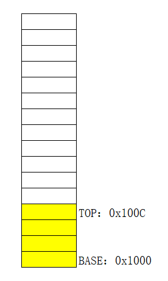

## 内存地址

### 寻址格式

#### 1、[立即数]

**读取内存的值：**

- ```
  MOV EAX,DWORD PTR DS:[0x13FFC4]
  ```

- ```
  MOV EAX,DWORD PTR DS:[0x13FFC8]
  ```

**向内存中写入数据：**

- ```
  MOV DWORD PTR DS:[0x13FFC4],eax
  ```

- ```
  MOV DWORD PTR DS:[0x13FFC8],ebx
  ```

**获取内存编号：**

- ```
  LEA EAX,DWORD PTR DS:[0X13FFC4]
  ```

- ```
  LEA EAX,DWORD PTR DS:[ESP+8]
  ```

#### 2、reg， reg代表寄存器 可以是8个通用寄存器中的任意一个

**读取内存的值：**

- ```
  MOV ECX,0x13FFD0
  ```

- ```
  MOV EAX,DWORD PTR DS:[ECX]
  ```

**向内存中写入数据：**

- ```
  MOV EDX,0x13FFD8
  ```

- ```
  MOV DWORD PTR DS:[EDX],0x87654321
  ```

**获取内存编号：**

- ```
  LEA  EAX,DWORD PTR DS:[EDX]
  ```

- ```
  MOV EAX,DWORD PTR DS:[EDX]
  ```

#### 3、[reg+立即数]

**读取内存的值：**

- ```
  MOV ECX,0x13FFD0
  ```

- ```
  MOV EAX,DWORD PTR DS:[ECX+4]
  ```

**向内存中写入数据：**

- ```
  MOV EDX,0x13FFD8
  ```

- ```
  MOV DWORD PTR DS:[EDX+0xC],0x87654321
  ```

**获取内存编号：**

- ```
  LEA  EAX,DWORD PTR DS:[EDX+4]
  ```

- ```
  MOV EAX,DWORD PTR DS:[EDX+4]
  ```

#### 4、[reg+reg*{1,2,4,8}]

**读取内存的值：**

- ```
  MOV EAX,13FFC4
  ```

- ```
  MOV ECX,2
  ```

- ```
  MOV EDX,DWORD PTR DS:[EAX+ECX*4]
  ```

**向内存中写入数据：**

- ```
  MOV EAX,13FFC4
  ```

- ```
  MOV ECX,2
  ```
  
- ```
  MOV DWORD PTR DS:[EAX+ECX*4],87654321
  ```

**获取内存编号：**

- ```
  LEA EAX,DWORD PTR DS:[EAX+ECX*4]
  ```


#### 5、[reg+reg*{1,2,4,8}+立即数]

**读取内存的值：**

- ```
  MOV EAX,13FFC4
  ```

- ```
  MOV ECX,2
  ```

- ```
  MOV EDX,DWORD PTR DS:[EAX+ECX*4+4]
  ```

**向内存中写入数据：** 

- ```
  MOV EAX,13FFC4
  ```

- ```
  MOV ECX,2
  ```

- ```
  MOV DWORD PTR DS:[EAX+ECX*4+4],87654321
  ```

**获取内存编号：**

- ```
  LEA EAX,DWORD PTR DS:[EAX+ECX*4+2]
  ```


#### 注意

当内存寻址编号计算操作时超过最大上限时，计算机只取最大的寻址编号

例如，32位计算机，寻址编号最大为FFFFFFFF，当计算时超过上限，只取FFFFFFFF


OD使用技巧：内存地址查找，窗口下方的命令输入

```
db 0x0012FFDC		// 
```

可以在数据窗口看到


## 堆栈

[堆栈](https://baike.sogou.com/v19399597.htm?fromTitle=%E5%A0%86%E6%A0%88_)其实是两种数据结构



**堆栈原理**

1. **BASE,TOP是2个32位的通用寄存器**，里面存储的是**内存单元编号(内存地址)**
2. **BASE**和**TOP**里面存储了一个地址，分别记录的**起始地址**和**结束地址**
3. 存入数据的时候，**TOP的值减4**(为方便理解，每次存取都是4个字节)
4. 释放数据的时候，**TOP的值加4**(为方便理解，每次存取都是4个字节)
5. 如果要读取中间的某个数据的时候可以通过**TOP 或者 BASE 加上偏移量的方式去读取**
6. **这种内存的读写方式就叫堆栈**

**优点：**可以临时存储大量的数据，便于查找

**注意：**windows的地址是由**下方的高地址 --> 上方的低地址**


### 步骤一：压入数据

1. 我们先挑一个可用的内存地址进行测试（比如选用地址为：**0x0013FFDC**）

2. 挑两个寄存器存入目标地址

   ```
   MOV EBX,13FFDC			//BASE，栈底
   MOV EDX,13FFDC			//TOP，栈顶
   ```

3. 内存中存入数据，并更改栈顶寄存器值为新栈顶地址

   - 方式一：内存先写入值，后SUB修改栈顶

     ```
     MOV DWORD PTR DS:[EDX-4],0xAAAAAAAA
     SUB EDX,4
     ```

   - 方式二：先SUB修改栈顶，后内存写入值

     ```
     SUB EDX,4
     MOV DWORD PTR DS:[EDX],0xBBBBBBBB
     ```

   - 方式三：内存先写入值，后LEA在栈顶寄存器写入新地址

     ```
     MOV DWORD PTR DS:[EDX-4],0xDDDDDDDD
     LEA EDX,DWORD PTR DS:[EDX-4]
     ```

   - 方式四：先LEA在栈顶寄存器写入新地址，后内存写入值

     ```
     LEA EDX,DWORD PTR DS:[EDX-4]
     MOV DWORD PTR DS:[EDX],0xEEEEEEEE
     ```


### 步骤二：读取第N个数

- 方式一：通过Base加偏移来读取**（通过栈底的方式读取）**

  ```
  MOV ESI,DWORD PTR DS:[EBX-4]		//读第一个压入的数据
  MOV ESI,DWORD PTR DS:[EBX-0x10]		//读第四个压入的数据
  ```

- 方式二：通过Top加偏移来读取**（通过栈顶的方式读取）**

  ```
  MOV EDI,DWORD PTR DS:[EDX+4]		//读第二个压入的数据
  MOV EDI,DWORD PTR DS:[EDX+8]		//读第三个压入的数据
  ```


### 步骤三：弹出数据

弹出数据（释放堆栈内存的空间，但值仍然在内存中，只不过我们忽略，不管了），**是压入数据的逆过程**

```
MOV ECX,DWORD PTR DS:[EDX]		//随便找个寄存器（例如EAX），存入需要弹出的第一个值
LEA EDX,DWORD PTR DS:[EDX+4]	//存入新栈顶的地址
```

```
MOV ESI,DWORD PTR DS:[EDX]
ADD EDX,4
```

```
LEA EDX,DWORD PTR DS:[EDX+4]
MOV EDI,DWORD PTR DS:[EDX-4]
```


### 汇编指令

#### push

压入数据，一般来说，**栈顶寄存器为ESP**，**栈底寄存器为EBP**

可以push立即数，寄存器，内存（寄存器，内存**仅限16位和32位**）

**命令：**

- ```
  PUSH r32
  PUSH r16
  ```

- ```
  PUSH m32
  PUSH m16
  ```

- ```
  PUSH imm8/imm16/imm32
  ```

**例子：**

```
push 0XAABBCCDD		//堆栈数据
```

**注意：**

- **如果是压入一个立即数，一定是算压入32位数据，地址减4**
- 如果是一个寄存器，会视寄存器的位数计算地址，**32位减4，16位减2，但不允许8位的**
- 因此，**并不是每一次栈顶都会减4，POP同理**


#### pop

弹出数据，每次弹出一个值，到寄存器，栈顶寄存器下降

**命令：**

- ```
  POP r32
  POP r16
  ```

- ```
  POP m32
  POP m16
  ```

**例子：**

```
pop EAX		//弹出值
```


#### PUSHAD指令 & POPAD指令

两个指令为**保存堆栈指令**

**执行pushad后**，计算机会**将此时的8个寄存器的值全部存入堆栈**（可以理解为进行了一次快照），之后便可以随便更改除了ESP、EBP的其他寄存器的值（因为寄存器存有堆栈的地址），**当执行popad后，便恢复之前所有寄存器的值**（相当于回复之前的快照）

