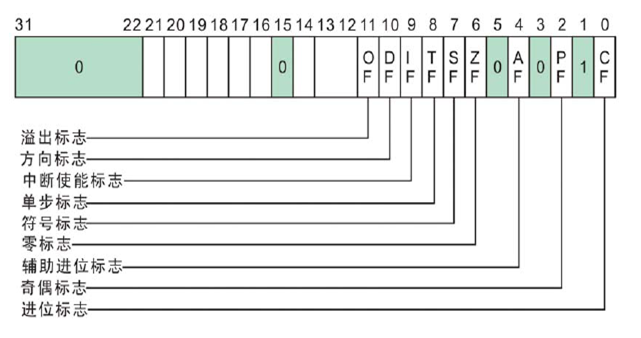
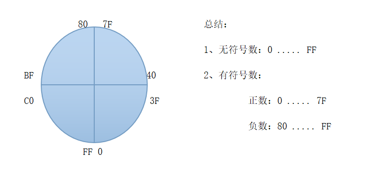

## 标记寄存器

EFLAGS寄存器

  

### CF(进位标志)

**CF(Carry Flag)：**如果运算结果的最高位产生了一个进位或借位，那么，其值为1，否则其值为0

**实验：**

```
MOV AL,0xEF
ADD AL,2


MOV AL,0xFE
ADD AL,2
```


**那么什么是最高位的进位和借位？**

```
80 + 40？			80 - 40？			80 - 81？

1000 0000			1000 0000			 1000 0000
0100 0000			0100 0000			 1000 0001
---------			---------			 ---------
1100 0000			0100 0000			 1111 1111

CF会判断没有进位	   CF会判断没有借位		CF会判断借位了，答案为全1为FF = -1 ；CF = 1
```


**注意：**

- 记住我们的数据宽度，决定了我们的最高位是哪一位
- 记住是要运算结果发生变化，因此MOV等非运算操作是不会影响的
- 当表示无符号数计算时，这个标志位非常重要，可以判断是否溢出


### PF(奇偶标志)

**PF(Parity Flag)：**奇偶标志PF用于反映运算结果中 “1” 的个数的奇偶性，如果 “1” 的个数为偶数，则PF的值为1，否则其值为0

**这里其实有坑**：这个标志位其实**是看最低有效字节里的1有几个**


**实验：**

```
MOV AL,3
ADD AL,3
ADD AL,2
```


**注意：**

- 记住我们的数据宽度，决定我们需要判断的位数有多少
- 记住我们最后看的是二进制下的 “1” 的个数
- 


### AF(辅助进位标志)

**AF(Auxiliary Carry Flag)：**同样为进位标识，要区别于CF(进位标志)。CF是判断最高位，AF是**判断最高位的一半那一位**。

在发生下列情况时，辅助进位标志AF的值被置为1，否则其值为0：

- 在**字(WORD)**操作时，发生**低字节向高字节**进位或借位时；
- 在**字节(DWORD)**操作时，发生**低4位向高4位**进位或借位时；

**实验：**

```
MOV EAX,0x55EEFFFF
ADD EAX,2


MOV AX,5EFE
ADD AX,2


MOV AL,4E
ADD AL,2
```


**注意：**

- 记住我们的数据宽度，决定了我们的最高位的一半是哪一位
- 记住是要运算结果发生变化，因此MOV等非运算操作是不会影响的


### ZF(零标志)

**ZF(Zero Flag)：**零标志ZF用来反映运算结果是否为0。如果运算结果为0，则其值为1，否则其值为0。在判断运算结果是否为0时，可使用此标志位

**实验：**

```
XOR EAX,EAX		//异或操作运算结果一定为0，因此ZF变为1 


MOV AL,0xEF
ADD AL,2
```


**注意：**

- 记住我们的数据宽度，决定了我们的运算位数
- 记住是要运算结果为0才会变化，因此MOV等非运算操作是不会影响的
- **Tips：`XOR EAX,EAX`是常用的清零寄存器的操作**


### SF(符号标志)

**SF(Sign Flag)：**符号标志SF用来反映运算结果的符号位，它与运算结果的最高位相同

**实验：**

```
MOV AL,7F
ADD AL,2
```


**注意：**

- 记住我们的数据宽度，决定了我们的最高位是哪一位
- 记住是运算结果，因此MOV等非运算操作是不会影响的


### DF(方向标志)

**DF(Direction Flag)：**用来标志方向。

​		例如MOVES指令，当**DF为0时，EDI和ESI寄存器的值增加相应地址宽度**；当**DF为1时，EDI和ESI寄存器的值减小相应地址宽度**

**实验：**

```
XOR EAX,EAX		//异或操作运算结果一定为0，因此ZF变为1 


MOV AL,0xEF
ADD AL,2
```


**注意：**

- 记住我们的数据宽度，决定了我们的运算位数
- 记住是要运算结果为0才会变化，因此MOV等非运算操作是不会影响的
- **Tips：`XOR EAX,EAX`是常用的清零寄存器的操作**


### OF(溢出标志)

**OF(Overflow Flag)：**溢出标志OF用于反映有符号数加减运算所得结果是否溢出。如果运算结果超过当前运算位数所能表示的范围，则称为溢出，OF的值被置为1，否则，OF的值被清为0


**最高位进位与溢出的区别：**

我们注意到，CF(Carry Flag) 和这里的 OF(Overflow Flag) 其实非常像，都是看是否超过可以存放的最大的数。

- **CF(Carry Flag)进位标志：表示无符号数运算结果是否超出范围，及==最高位==有没有进位**。是无符号的计算里我们需要关注的位数

- **OF(Overflow Flag)溢出标志：表示有符号数运算结果是否超出范围，及==除去符号位的最高位==有没有进位**。是有符号的计算里我们应该关注

- 无论有无符号计算，都可以看下表

  


**溢出主要是给有符号运算使用的，在有符号的运算中，有如下的规律：**

- 正 + 正 = 正 如果结果是负数，则说明有溢出
- 负 + 负 = 负 如果结果是正数，则说明有溢出
- 正 + 负 永远都不会有溢出


**计算机如何判断是否溢出？**

需要得到计算后，**符号位**和**最高有效位**是否有产生进位（**其实符号位就是计算宽度的最高位**，最高有效位是符号位的下一位），如果进位则为1，否则为0

再进行**符号位**和**最高有效位**的异或，异或结果为1，则判断溢出 **OF=1**

例	80 + C0

```
	1000 0000
+	1100 0000
--------------
	0100 0000		符号位有进位：1；最高有效位没有向符号位产生进位：0
```


**实验：**

1. 无符号、有符号都不溢出

   ```
   MOV AL,8
   ADD AL,8
   ```

   

2. 无符号溢出、有符号不溢出

   ```
   MOV AL,0FF
   ADD AL,2
   ```

   

3. 无符号不溢出、有符号溢出

   ```
   MOV AL,7F
   ADD AL,2
   ```

   

4. 无符号、有符号都溢出

   ```
   MOV AL,0FE
   ADD AL,80
   ```


**注意：**

- 记住我们的数据宽度，决定了我们的最高位是哪一位

- 记住是运算结果，MOV等非运算操作是不会影响的

- **始终记住，计算机是不知道有没有符号的，人去定义才有符号**

  无符号时

  - 0是最小数，FF是最大数

  有符号时

  - 0是最小的正数，7F是最大的正数
  - 80是最小的负数，FF是最大的负数


## ADC指令

**作用：**==带进位加法==，执行时会看CF标志位

**格式：**ADC  R/M,R/M/IMM   两边不能同时为内存  宽度要一样

**示例：**

```
ADC AL,CL
ADC BYTE PTR DS:[12FFC4],2
ADC BYTE PTR DS:[12FFC4],AL
```


## SBB指令

**作用：**==带借位减法==，执行时会看CF标志位

**格式：**SBB  R/M,R/M/IMM   两边不能同时为内存  宽度要一样

**示例：**

```
SBB AL,CL
SBB BYTE PTR DS:[12FFC4],2
SBB BYTE PTR DS:[12FFC4],AL
```


## XCHG指令

**作用：**交换数据，交换两个位置的数据，因此立即数（立即数没有存储的空间）不适用。只要宽度一样，就可以进行交换

**格式：**XCHG  R/M,R/M   两边不能同时为内存  宽度要一样

**示例：**

```
XCHG AL,CL
XCHG DWORD PTR DS:[12FFC4],EAX
XCHG BYTE PTR DS:[12FFC4],AL
```


## MOVS指令

**作用：**移动数据  内存-内存（为数不多可以进行内存与内存之间的数据），主要依赖于ESI和EDI寄存器（寄存器会存放两个内存的地址用于**类mov操作**），当使用MOVS后，除了有赋值操作，还同时更改了这两个寄存器的值，会根据**宽度**和**DF标志寄存器（DF为0时；两个寄存器同时减小对应地址宽度；反之则增加）**进行改变

**格式：**

- ```
  MOVS BYTE PTR ES:[EDI],BYTE PTR DS:[ESI]		简写为：MOVSB
  ```

- ```
  MOVS WORD PTR ES:[EDI],WORD PTR DS:[ESI]		简写为：MOVSW
  ```

- ```
  MOVS DWORD PTR ES:[EDI],DWORD PTR DS:[ESI]		简写为：MOVSD
  ```

  

**示例：**

```
MOV EDI,12FFD8
MOV ESI,12FFD0
MOVS BYTE PTR ES:[EDI],BYTE PTR DS:[ESI]
MOVS DWORD PTR ES:[EDI],DWORD PTR DS:[ESI]

//修改标志寄存器中D位的值，然后再执行下面的命令
MOV EDI,12FFD8
MOV ESI,12FFD0
MOVS BYTE PTR ES:[EDI],BYTE PTR DS:[ESI]
MOVS DWORD PTR ES:[EDI],DWORD PTR DS:[ESI]
```


## STOS指令

**作用：**将Al/AX/EAX的值存储到[EDI]指定的内存单元

**格式：**

- ```
  STOS BYTE PTR ES:[EDI]			简写为STOSB
  ```

- ```
  STOS WORD PTR ES:[EDI]			简写为STOSW
  ```

- ```
  STOS DWORD PTR ES:[EDI]			简写为STOSD
  ```

  

**示例：**

```
MOV EAX,12345678
MOV EDI,12FFC4
STOS BYTE PTR ES:[EDI]
STOS WORD PTR ES:[EDI]
STOS DWORD PTR ES:[EDI]

//修改标志寄存器中D位的值，然后再执行下面的命令
STOS BYTE PTR ES:[EDI]
STOS WORD PTR ES:[EDI]
STOS DWORD PTR ES:[EDI]
```


## REP指令

**作用：**按计数寄存器 (ECX) 中指定的次数重复执行字符串指令

**格式：**REP + 其他需要重复的指令


**示例：**

```
MOV ECX,5	//计数寄存器赋值，存放需要重复执行的次数
REP MOVSD	

MOV ECX,10
REP STOSD
```

